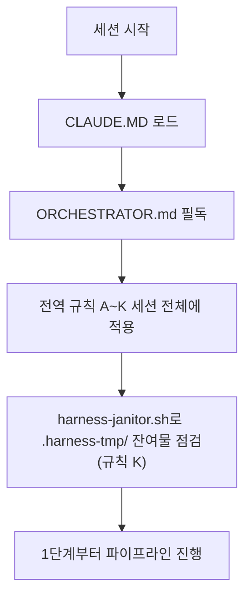

# HANESS_AUTO — 13단계 개발 하네스 시스템

이 저장소는 범용 재사용 가능한 13단계 개발 파이프라인 하네스다. 이 프로젝트에서 작업을 시작하기 전에 **[ORCHESTRATOR.md](ORCHESTRATOR.md)를 반드시 먼저 읽는다** — 전체 페르소나(20년차 개발/기획/설계/보안/디자인 기준), 전역 규칙(A~K: 모르면 질문, 최소 2회 내부 검증, 완전한 테스트 결과서, 단계 게이트, 배포 승인, 실패 피드백 루프, 의사결정 로그, 요구사항 추적성, 규제 민감 도메인 대응, AI/LLM 기능 내장 대응, 중단-안전 정리), 13단계 파이프라인 정의(11단계 문서화/인수인계 포함), 자동화 트리거 설계가 모두 여기에 있다.

- 각 단계 서브에이전트 정의: `.claude/agents/01-trend-analyst.md` ~ `13-post-deploy-verifier.md`
- 공통 양식: `templates/verification-log-template.md`, `templates/test-report-template.md`, `templates/decision-log-template.md`, `templates/traceability-matrix-template.md`
- 자동화(CI/git hook) 예시: `automation/` (임시 아티팩트 잔여 점검용 `automation/harness-janitor.sh` 포함)
- 검증/테스트용 임시 아티팩트(venv·DB 등) 전용 디렉터리: `.harness-tmp/` (`.gitignore` 처리됨, 규칙 K)

ORCHESTRATOR.md의 규칙은 이 저장소 안에서는 예외 없이 적용된다. 특히 규칙 A(모르면 반드시 질문, 임의 진행 금지), 규칙 E(배포는 사용자 승인 없이 절대 실행 금지), 규칙 K(정상 종료든 강제 중단이든 임시 아티팩트 정리는 동일하게 보장, 6번 항목의 서비스 헬스체크 포함)는 어떤 상황에서도 우회하지 않는다.

## 필수 준수: 부하 테스트 후 서비스 헬스체크 (2026-09-22, 실제 장애 재발 방지)
검증용 E2E/부하 테스트(병렬 브라우저, 반복 폴링, 대량 API 호출 등)를 로컬 백엔드/프런트/워커/DB에 대해 실행한 적이 있다면, **작업 완료를 사용자에게 보고하기 전에 반드시**:
1. 헬스체크 엔드포인트 또는 로그인처럼 사용자가 바로 쓰는 핵심 경로를 실제로 한 번 호출해 정상 응답을 확인한다.
2. 응답이 없거나 비정상이면(프로세스는 살아 있어도 무응답 등) 그 자리에서 원인을 파악하고 즉시 복구(재시작 등)한 뒤 재확인한다.
3. 이 확인 없이 "테스트 통과"만 보고하고 끝내지 않는다 — 사용자 환경이 실제로 정상 동작해야 완료다.
(근거: ORCHESTRATOR.md 규칙 K-6. 과거에 검증용 병렬 E2E 부하로 백엔드가 응답 불능 상태가 됐는데 이를 확인 없이 완료 보고를 해 사용자가 직접 장애를 겪은 사고가 있었다.)

## 참고: 동시접속 목표 재검토 — 10명 기준 (2026-09-23 검토, 실측 부하테스트 미실시)

사용자 요청으로 "500명 동시접속 처리"(③ 전환 가능성 매트릭스, 개발 불가 그룹)를
"10명 동시접속" 기준으로 낮추면 가능한지 이론적으로 검토했다. **결론: "동시
접속"의 정의에 따라 답이 갈린다.**

- **"동시 접속·연습 중"**(로그인 후 화면을 보거나 답변을 작성 중인 인원) 기준:
  이미 추가 인프라 투자 없이 가능하다 — 현재 아키텍처(단일 GPU, Celery
  `--pool=solo` 직렬 처리)는 "동시에 몇 명이 접속해 있는가"가 아니라 "동시에
  몇 명이 LLM 큐에 요청을 넣는가"만 병목이다.
- **"10명이 정확히 같은 순간 LLM 처리 요청을 제출"** 기준: 가능은 하나 대기시간이
  발생한다. 턴당 LLM 처리시간 실측치(약 4.5~7초, unit-7-note.md 참고) 기준으로
  마지막(10번째) 요청자는 최대 약 50~70초 대기할 수 있다. 이미 구현된 큐 최대
  길이(50, §1.3)와 사용자당 분당 레이트리밋(10회, unit-27)의 여유 범위 안이라
  **코드/설정 추가 변경 없이도 "장애 없이 동작"은 보장된다** — 다만 대기시간이
  사용자 경험상 허용 가능한 수준인지는 별도 판단 필요.
- 500명 목표가 "개발 불가"였던 근본 이유(GPU 1개 물리적 한계)는 10명 규모에서는
  전혀 문제가 되지 않는다 — 두 목표는 규모 차이(50배)로 인해 결론이 다르다.

**이 검토는 실제 동시 요청 부하테스트로 검증하지 않았다** — 규칙 K-6(본 문서
상단, 과거 병렬 E2E 부하로 백엔드가 응답불능이 된 실제 사고 이력)과 2026-09-22
세션에서 이 근처 코드(`interviews.py` 음성 제출 경로)에 실제로 있었던 장애를
감안해, 임의로 부하를 걸지 않고 기존 실측 데이터(턴당 처리시간) 기반 이론적
분석만 수행했다. 실제 부하테스트를 원할 경우 반드시 규칙 K-6에 따라 테스트 직후
헬스체크를 수행할 것.

## 필수 준수: 작업 단위별 개발작업내용 로그 파일 생성 (2026-09-25, 사용자 지시, 2026-09-25 파일명 규칙 수정)

`decisions.md`(DEC 로그)·`traceability.md`·각 `unit-N-test.md`에 기록하는 기존 방식과
**별도로**, 사용자에게 제출 가능한 결과물로서 작업할 때마다 프로젝트 루트의
`개발작업내용/` 폴더에 마크다운 파일을 1개씩 생성한다.

- **파일명 형식**: `{작업내용(20글자 이내 함축)}_{yyyyMMdd}_{HHMM}.md`
  (예: `K8s로컬검증_20260925_0807.md` — 날짜/시간은 KST 기준 작업 시각,
  **초 단위는 파일명에 넣지 않는다**)
- **내용**: 무엇을 요청받았는지, 무엇을 했는지, 검증 결과(표가 필요하면 반드시
  **머메이드(mermaid) 표/다이어그램 문법**으로 작성), 관련 `decisions.md` DEC-ID를
  본문에 명시.
- 이 파일은 `decisions.md`/`traceability.md`/`unit-N-test.md` 기재를 **대체하지
  않는다** — 두 체계를 병행 유지한다(기존 체계는 하네스 내부 근거 기록용, 이
  폴더는 제출용 결과물).
- `docs/harness/units/`의 각 `unit-N-note.md`/`unit-N-test.md`(및 대응
  `verify-log_*.md`)처럼 이미 완료된 작업 단위 문서가 존재한다면, 그 내용도
  동일한 파일명 규칙·형식으로 `개발작업내용/`에 채워 넣는다(유닛 1개당 파일 1개,
  note+test+verify-log 내용을 종합해 요약).
- 2026-09-25 세션에서 그 이전까지의 모든 작업(DEC-063~074 대응분 + 과거
  unit-1~37 전체)도 이 형식으로 소급 작성해 `개발작업내용/`에 채워 넣었다 —
  이후부터는 매 작업 완료 시점에 실시간으로 1개씩 추가한다.
