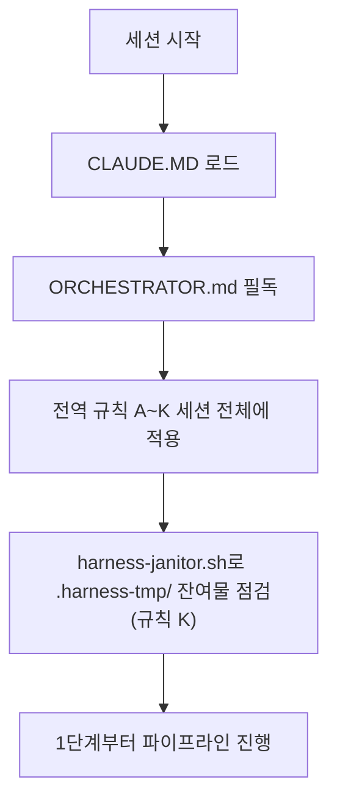

# HANESS_AUTO — 13단계 개발 하네스 시스템

이 저장소는 범용 재사용 가능한 13단계 개발 파이프라인 하네스다. 이 프로젝트에서 작업을 시작하기 전에 **[ORCHESTRATOR.md](ORCHESTRATOR.md)를 반드시 먼저 읽는다** — 전체 페르소나(20년차 개발/기획/설계/보안/디자인 기준), 전역 규칙(A~K: 모르면 질문, 최소 2회 내부 검증, 완전한 테스트 결과서, 단계 게이트, 배포 승인, 실패 피드백 루프, 의사결정 로그, 요구사항 추적성, 규제 민감 도메인 대응, AI/LLM 기능 내장 대응, 중단-안전 정리), 13단계 파이프라인 정의(11단계 문서화/인수인계 포함), 자동화 트리거 설계가 모두 여기에 있다.

- 각 단계 서브에이전트 정의: `.claude/agents/01-trend-analyst.md` ~ `13-post-deploy-verifier.md`
- 공통 양식: `templates/verification-log-template.md`, `templates/test-report-template.md`, `templates/decision-log-template.md`, `templates/traceability-matrix-template.md`
- 자동화(CI/git hook) 예시: `automation/` (임시 아티팩트 잔여 점검용 `automation/harness-janitor.sh` 포함)
- 검증/테스트용 임시 아티팩트(venv·DB 등) 전용 디렉터리: `.harness-tmp/` (`.gitignore` 처리됨, 규칙 K)

ORCHESTRATOR.md의 규칙은 이 저장소 안에서는 예외 없이 적용된다. 특히 규칙 A(모르면 반드시 질문, 임의 진행 금지), 규칙 E(배포는 사용자 승인 없이 절대 실행 금지), 규칙 K(정상 종료든 강제 중단이든 임시 아티팩트 정리는 동일하게 보장, 6번 항목의 서비스 헬스체크 포함)는 어떤 상황에서도 우회하지 않는다.

## 필수 준수: 부하 테스트 후 서비스 헬스체크 (2026-09-22, 실제 장애 재발 방지)
검증용 E2E/부하 테스트(병렬 브라우저, 반복 폴링, 대량 API 호출 등)를 로컬 백엔드/프런트/워커/DB에 대해 실행한 적이 있다면, **작업 완료를 사용자에게 보고하기 전에 반드시**:
1. 헬스체크 엔드포인트 또는 로그인처럼 사용자가 바로 쓰는 핵심 경로를 실제로 한 번 호출해 정상 응답을 확인한다.
2. 응답이 없거나 비정상이면(프로세스는 살아 있어도 무응답 등) 그 자리에서 원인을 파악하고 즉시 복구(재시작 등)한 뒤 재확인한다.
3. 이 확인 없이 "테스트 통과"만 보고하고 끝내지 않는다 — 사용자 환경이 실제로 정상 동작해야 완료다.
(근거: ORCHESTRATOR.md 규칙 K-6. 과거에 검증용 병렬 E2E 부하로 백엔드가 응답 불능 상태가 됐는데 이를 확인 없이 완료 보고를 해 사용자가 직접 장애를 겪은 사고가 있었다.)

