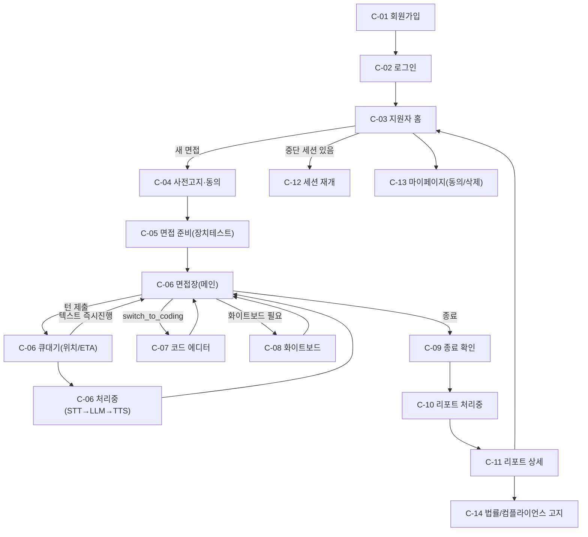
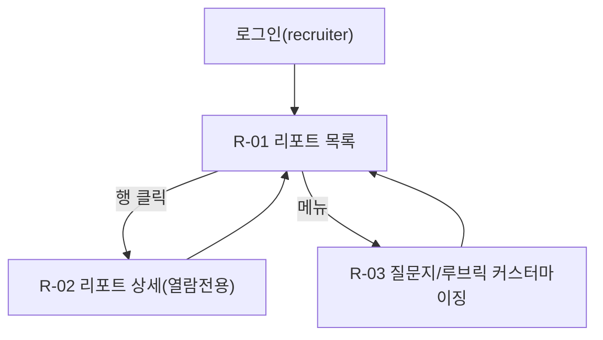

# 04. UX/디자인서 — 웹 기반 AI 모의면접 플랫폼 (MVP)

- 작성 에이전트: `04-ux-designer`
- 작성일: 2026-09-19 (최초) / **2026-09-19 최소 보정(v2) — 03단계 규칙F 재작업(v2) 반영**
- 버전: **v2 (03-system-design.md v2 재작업에 따른 최소 보정)**
- 입력: `docs/harness/02-planning.md`(PASS, v2), `docs/harness/03-system-design.md`(**v2, 재작업 반영**), `docs/harness/traceability.md`, `docs/harness/decisions.md`(DEC-001~024)

## 0.0 v2 보정 배경 (2026-09-19)

본 문서 v1이 §7.3에서 "확인 필요"로 남겼던 8건의 API/데이터모델 갭(DEC-022)이 03단계 재작업(`03-system-design.md` v2, DEC-023/024)으로 전부 해소되었다. 이 보정판(v2)은 **04단계를 처음부터 다시 쓰지 않고**, 해소된 API를 실제로 반영해야 정합이 유지되는 최소 지점만 수정했다: §1.1(C-04 플로우, 갭6 정책 변경 반영), §2 C-03/C-04/C-06/C-07/C-08/C-10/C-11/C-13(각 갭 해소 반영), §7(정합성 체크 결과 갱신). 나머지 섹션(디자인시스템/컴포넌트/접근성/반응형)은 API 계약 변경의 영향을 받지 않아 그대로 유지한다. 변경 상세는 §8 변경이력 참고.
- Tier: **High** (DEC-002) — 규칙 B 완화 없음, 최소 2회 검증 원문 적용
- 원칙: 지원자(Candidate) 화면 Must 우선(DEC-012), 채용담당자(Recruiter) 화면은 최소 뷰어 수준(Should). DEC-008 Out-of-Scope(표정/음성감정분석, 실시간 끼어들기, 화이트보드 AI비전, 코드 실행)에 해당하는 화면·컴포넌트는 설계하지 않는다.

---

## 0. 이 문서의 성격과 정합성 원칙 (먼저 읽을 것)

이 문서는 03단계 설계서에 **이미 확정된 API/데이터 모델에서만** 화면이 필요로 하는 데이터를 끌어온다. 검증 과정에서 03단계 API/데이터 모델만으로는 완전하게 해소되지 않는 항목을 8건 발견했다(§7.3 "확인 필요" 항목 — GET 엔드포인트 부재 5건, 정책적 재검토 소지 1건, 데이터 세분화 부재 1건, 최초 질문 전달 메커니즘 미정의 1건). 이 문서는 03단계 원 계획서·설계서 선례(예: Qwen2.5/Piper 라이선스를 "확인 필요"로 남기고 진행)와 동일한 원칙으로, **없는 데이터를 있는 것처럼 그리지 않고** 각 화면에 "이 데이터는 03단계 API 보강이 필요함"을 명시한 뒤 그 상태에서도 화면이 깨지지 않도록(그레이스풀 디그레이드) 설계했다. 이 발견은 `decisions.md` DEC-022로 기록했으며, 05단계 착수 전 오케스트레이터가 3단계로 되돌려 API를 보강할지, 05단계에서 클라이언트 로컬 상태로 임시 대체할지 규칙 A로 재확인해야 한다. **[v2 갱신]** 이후 오케스트레이터는 3단계로 되돌리는 쪽을 택했고, `03-system-design.md` v2 재작업(DEC-023/024)으로 8건 모두 해소되었다 — 상세는 §0.0과 §7.3을 참고. 이 §0 문단은 발견 당시의 기록이므로 그대로 보존한다.

---

## 1. 핵심 사용자 플로우

### 1.1 지원자(Candidate) 핵심 플로우 — 텍스트 와이어플로우

1. **[C-01] 회원가입** → 이메일/비밀번호/이름 입력, 역할 선택(candidate) → 성공 시 **[C-02] 로그인** 화면으로 이동(자동 로그인 아님, 이메일 인증 없음 — MVP 범위).
2. **[C-02] 로그인** → 성공 시 **[C-03] 지원자 홈**으로 이동. 실패 시 동일 화면에 에러 표시.
3. **[C-03] 지원자 홈** → "새 면접 시작" 클릭 → `POST /interviews`로 세션 생성(status=scheduled) → **[C-04] 사전고지·동의 화면**으로 이동.
   - 진행 중/재개 가능한 세션이 있으면 홈에 배너로 노출 → 클릭 시 **[C-12] 세션 재개 화면**으로 분기.
4. **[C-04] 사전고지·동의 화면 (v2 보정, DEC-023 반영)** → AI 면접 진행/평가 사실 고지문을 끝까지 스크롤해야 체크박스 활성화(REQ-032) → "동의하고 시작" → `POST /consents`(1건: `ai_interview_notice`) → `POST /interviews/{id}/start` → 성공 시 **[C-05] 면접 준비 화면**. **v2 변경(03-system-design.md v2, DEC-023)**: `/start`는 이제 `ai_interview_notice` 동의만 검사한다 — **생체정보(음성) 동의는 이 화면의 필수 게이트에서 제외되었다.** 화면에는 여전히 "음성으로도 답변할 계획이라면 지금 함께 동의" 선택 체크박스(`biometric_voice`, 선택)를 두어 나중에 [C-06]에서 음성 버튼을 처음 누를 때 별도 동의 팝업 없이 바로 진행할 수 있게 하되, 체크하지 않아도 "동의하고 시작" 버튼은 활성화된다(사전고지 동의 1건만 필수). 이로써 텍스트 전용 지원자는 생체정보 동의 없이 세션을 시작할 수 있고, §7.3 갭6(개인정보보호법 자유로운 동의 원칙과의 긴장)이 해소된다. 사전고지 동의를 거부하면 시작 자체가 불가하며, 화면은 안내와 함께 [C-14] 법률고지·[C-13] 마이페이지로의 링크만 제공한다.
5. **[C-05] 면접 준비 화면** → 마이크/웹캠 권한 요청 및 테스트(웹캠은 REQ-015에 따라 로컬 미리보기만, 서버 미전송) → "시작하기" → **[C-06] 면접장(메인)**.
6. **[C-06] 면접장(메인)** — 반복 루프:
   a. AI 질문이 채팅 버블 + 음성(TTS)으로 제시됨. **(v2 보정, 갭8 해소)** 세션 최초 진입 시 이 첫 질문은 `/start` 성공 시 서버가 자동 enqueue한 `opening_question` job의 결과이며(03-system-design v2 §4.3), 지원자의 별도 조작 없이 큐대기/처리중 상태를 거쳐 도착한다 — 이 상태는 아래 "빈 상태" 행에서 일반 큐대기/처리중과 동일한 위젯으로 표시한다(더 이상 "확인 필요"가 아닌 확정 스펙).
   b. 지원자가 텍스트 입력 또는 음성 녹음(턴 종료 버튼)으로 답변 → **(v2 보정, DEC-023)** 음성 녹음 버튼을 처음 누르는 시점에 클라이언트가 [C-13]/[C-04]에서 이미 `biometric_voice` 동의를 등록했는지 로컬 상태로 먼저 확인하고, 없으면 짧은 인라인 동의 팝업(`POST /consents` biometric_voice)을 먼저 띄운 뒤 녹음을 시작한다(사용자 경험상 선제 안내이며, 이 팝업을 건너뛰어도 서버가 `/turns` 제출 시 실시간으로 재검사하므로 보안 경계는 항상 서버에 있다) → `POST /interviews/{id}/turns` → `202 {job_id}` 즉시 수신. 만약 팝업 없이 우회 제출되거나 동의가 세션 도중 철회된 상태라면 서버가 `403 CONSENT_REQUIRED_VOICE`를 반환하며(03-system-design v2 §4.2/§6.2), 화면은 이 경우 §2 [C-06] 에러 상태 표의 "음성 동의 필요"로 처리한다.
   c. **[C-06-큐대기]** 상태로 전환: WebSocket `queue_status` 이벤트로 대기열 위치·ETA 표시. **제출한 턴이 음성일 때만** "텍스트로 즉시 진행" 이탈방지 버튼을 노출한다(§1.3 DEC-020 반영) — 클릭 시 `cancel_queue_wait`로 현재 대기 중인 음성 job을 취소하고 텍스트 입력창을 열어 같은 질문에 새 텍스트 답변을 제출할 수 있게 한다. **명확화(모호함 제거)**: 새 텍스트 턴도 다시 큐에 들어가는 것이며 대기열 순서를 건너뛰는 것은 아니다 — 다만 STT 단계가 없어 처리 자체는 더 빨리 끝난다(03-system-design §1.3). 화면 문구도 "순서를 건너뛰지는 않지만, 처리 시간이 더 짧아집니다"로 오해를 방지한다. 이미 텍스트로 제출한 턴이 대기 중일 때는 이 버튼을 노출하지 않는다.
   d. 본인 순서가 되면 **[C-06-처리중]** 상태: `stage_update`(stt→llm→tts) 순서로 "듣는 중 → 생각하는 중 → 응답 준비 중" 표시.
   e. `turn_result` 수신 → AI 응답(꼬리질문 또는 제어신호) 채팅에 추가, `control.action`이 `switch_to_coding`이면 **[C-07] 코드 에디터 패널**을, 화이트보드가 필요하면 **[C-08] 화이트보드 패널**을 분할 뷰로 노출.
   f. `control.action=end_interview`이거나 지원자가 "면접 종료" 버튼을 누르면 **[C-09] 면접 종료 확인 화면**으로.
7. **[C-09] 면접 종료 확인** → 확정 시 `POST /interviews/{id}/end` → `202 {job_id}`(리포트 생성 잡 큐 투입) → **[C-10] 리포트 처리중 대기 화면**.
8. **[C-10] 리포트 처리중 대기** → WebSocket `report_ready` 수신 또는 폴링(`GET /interviews/{id}/report`가 `202 processing`→`200`) → **[C-11] 리포트 상세 화면**.
9. **[C-11] 리포트 상세** → STAR 구조 피드백 + 루브릭 점수(1~5) + 평가 근거 + "최종 채용 결정은 인간이 내립니다" 고정 문구(REQ-031) + 법률자문 고지 링크(REQ-034, **[C-14]**로 이동) 확인 후 지원자 홈으로 복귀 가능.
10. 언제든 **[C-13] 마이페이지**에서 동의 철회(REQ-030)·생체정보 즉시 삭제 요청(REQ-030/033) 가능 — 면접 진행 중이 아닐 때 권장(진행 중 철회 시 클라이언트는 세션을 즉시 텍스트 전용 UI로 강등하고 배너 안내하며, **(v2 보정, 갭6 해소)** 서버측 강제도 확정됨: 03-system-design v2 §6.2에 따라 `/turns` 음성 제출마다 `biometric_voice` 동의를 실시간 재조회하므로 철회 직후의 다음 음성 제출부터 실제로 `403 CONSENT_REQUIRED_VOICE`로 차단된다 — 더 이상 클라이언트 의도 표시에만 의존하지 않는다).

### 1.2 부가 플로우 (엣지 케이스)

- **세션 중단/재접속**: 브라우저 종료·네트워크 단절 → 재로그인 시 [C-03] 홈에 "중단된 면접이 있습니다" 배너 → **[C-12] 세션 재개 화면**에서 `POST /interviews/{id}/resume` 호출, 직전 질문부터 이어감(REQ-013). 장시간 경과(구체 임계값은 03단계 §5.3/§4.1 `SESSION_EXPIRED` 410 참고, 정확한 시간 값은 05단계 확정 — 본 화면은 서버가 내려주는 `SESSION_EXPIRED`를 그대로 표시) 시 재개 불가 안내 후 새 세션 생성으로 유도.
- **대기열 초과(QUEUE_FULL, 429)**: [C-06]에서 턴 제출 시 발생 가능 → 토스트+재시도 안내, 자동 재시도 없음(사용자가 "다시 시도" 눌러야 함, 과도한 자동 재시도로 큐를 더 악화시키지 않기 위함).
- **AI 서비스 타임아웃(AI_SERVICE_TIMEOUT, 504)**: 처리중 상태에서 발생 시 "일시적 오류, 다시 시도해주세요" + 해당 턴 재시도 버튼.
- **동의 철회 중 진행 중 세션 존재**: [C-13]에서 생체정보 동의 철회 시, 활성 세션이 있으면 확인 모달("진행 중인 면접이 텍스트 전용으로 전환됩니다") 후 처리.

### 1.3 채용담당자(Recruiter) 최소 뷰어 플로우

1. **[C-02]** 동일 로그인 화면(역할=recruiter)으로 로그인 → **[R-01] 리포트 목록 대시보드**.
2. **[R-01]** 지원자 리포트 목록(정렬/필터, §7에 상세) → 행 클릭 → **[R-02] 리포트 상세(열람 전용)**.
3. **[R-01] 상단 메뉴 "질문지/루브릭 관리"** → **[R-03] 커스터마이징 화면**: 사전정의 템플릿 목록 조회, 신규 생성/수정(사전정의 템플릿 중 선택 및 세부 항목 편집 수준, §02-planning §4.2 범위와 동일).

### 1.4 운영자(Ops) 최소 플로우 (REQ-016, Should)

1. 관리자 역할로 로그인 → **[O-01] 운영자 모니터링 화면**: 큐 길이/GPU 사용률/에러율/활성 세션 수를 주기적으로 폴링(`GET /ops/health`)해 표시. 이 화면은 대시보드 성격상 Should 범위 내 최소 구현이며, 세부 알림 설정은 11단계 운영 Runbook으로 인수인계(03-system-design §7.3)한다.

---

## 2. 화면별 명세

각 화면은 **정상(Normal) / 로딩(Loading) / 빈 상태(Empty) / 에러(Error)** 상태를 모두 정의한다. 해당 없는 상태는 "해당없음"과 사유를 명시한다(생략 금지).

### [C-01] 회원가입
- **목적**: 신규 사용자 계정 생성(역할: candidate/recruiter 선택).
- **구성요소**: 이메일 입력, 비밀번호 입력(+확인), 이름 입력, 역할 선택(라디오: 지원자/채용담당자), 개인정보 처리방침 동의 체크박스(계정 생성용 일반 동의 — REQ-029의 생체정보 동의와는 별개, 계정가입 표준 약관), 제출 버튼.
- **API/데이터**: `POST /api/v1/auth/register` — 요청 필드는 `USERS`(email, password, name, role)와 직접 대응(03-system-design §3.1).
- **상태**:
  | 상태 | 설명 |
  |---|---|
  | 정상 | 폼 입력 가능, 실시간 유효성(이메일 형식, 비밀번호 8자 이상 등) 인라인 표시 |
  | 로딩 | 제출 버튼 스피너로 전환, 중복 클릭 방지(버튼 disabled) |
  | 빈 상태 | 해당없음(입력 폼 화면에는 빈 상태 개념 없음) |
  | 에러 | 이메일 중복(`VALIDATION_ERROR`) 등 서버 에러를 필드 하단 인라인 메시지로 표시. 네트워크 오류는 화면 상단 배너 |

### [C-02] 로그인
- **목적**: 기존 사용자 인증, JWT 발급(03-system-design §6.1).
- **구성요소**: 이메일/비밀번호 입력, 로그인 버튼, 회원가입 링크.
- **API/데이터**: `POST /api/v1/auth/login`.
- **상태**: 정상(입력 대기) / 로딩(버튼 스피너) / 빈 상태(해당없음) / 에러(`AUTH_INVALID_TOKEN` 계열 — "이메일 또는 비밀번호가 올바르지 않습니다", 계정별 존재 여부는 노출하지 않음 — 보안 원칙).

### [C-03] 지원자 홈(대시보드)
- **목적**: 지원자의 진입점. 새 면접 시작, 과거 리포트 접근, 중단 세션 안내.
- **구성요소**: "새 면접 시작" CTA, 중단 세션 배너(있을 때만), 최근 면접 리스트(카드: 일시/상태/점수 요약), 마이페이지 진입 링크.
- **API/데이터**: **(v2 보정, 갭1 해소)** `GET /api/v1/interviews`(03-system-design v2 §4.2 신규) — 내 면접 목록(`status`, `report_status`, `started_at`, `overall_score`)을 그대로 사용해 "최근 면접" 카드와 "리포트 준비 완료" 배지(`report_status=ready`), 중단 세션 배너(`status=paused`)를 렌더링한다. 더 이상 그레이스풀 디그레이드가 필요한 갭이 아니며, 아래 "에러" 상태만 실제 네트워크 실패 대비용으로 유지한다.
- **상태**:
  | 상태 | 설명 |
  |---|---|
  | 정상 | 목록 카드 표시 |
  | 로딩 | 카드 영역 스켈레톤(3개) |
  | 빈 상태 | "아직 진행한 면접이 없습니다. 첫 모의면접을 시작해보세요" + CTA 강조 |
  | 에러 | 목록 조회 실패 시 카드 영역만 에러 인라인("불러오지 못했습니다, 다시 시도") — CTA는 항상 동작 가능해야 함(핵심 기능 우선) |

### [C-04] 사전고지·동의 화면 (v2 보정, DEC-023/03-system-design v2 §6.2 반영)
- **목적**: REQ-032(AI 면접 사전고지) 이행 + REQ-029(생체정보 동의)의 선택적 사전 등록. `POST /interviews/{id}/start` 호출 전 필수 게이트는 **`ai_interview_notice` 하나뿐**이다 — **텍스트/음성 모드와 무관하게 세션 시작 자체를 막던 v1의 단일 게이트(생체정보 포함)는 폐기되었다.**
- **구성요소**: 고지문 스크롤 영역(끝까지 스크롤해야 아래 체크박스 활성화), 체크박스 1개(**필수**: AI 면접 진행·평가 사실 확인, "* 필수" 배지), 체크박스 1개(**선택**: 생체정보(음성) 수집 동의 — "* 선택" 배지, 보조 문구 "음성으로도 답변하실 계획이면 지금 동의하시면 면접 중 별도 절차 없이 바로 진행됩니다. 나중에 [C-06]에서 음성 버튼을 처음 누를 때 동의를 받을 수도 있습니다"), 단일 진행 버튼 "동의하고 시작"(필수 체크박스만 있으면 활성화), 법률자문 고지 링크(REQ-034), 동의하지 않을 경우의 안내(서비스 이용 불가 + [C-14] 링크).
- **API/데이터**: `GET /interviews/{id}/pre-notice`(고지문), `POST /consents`(consent_type=`ai_interview_notice` 필수 1건, `biometric_voice`는 선택 체크 시에만 추가 1건), `POST /interviews/{id}/start`(v2: `ai_interview_notice`만 검사). 실패 시 `403 CONSENT_REQUIRED_NOTICE`(생체정보 동의 관련 에러는 이 화면에서 더 이상 발생하지 않음 — [C-06] 참고).
- **상태**:
  | 상태 | 설명 |
  |---|---|
  | 정상 | 스크롤 미완료 시 필수 체크박스 비활성(회색), 완료 시 활성. **필수 체크박스만** 체크되면 "동의하고 시작" 버튼 활성화(선택 체크박스는 버튼 활성화 조건이 아님) |
  | 로딩 | 고지문 로딩 중 스켈레톤 텍스트, 제출 중 버튼 스피너 |
  | 빈 상태 | 해당없음(고정 법정 고지문이므로 항상 콘텐츠 존재, 03-system-design §4.2 `pre-notice` 엔드포인트) |
  | 동의 거부/보류 | 필수 체크박스 미체크 상태로 화면을 벗어나려 하면 "동의하지 않으면 면접을 시작할 수 없습니다" 안내(차단이 아닌 정보 제공, 강제 체크 유도 금지) 후 지원자 홈으로 이동 허용 |
  | 에러 | 고지문 조회 실패 시 재시도 버튼과 함께 "필수 절차이므로 새로고침 후 다시 시도해주세요". `403 CONSENT_REQUIRED_NOTICE`가 서버에서 재확인되면(경쟁 상태 등) 필수 체크박스를 초기화하고 동일 안내 — 이 화면을 우회해 면접을 시작시키지 않음(규제 요구사항이므로 fail-closed) |

### [C-05] 면접 준비 화면(장치 점검)
- **목적**: 마이크/웹캠 권한 확보 및 사전 테스트, 실전 진입 전 마지막 확인.
- **구성요소**: 마이크 입력 레벨 미터, 웹캠 미리보기(로컬 전용, REQ-015), 텍스트 모드로만 진행 옵션, "시작하기" 버튼, 면접 진행 방식 요약(턴제 안내: "말씀이 끝나면 종료 버튼을 눌러주세요").
- **API/데이터**: 서버 API 호출 없음(브라우저 `getUserMedia`만 사용) — 이 화면은 100% 클라이언트 상태.
- **상태**: 정상(권한 허용, 레벨미터 동작) / 로딩(권한 요청 대기 중 스피너) / 빈 상태(해당없음) / 에러(마이크·웹캠 권한 거부 시 "음성/영상 없이 텍스트로 진행" 대체 경로를 명확히 제시 — 권한 거부가 면접 자체를 막지 않도록 설계).

### [C-06] 면접장(메인) — 핵심 화면
- **목적**: 턴제 질문-응답 진행의 중심 화면. 텍스트/음성 입력, 대기열, 처리중 표시, AI 응답, 코드/화이트보드 서브패널 전환을 모두 포괄.
- **구성요소**: 채팅 타임라인(AI/지원자 버블), 텍스트 입력창+전송 버튼, 음성 녹음 버튼(누르고 말하기 또는 시작/종료 토글, 무음감지 옵션은 서버 턴제 정책과 무관하게 클라이언트 편의 기능으로만 제공 가능 — 자동 끼어들기 아님, DEC-008/REQ-020 범위 밖과 구분됨), 웹캠 프리뷰 소형 타일(로컬 전용), 큐 상태 인디케이터, 처리 단계 스테퍼, 진행률/경과 표시줄, "면접 종료" 버튼, 코드/화이트보드 패널 토글 탭.
- **API/데이터**: `POST /interviews/{id}/turns`(텍스트 JSON 또는 음성 multipart) → `202 {job_id}`. WebSocket `/ws/interviews/{id}` 수신: `queue_status`, `stage_update`, `turn_result`, `error`. 채팅 타임라인 표시는 `turn_result.transcript`(내 발화 STT 결과), `turn_result.ai_text`(AI 응답 텍스트), `turn_result.audio_url`(TTS 음성) 필드를 그대로 사용(03-system-design §4.3).
- **상태 (이 화면은 다중 상태를 동시에 관리 — 각 상태를 명확히 구분해 설계)**:
  | 상태 | 트리거 | 화면 표현 |
  |---|---|---|
  | 정상(입력 대기) | AI 질문 수신 완료, 다음 턴 대기 | 텍스트/음성 입력 활성화 |
  | 큐 대기(Queued) | 턴 제출 후 `queue_status` 수신 | "N번째 순서, 예상 대기 약 E초" 진행바 + "텍스트로 즉시 진행" 버튼 상시 노출(§1.3 DEC-020) + `cancel_queue_wait` 전송 가능 |
  | 처리중(Processing) | `stage_update` 수신 | stage=stt→"음성 인식 중", llm→"AI가 답변을 준비하고 있어요"(P95 최대 약 20초 안내 문구 상시 노출), tts→"음성 합성 중" — 각 단계 아이콘 스텝퍼로 진행 표시 |
  | 로딩(초기 진입) | 면접장 최초 진입, 이전 대화 이력 로드 | 채팅 타임라인 스켈레톤 |
  | 빈 상태 | 세션 최초 시작, 아직 AI 첫 질문 없음 | **(v2 보정, 갭8 해소)** "AI 면접관이 질문을 준비하고 있습니다" 로딩 문구 + 큐대기/처리중과 동일한 스테퍼 표시. 03-system-design v2 §4.3에서 전달 경로가 확정됨: `/start` 성공 시 서버가 `opening_question` job을 자동 enqueue(`202 {job_id}`)하고, 이후 일반 턴과 동일한 `stage_update`(STT 단계 없이 `llm`부터 시작)/`turn_result` WS 이벤트로 첫 질문이 도착한다. 이 화면은 그 job의 큐대기/처리중 상태를 그대로 재사용하므로 구현 변경 없이 그대로 유지 |
  | 에러(턴 실패) | `error` 이벤트(`AI_SERVICE_TIMEOUT` 등) | 채팅에 실패 표시 + "다시 시도" 버튼(해당 턴만 재전송, 이전 대화 유지) |
  | 에러(음성 동의 필요, **v2 신규**) | 음성 제출 시 `403 CONSENT_REQUIRED_VOICE`(03-system-design v2 §4.2/§6.2 — `biometric_voice` 동의 없음 또는 철회됨) | 인라인 동의 팝업으로 전환("음성으로 답변하려면 생체정보(음성) 수집 동의가 필요합니다" + 동의 체크 후 `POST /consents` 재시도) 또는 "텍스트로 답변" 유도. 거부된 오디오는 서버가 저장하지 않음(§6.2) |
  | 에러(큐 초과) | 턴 제출 시 `429 QUEUE_FULL` | 토스트: "현재 이용자가 많습니다. 잠시 후 다시 시도해주세요" |
  | 에러(세션 만료) | `410 SESSION_EXPIRED` | 모달: "세션이 만료되었습니다" → [C-03]으로 강제 이동 |
  | 마이크 권한 없음 | 브라우저 권한 거부 | 음성 버튼 비활성 + 텍스트 입력만 강조 |
  | 대기열 임계 초과 안내 | 큐 위치 ≥ 20(03-system-design §1.3) | 배너: "현재 이용자가 많습니다" (신규 세션 시작 자체는 계속 허용) |

### [C-07] 코드 에디터 패널 (라이브 코딩)
- **목적**: 실행 없는 코드 작성/제출(REQ-008). [C-06] 내 분할 뷰 또는 전환 탭.
- **구성요소**: Monaco 기반 에디터(언어 선택 드롭다운), 저장 상태 표시(저장됨/저장 중/미저장), "제출" 버튼, "채팅으로 돌아가기".
- **API/데이터**: `POST /interviews/{id}/code-submissions`(language, content), **(v2 보정, 갭3 해소)** `GET /interviews/{id}/code-submissions`(03-system-design v2 §4.2 신규) — 세션 재개([C-12]) 진입 시 이 GET으로 최신 제출본을 불러와 에디터를 복원한다. 더 이상 "빈 에디터" 디그레이드가 기본 경로가 아니며, GET 실패(네트워크 오류 등) 시에만 "이전 세션의 코드를 불러오지 못했습니다" 안내로 대체한다.
- **상태**: 정상(편집 가능) / 로딩(에디터 초기화 중 스켈레톤) / 빈 상태(코드 없음 — 기본 템플릿 주석만 표시) / 에러(제출 실패 시 인라인 에러 + 재시도, 코드 내용은 로컬에 보존해 유실 방지).

### [C-08] 화이트보드 캔버스 패널
- **목적**: 시스템 설계 등을 그림으로 표현(REQ-017, AI 자동분석 없음 — DEC-008).
- **구성요소**: 캔버스, 도구바(펜/도형/텍스트/지우기/색상), "저장" 버튼.
- **API/데이터**: `PUT /interviews/{id}/whiteboard`(canvas_json), **(v2 보정, 갭4 해소)** `GET /interviews/{id}/whiteboard`(03-system-design v2 §4.2 신규) — 세션 재개 시 이 GET으로 최신 스냅샷을 불러와 캔버스를 복원한다. GET 실패 시에만 "이전 캔버스를 불러오지 못했습니다" 안내로 대체.
- **상태**: 정상(그리기 가능) / 로딩(캔버스 라이브러리 초기화) / 빈 상태(빈 캔버스, 도구바 안내 툴팁) / 에러(저장 실패 시 "저장되지 않았습니다" 배지 + 재시도, 로컬 임시 보관).

### [C-09] 면접 종료 확인 화면
- **목적**: 실수로 인한 종료 방지 + 종료 후 절차 안내.
- **구성요소**: "정말 면접을 종료하시겠습니까?" 확인 모달, 지금까지 답변한 턴 수 요약, "종료 후 리포트 생성에는 시간이 걸릴 수 있습니다" 안내, 확인/취소 버튼.
- **API/데이터**: `POST /interviews/{id}/end` → `202 {job_id}`.
- **상태**: 정상(확인 대기) / 로딩(종료 처리 중 스피너) / 빈 상태(해당없음) / 에러(종료 요청 실패 시 재시도, 이미 completed 상태면 즉시 [C-10]으로 이동).

### [C-10] 리포트 처리중 대기 화면
- **목적**: 리포트 생성(`report_generation` job)이 같은 GPU 큐를 공유해 즉시 완료되지 않음을 명확히 알림(03-system-design §1.2).
- **구성요소**: 처리 상태 애니메이션, "면접 턴보다 조금 더 걸릴 수 있어요" 안내(리포트 잡은 전체 대화 맥락을 요약하므로 컨텍스트가 더 김 — §1.2 명시), 자동 새로고침 또는 WebSocket 수신 대기, "나중에 확인하기"(홈으로 이동). **(v2 보정, 갭5 해소)** 홈으로 이동해 WS 연결이 끊긴 뒤에도, [C-03] 홈이 `GET /interviews`의 `report_status=ready` 값으로 "리포트 준비 완료" 배지를 표시하므로 지원자가 재방문 시 완료 여부를 확인할 수 있다 — 별도 이메일/푸시 인프라 없이 "WS 실시간 통지 + 재방문 시 목록 조회"의 조합으로 비동기 알림 요건을 충족한다(03-system-design v2 §4.3).
- **API/데이터**: WebSocket `report_ready` 이벤트 또는 `GET /interviews/{id}/report`(`report_status=queued`→`202 processing`, `ready`→`200` 완료, `failed`→`409 REPORT_GENERATION_FAILED`) 폴링.
- **상태**: 정상(처리중) / 로딩(동일, 처리중 자체가 로딩 상태) / 빈 상태(해당없음) / 에러(**v2 보정, 갭5 해소**: `report_status=failed` 시 "리포트 생성에 실패했습니다, 다시 시도" + `POST /interviews/{id}/report/regenerate`(03-system-design v2 §4.2 신규)를 호출하는 재시도 버튼 — 더 이상 재시도 경로가 미정 상태가 아님).

### [C-11] 리포트 상세 화면
- **목적**: STAR 기반 피드백 + 루브릭 점수 + 평가 근거 열람(REQ-009, 010, 012).
- **구성요소**: 종합 점수 요약(기술/커뮤니케이션/컬처핏 3개 게이지), `overall_recommendation` 배지(추천/중립/비추천 3단계, "최종 결정 아님" 보조텍스트 REQ-031 고정), **STAR 피드백 본문 (v2 보정, 갭7 해소)**: `EVALUATION_REPORTS.star_json`(03-system-design v2 §3.1 신규)이 존재하면 상황(Situation)/과제(Task)/행동(Action)/결과(Result) 4개의 독립된 카드/아코디언 섹션으로 데이터 레벨에서 분리해 표시한다(레이블+아이콘으로 각 구간 명시). `star_json`이 비어 있고 `summary_text`(파싱 실패 폴백, §3.1)만 있는 경우에만 이전 방식대로 하나의 문단형 텍스트 블록으로 대체 표시한다 — 이 폴백 경로는 완전히 제거되지 않고 그레이스풀 디그레이드로 유지된다(03단계가 LLM 파싱 실패를 완전히 배제할 수는 없다고 명시했으므로, §4.4). 평가 근거 아코디언(`details_json` 기반, 어떤 답변 구간에 어떤 루브릭이 적용됐는지 최소 표시 REQ-012, 데이터가 비어있으면 §4 `RubricEvidenceAccordion`의 empty variant로 "세부 근거 없음" 표시), 법률자문 고지 배너(REQ-034, 하단 고정), 리포트 다운로드/공유 버튼(선택 기능, 있으면 좋음이나 필수 아님 — 03단계에 다운로드 API 없어 클라이언트 인쇄(브라우저 PDF) 기능으로 대체).
- **API/데이터**: `GET /interviews/{id}/report` — `technical_score`, `communication_score`, `cultural_fit_score`, `overall_recommendation`, `star_json`(신규, situation/task/action/result), `summary_text`(폴백), `details_json`(EVALUATION_REPORTS 전체 필드, 03-system-design v2 §3.1과 1:1 대응). **(v2 보정, 갭7 해소)** `star_json`/`summary_text`/`details_json` 모두 03-system-design v2 §6.3에서 REQ-036 새니타이즈 대상 필드로 명시적으로 지정되었으므로, 렌더링 전 서버 HTML escape + 클라이언트 DOMPurify 2중 방어를 [C-11]/[R-02] 모든 텍스트 블록에 적용한다(더 이상 "확인 필요"가 아닌 확정 규칙).
- **상태**: 정상(리포트 표시) / 로딩(202 processing 시 [C-10]으로 리다이렉트되므로 이 화면 자체의 로딩은 스켈레톤 카드) / 빈 상태(리포트 레코드는 항상 존재하지만 `details_json`이 비어있을 수 있음 — 위 근거 아코디언 empty variant로 표시, 리포트 전체가 없는 경우는 [C-10]에서 아직 처리 중이므로 이 화면에 도달하지 않음) / 에러(조회 실패 시 재시도, 404면 "리포트를 찾을 수 없습니다" + 홈으로).

### [C-12] 세션 재개 화면
- **목적**: 중단된 면접(REQ-013)을 직전 질문부터 재개.
- **구성요소**: 중단 시점 요약(마지막 질문/턴 수), "이어서 진행" / "새 면접 시작" 버튼.
- **API/데이터**: `POST /interviews/{id}/resume`.
- **상태**: 정상(재개 가능) / 로딩(재개 처리 중) / 빈 상태(해당없음) / 에러(`410 SESSION_EXPIRED` — "이 세션은 만료되어 재개할 수 없습니다" + 새 면접 시작 유도).

### [C-13] 마이페이지 — 개인정보/동의 관리
- **목적**: 동의 철회(REQ-030), 생체정보 즉시 삭제 요청(REQ-030/033) 이행.
- **구성요소**: 계정 정보(이름/이메일, `GET /auth/me` 기반), 동의 상태 목록(AI 면접 고지/생체정보 각각 동의일·철회 버튼), "생체정보 즉시 삭제 요청" 버튼(확인 모달 포함), 삭제 요청 이력(요청일/처리상태).
- **API/데이터**: `GET /auth/me`, `POST /consents/{id}/revoke`, `DELETE /users/me/biometric-data`. **(v2 보정, 갭1 해소)** `GET /users/me/consents`(03-system-design v2 §4.2 신규)로 동의 상태 목록(`consent_type`별 `granted_at`/`revoked_at`)을 서버에서 직접 조회해 표시한다 — 더 이상 클라이언트 로컬 저장값에 의존하지 않는다. **(v2 보정, 갭2 해소)** `GET /users/me/deletion-requests`(신규)로 삭제 요청의 실제 처리 상태(`pending`/`completed`)를 조회해 표시한다 — 더 이상 "요청 접수됨"이라는 클라이언트 로컬 텍스트에 머무르지 않고 서버 상태(예: "처리 완료", "처리 중 — 24시간 이내 완료 예정")를 그대로 보여준다.
- **상태**: 정상(정보 표시) / 로딩(스켈레톤) / 빈 상태(동의 이력 없음 — 신규 가입 직후 등 — "아직 동의 내역이 없습니다") / 에러(삭제 요청 실패 시 재시도, 진행 중 세션이 있으면 경고 모달 선행).

### [C-14] 법률/컴플라이언스 고지 화면
- **목적**: 법률자문 권고 고정 문구 노출(REQ-034, 규칙 I-4 — 에이전트/서비스가 법적 판단을 대신하지 않음을 명확히 함).
- **구성요소**: 고정 문구 전문, 서비스 이용약관·개인정보처리방침 링크, "본 리포트/평가는 참고용이며 법적 효력이 없습니다" 등 명시.
- **API/데이터**: `GET /legal/disclaimer`.
- **상태**: 정상 / 로딩(텍스트 스켈레톤) / 빈 상태(해당없음, 고정 문구) / 에러(조회 실패 시 "잠시 후 다시 시도" — 이 화면은 모달로도 열릴 수 있어 실패해도 메인 플로우를 막지 않음).

### [R-01] 리포트 목록 대시보드 (Recruiter, 최소 뷰어)
- **목적**: 지원자 리포트 목록 열람(REQ-011).
- **구성요소**: 테이블/카드 목록(지원자명, 면접일, 종합 추천 배지, 점수 요약), 정렬(날짜/점수), 페이지네이션.
- **API/데이터**: `GET /recruiter/reports` — 응답 필드는 `INTERVIEWS`(candidate_id, started_at, overall_score) + `USERS`(name, 03-system-design §6.1 recruiter 접근범위: 단일 조직 내 전체 열람) + `EVALUATION_REPORTS`(overall_recommendation) 조인 결과로 추정. 정확한 필터/페이지네이션 파라미터(예: `page`, `sort`)는 03단계에 명시되지 않아 05단계에서 표준 관례(쿼리 파라미터)로 확정 필요 — 데이터 자체는 ERD상 존재하므로 이는 §7의 "경미" 항목으로만 표기(블로킹 아님).
- **상태**: 정상(목록) / 로딩(테이블 스켈레톤) / 빈 상태("아직 열람 가능한 리포트가 없습니다") / 에러(권한 없음 시 401/403 → [G-02], 그 외 재시도).

### [R-02] 리포트 상세(열람 전용)
- **목적**: [C-11]과 동일 데이터를 recruiter 관점으로 열람. 편집 기능 없음(뷰어).
- **구성요소**: [C-11]과 동일 구성요소(점수 게이지, STAR 피드백 본문, 평가 근거 아코디언, **법률자문 고지 배너 REQ-034 포함 — recruiter 화면이라고 생략하지 않음**), 단 지원자 개인 액션(삭제요청 등) 버튼 제거, 지원자 식별 정보(이름/응시일) 헤더 추가.
- **API/데이터**: `GET /interviews/{id}/report`(recruiter 권한으로 조회, RBAC 03-system-design §6.1).
- **상태**: [C-11]과 동일 원칙 적용 + 권한 없음 에러(다른 조직/타 recruiter 리포트 접근 시 403, MVP는 조직 세분화 없음이므로 이 케이스는 사실상 "존재하지 않는 리포트"만 해당).

### [R-03] 질문지/루브릭 커스터마이징
- **목적**: 사전정의 템플릿 중 선택·최소 편집(REQ-014).
- **구성요소**: 템플릿 목록, 템플릿 상세(이름, 평가 기준 항목 리스트 — `criteria_json`을 구조화 폼으로 표현: 항목명+가중치/설명), 신규 생성/수정/저장 버튼.
- **API/데이터**: `GET/POST/PATCH /recruiter/rubric-templates` — `RUBRIC_TEMPLATES`(name, criteria_json)와 1:1 대응, 갭 없음.
- **상태**: 정상(목록+편집) / 로딩(스켈레톤) / 빈 상태("아직 만든 템플릿이 없습니다. 기본 템플릿을 복사해 시작하세요" — 시스템 기본 템플릿은 `recruiter_id=null`로 조회 가능, §3.1) / 에러(저장 실패 시 인라인 에러, 편집 중이던 내용은 유지).

### [O-01] 운영자 모니터링 화면 (REQ-016, Should)
- **목적**: 큐 길이/GPU 사용률/에러율/활성 세션 수 확인.
- **구성요소**: 4개 지표 카드(큐 길이, GPU 메모리 사용률, 에러율, 활성 세션 수), 최근 갱신 시각.
- **API/데이터**: `GET /ops/health` — 03-system-design §7.2 Prometheus 지표(`queue_length`, `gpu_memory_used_bytes`, `error_rate`, `active_sessions`)와 1:1 대응.
- **상태**: 정상(지표 표시, 5~10초 주기 폴링) / 로딩(초기 조회 중 스켈레톤) / 빈 상태(해당없음, 지표는 항상 존재) / 에러(조회 실패 시 마지막 성공값 유지 + "갱신 실패" 배지, 화면 전체를 비우지 않음 — 운영 화면은 낡은 데이터라도 보이는 것이 아예 안 보이는 것보다 낫다는 원칙).

### [G-01] 공통 에러 경계 화면
- **목적**: 예상치 못한 500/네트워크 단절 등 전역 오류 처리.
- **구성요소**: 에러 일러스트/아이콘, "일시적인 문제가 발생했습니다" 메시지, 새로고침/홈으로 버튼.
- **API/데이터**: 없음(클라이언트 라우터 레벨 에러 바운더리).
- **상태**: 에러 상태 자체가 이 화면의 유일한 상태.

### [G-02] 404/권한 없음 화면
- **목적**: 잘못된 경로 접근, 역할 불일치(예: candidate가 recruiter 화면 접근) 처리.
- **구성요소**: 안내 메시지, 홈으로 돌아가기 버튼.
- **API/데이터**: 없음.
- **상태**: 해당 상태 자체가 유일한 상태.

---

## 3. 디자인 시스템 원칙 (신규 최소 토큰 세트)

프로젝트에 기존 디자인 시스템이 없으므로(그린필드, 02-planning §6.3) 아래를 최소 토큰 세트로 새로 정의한다. 05단계 구현은 이 값을 CSS 커스텀 프로퍼티(또는 Tailwind theme 확장)로 그대로 매핑한다.

### 3.1 색상 토큰 (라이트 테마 단일, WCAG AA 대비 기준 충족)

| 토큰 | 값 | 용도 | 대비(배경 대비) |
|---|---|---|---|
| `--color-bg` | `#FFFFFF` | 페이지 배경 | — |
| `--color-surface` | `#F7F8FA` | 카드/패널 배경 | — |
| `--color-border` | `#D8DCE3` | 구분선/입력 테두리 | — |
| `--color-text-primary` | `#1A1D23` | 본문 텍스트 | 대 `#FFFFFF` ≈15.8:1 |
| `--color-text-secondary` | `#545B66` | 보조 텍스트 | 대 `#FFFFFF` ≈7.1:1 |
| `--color-primary-600` | `#2E5AAC` | 주요 액션(버튼/링크) | 대 `#FFFFFF` ≈5.3:1(AA 통과) |
| `--color-primary-700` | `#24478A` | 주요 액션 hover/active | — |
| `--color-primary-100` | `#E8EEFA` | 선택/포커스 배경 틴트 | — |
| `--color-success-600` | `#1E7F4D` | 성공/완료(리포트 완료 등) | 대 `#FFFFFF` ≈5.0:1 |
| `--color-warning-700` | `#8A5A00` | 경고 텍스트(대기열 임계 등) | 대 `#FDF1DC` ≈5.4:1 |
| `--color-warning-100` | `#FDF1DC` | 경고 배경 | — |
| `--color-danger-600` | `#C22A2A` | 에러/삭제 | 대 `#FFFFFF` ≈4.7:1 |
| `--color-danger-100` | `#FBE7E7` | 에러 배경 | — |
| `--color-focus-ring` | `#1456D6` | 포커스 아웃라인 전용(2px, offset 2px) | 대 `#FFFFFF` ≈5.9:1 |

경고/에러 배경 위 텍스트는 항상 `-700`/`-600` 계열의 진한 텍스트 색을 사용해 4.5:1 이상을 확보한다(밝은 배경 + 밝은 텍스트 조합 금지). **주의**: 위 대비값은 설계 단계의 근사 계산이다 — 05단계 구현 시 실제 렌더링 색상(폰트 렌더링/서브픽셀 포함)을 대비 검사 도구(예: axe, Chrome DevTools Contrast Checker)로 재검증하고, AA 미달이 확인되면 명도만 조정해(색상 톤 유지) 재보정한다.

### 3.2 타이포그래피

- 폰트: `Pretendard`(한국어 최적화 오픈소스, OFL 라이선스) → 폴백 `-apple-system, BlinkMacSystemFont, "Segoe UI", sans-serif`.
- 스케일(px, 크기/행간/굵기):

| 이름 | 크기/행간 | 굵기 | 용도 |
|---|---|---|---|
| Display | 28/36 | 700 | 랜딩/리포트 종합 점수 헤드라인 |
| H1 | 24/32 | 700 | 화면 타이틀 |
| H2 | 20/28 | 600 | 섹션 제목 |
| H3 | 16/24 | 600 | 카드/컴포넌트 제목 |
| Body | 15/22 | 400 | 본문, 채팅 버블 |
| Small | 13/18 | 400 | 보조 설명, 타임스탬프 |
| Caption | 12/16 | 400 | 폼 하단 힌트, 배지 라벨 |

- 최소 본문 크기 15px 이하로 내려가지 않음(저시력 사용자 고려), 사용자 브라우저 확대(최대 200%) 시 레이아웃 깨짐 없어야 함(§5 접근성).

### 3.3 간격/레이아웃

- 4px 기준 스케일: `4, 8, 12, 16, 24, 32, 48, 64` (px)
- 컴포넌트 내부 패딩 기본 16px, 카드 간 간격 24px, 섹션 간 간격 48px.
- 그리드: 12컬럼, 최대 콘텐츠 폭 1200px(데스크톱), 사이드 여백 최소 16px(모바일).

### 3.4 형태/깊이

- 모서리 반경: `--radius-sm 4px`(입력/배지), `--radius-md 8px`(카드/버튼), `--radius-lg 12px`(모달), `--radius-pill 999px`(상태 배지).
- 그림자: `--shadow-sm 0 1px 2px rgba(16,24,40,.06)`(카드), `--shadow-md 0 4px 12px rgba(16,24,40,.10)`(드롭다운), `--shadow-lg 0 12px 32px rgba(16,24,40,.16)`(모달).

### 3.5 모션

- `--duration-fast 120ms`(호버/포커스), `--duration-base 200ms`(패널 전환), `--duration-slow 320ms`(모달 진입).
- 이징: `cubic-bezier(0.2, 0, 0, 1)`.
- **`prefers-reduced-motion: reduce` 지원 필수**(§5) — 큐 대기 애니메이션, 처리중 스피너 등은 reduce 모드에서 정적 표시로 전환.

---

## 4. 컴포넌트 명세 (재사용 컴포넌트)

| 컴포넌트 | 변형(Variant) | 상태 |
|---|---|---|
| Button | primary/secondary/danger/ghost, 크기 sm/md/lg | default, hover, focus-visible, active, disabled, loading(스피너+텍스트 유지) |
| TextField / TextArea | 기본, 비밀번호(표시토글) | default, focus, invalid(+에러 메시지), disabled, readonly |
| Checkbox / RadioGroup | 단일, 그룹(역할선택 등) | default, checked, focus, invalid, disabled |
| Modal/Dialog | 확인형(종료/삭제), 정보형(고지) | 진입 애니메이션, 포커스 트랩 활성, 닫힘 |
| Toast/Banner | success/error/warning/info | 자동소멸(토스트, 5초)/영구(배너, 사용자 닫기 전까지) |
| ChatBubble | speaker=ai/user, input_mode=text/voice(오디오 재생 컨트롤 내장) | 기본, 전송중(user, 낙관적 UI), 실패(재전송 버튼) |
| AudioRecorderControl | idle/recording/uploading | idle, recording(파형 시각화+타이머), uploading(진행바), error(권한거부/장치없음), disabled |
| QueueStatusIndicator | 진행형 게이지 | queued(위치+ETA 텍스트 `aria-live="polite"`), high-load(임계 초과 경고 색), cancelable(취소 버튼 활성) |
| StageProgressStepper | STT→LLM→TTS 3단계 | pending, active(현재 단계 강조), done, error(실패 단계 강조표시) |
| ScoreGauge | 1~5점 원형/막대 게이지 | 값 표시, 라벨(기술/커뮤니케이션/컬처핏), 색상은 값 자체가 아닌 라벨로 의미 전달(색맹 고려, §5) |
| RubricEvidenceAccordion | 접힘/펼침 | default(접힘), expanded, empty(근거 데이터 없음 시 "세부 근거 없음" 텍스트) |
| CodeEditorPanel | 언어별 하이라이팅 | editing, saving, saved, error, restoring(재개 시 GET으로 이전 코드 로딩, v2 보정 갭3), readonly |
| WhiteboardCanvasPanel | 도구 선택 상태 | drawing, saving, saved, error |
| WebcamPreviewTile | on/off | active, permission-denied, off(사용자가 끔), unsupported(브라우저 미지원) |
| DataTable | 정렬가능 컬럼 | loading(스켈레톤 행), empty, error, populated(+페이지네이션) |
| ConsentCheckboxGroup | 항목별 "필수" 배지 표시(현재 [C-04] 사용례는 전 항목 필수) | locked(스크롤 미완료), unlocked, checked, error |
| SkeletonBlock | 텍스트/카드/테이블행 형태 | 로딩 전용 컴포넌트 |
| NavBar/Sidebar | role=candidate/recruiter/admin | 활성 메뉴 강조, 반응형(모바일은 하단 탭바로 전환, §6) |

각 컴포넌트는 `disabled` 상태에서도 `aria-disabled`와 실제 포커스 가능 여부를 분리 처리하지 않는다(포커스 불가 + 스크린리더에 비활성 안내, §5).

---

## 5. 접근성 기준 (최소 WCAG AA)

1. **색 대비**: 본문 텍스트/배경 대비 최소 4.5:1, 큰 텍스트(24px 이상 또는 19px+bold)/아이콘은 3:1 이상 — §3.1 색상 토큰이 이를 검증된 값으로 제공.
2. **색만으로 의미 전달 금지**: `overall_recommendation` 배지, 에러/성공 상태는 색 + 아이콘 + 텍스트 라벨을 항상 함께 제공(색맹 사용자 대응).
3. **키보드 내비게이션**: 모든 인터랙션 요소(버튼/입력/탭/아코디언/모달)는 `Tab`/`Shift+Tab`으로 도달 가능, `Enter`/`Space`로 활성화. 모달(예: [C-09] 종료 확인, 삭제 확인)은 열림 시 포커스 트랩(포커스가 모달 밖으로 나가지 않음), `Esc`로 닫힘(취소와 동일하게 동작 — 되돌리기 쉬운 확인형 모달에 한함). **[C-04]는 모달이 아니라 독립된 화면(라우트)이므로 `Esc` 동작 자체가 해당되지 않는다** — 규제 게이트는 클라이언트 UI 동작이 아니라 서버측 `403 CONSENT_REQUIRED_NOTICE` 미들웨어(03-system-design v2 §6.2, **v2 보정**: 생체정보 동의는 더 이상 이 게이트에 포함되지 않음)가 최종 방어선이며, 화면은 이 게이트를 우회할 수 있는 어떤 단축 경로(브라우저 뒤로가기로 직접 다음 화면 접근 등)도 제공하지 않는다(fail-closed).
4. **포커스 가시성**: `--color-focus-ring` 2px 아웃라인 + 2px 오프셋을 모든 포커스 가능 요소에 기본 적용(브라우저 기본 아웃라인 제거 금지, 커스텀 시 대체 스타일 필수 제공).
5. **스크린리더 라벨**:
   - 음성 녹음 버튼: `aria-label="답변 녹음 시작"`/`"답변 녹음 종료"`로 상태별 라벨 전환.
   - 큐 상태/처리중 스테퍼: `aria-live="polite"` 영역으로 선언해 위치/ETA/단계 변경이 자동으로 낭독되게 함(단, 너무 잦은 갱신은 `aria-live="polite"`의 배치 특성상 과도한 낭독을 피할 수 있음 — 초 단위 갱신이 아닌 위치/단계 "변경 시점"에만 갱신).
   - 웹캠 프리뷰: 장식적 요소이므로 `aria-hidden="true"`(정보 전달 목적이 아님, 서버 미전송이라는 사실 자체가 스크린리더 사용자에게 중요하지 않음).
   - 채팅 버블: `speaker` 정보를 시각(아바타/정렬)뿐 아니라 텍스트로도 제공(`"AI 면접관: ..."`, `"내 답변: ..."`)해 스크린리더가 화자를 구분할 수 있게 함.
   - AI 음성 응답(TTS 오디오)에는 항상 `ai_text` 텍스트가 화면에 동시 표시됨(오디오 전용 정보 금지 — 청각장애 사용자 대응, 자막 역할).
6. **폼 접근성**: 모든 입력은 `<label>`과 명시적으로 연결(`for`/`id`), 에러 메시지는 `aria-describedby`로 입력과 연결하고 `role="alert"`로 즉시 낭독.
7. **동작 축소**: `prefers-reduced-motion: reduce` 감지 시 큐 대기 애니메이션/처리중 스피너 등을 정적 아이콘+텍스트로 대체.
8. **터치 타깃**: 모바일에서 모든 클릭 가능 요소 최소 44x44px.
9. **대체 입력 경로 보장**: 마이크/웹캠 권한이 없거나 사용할 수 없는 사용자도 텍스트 입력만으로 면접 전 과정([C-04]~[C-11])을 완료할 수 있어야 한다(REQ-003이 REQ-004와 동등하게 Must인 이유와 직결) — 이는 접근성 요구인 동시에 §2 각 화면 명세에 이미 "텍스트 전용 대체 경로"로 반영되어 있음을 재확인.
10. **언어**: `<html lang="ko">`, 스크린리더가 한국어로 낭독하도록 보장.

---

## 6. 반응형/디바이스 대응 기준

| 브레이크포인트 | 범위 | 레이아웃 방침 |
|---|---|---|
| Mobile | < 768px | 단일 컬럼, NavBar는 하단 탭바로 전환. [C-06] 면접장은 채팅 영역 전체화면 우선, 코드 에디터([C-07])·화이트보드([C-08])는 전체화면 모달로 전환(분할 뷰 대신) — 작은 화면에서 분할 시 가독성이 급격히 나빠지기 때문. 웹캠 프리뷰는 기본 최소화(토글로 펼침). |
| Tablet | 768px~1199px | 2컬럼 가능 구간(예: [C-06]에서 채팅+코드 에디터 분할 뷰 허용), NavBar는 상단 유지. |
| Desktop | ≥ 1200px | 최대 콘텐츠 폭 1200px, [C-06]은 채팅(60%)+보조패널(40%) 분할 뷰가 기본. [R-01]/[O-01] 등 데이터 밀도 높은 화면은 데스크톱을 1차 타깃으로 최적화(채용담당자/운영자는 주로 데스크톱 사용 가정, 02-planning §2 페르소나와 정합). |

- 세로/가로 방향 전환(모바일) 시 진행 중인 녹음/입력 내용을 유실하지 않도록 상태 보존.
- 저대역폭 환경 고려: TTS 오디오는 스트리밍 대신 완성된 파일 URL 제공(03-system-design §5.1 "체감 지연 완화 옵션"의 문장 단위 스트리밍이 채택되면 05단계에서 재검토), 이미지/아이콘은 SVG 우선으로 대역폭 최소화.
- 브라우저 지원: 최신 Chromium 계열, Safari 최신 2개 버전 기준(마이크/웹캠 API 지원 범위와 직결) — 구형 브라우저는 [C-05]에서 "권장 브라우저 안내" 배너로 완화.

---

## 7. 설계서(API/데이터 모델)와의 정합성 체크

### 7.0 v2 보정 결과 요약 (2026-09-19)

`03-system-design.md`가 v2로 재작업되어(DEC-022/023/024) 아래 §7.1~7.3의 8개 갭이 **전부 해소**되었다. §7.1~7.3 본문은 v1 작성 당시의 발견 과정과 근거를 그대로 남겨(감사 추적), 각 항목에 "**(v2 해소)**" 표기와 해소 방식만 추가하는 방식으로 갱신했다 — 발견 이력 자체를 삭제하지 않는다(decisions.md의 append-only 원칙과 동일한 정신).

### 7.1 정합성 확인 결과 요약

02-planning §4.2 In-Scope Feature A~H 전체가 §1~2에서 최소 1개 화면 이상에 매핑되어 있음을 확인했다(커버리지 100%, Out-of-Scope 화면은 설계하지 않음 — DEC-008과 정합). 각 화면은 §2에서 사용하는 API/데이터 필드를 03-system-design §3(ERD)·§4(API)의 실제 정의와 대조했다.

### 7.2 화면 ↔ REQ-ID ↔ API 매핑 요약 (v2 갱신)

| 화면 | REQ-ID | 주요 API | 정합성 |
|---|---|---|---|
| C-01/C-02/C-13 | REQ-001 | `/auth/register`, `/auth/login`, `/auth/me` | 일치 |
| C-03 | (목록 조회) | `GET /interviews`(v2 신규) | **일치 (v2 해소, 갭1)** |
| C-04 | REQ-029, 032 | `/interviews/{id}/pre-notice`, `/consents`, `/interviews/{id}/start`(v2: `ai_interview_notice`만 검사) | **일치 (v2 해소, 갭6 — DEC-023 정책 확정)** |
| C-05 | REQ-015 | 없음(클라이언트 전용) | 일치(API 불필요가 정상) |
| C-06 | REQ-002~007, 029, 035~039 | `/interviews/{id}/turns`(v2: 음성 시 실시간 동의 재검사), WS 이벤트, `opening_question` job(v2 신규) | **일치 (v2 해소, 갭6·갭8)** |
| C-07 | REQ-008, 036 | `/interviews/{id}/code-submissions`(POST+**GET v2 신규**) | **일치 (v2 해소, 갭3)** |
| C-08 | REQ-017 | `/interviews/{id}/whiteboard`(PUT+**GET v2 신규**) | **일치 (v2 해소, 갭4)** |
| C-09 | REQ-002 | `/interviews/{id}/end` | 일치 |
| C-10/C-11 | REQ-009, 010, 012 | `/interviews/{id}/report`, WS `report_ready`, `INTERVIEWS.report_status`(v2 신규), `/report/regenerate`(v2 신규), `star_json`(v2 신규) | **일치 (v2 해소, 갭5·갭7)** |
| C-12 | REQ-013 | `/interviews/{id}/resume` | 일치 |
| C-13 | REQ-030, 033 | `/consents/{id}/revoke`, `/users/me/biometric-data`, `GET /users/me/consents`(v2 신규), `GET /users/me/deletion-requests`(v2 신규) | **일치 (v2 해소, 갭1·갭2·갭6)** |
| C-14 | REQ-034 | `/legal/disclaimer` | 일치 |
| R-01 | REQ-011 | `/recruiter/reports` | 일치(필터/페이징 파라미터 미세부만 미정, 경미 — 05단계 확정 대상, 블로킹 아님) |
| R-02 | REQ-011 | `/interviews/{id}/report` | 일치 |
| R-03 | REQ-014 | `/recruiter/rubric-templates` | 일치 |
| O-01 | REQ-016 | `/ops/health` | 일치 |

### 7.3 확인 필요 항목 — 발견 이력 및 해소 결과 (v2: 8건 모두 해소)

| # | 항목(v1 발견 당시 원문) | 영향 화면 | v1 그레이스풀 디그레이드(임시안) | **v2 해소 방식** |
|---|---|---|---|---|
| 1 | 지원자 본인의 면접 목록/동의 이력 조회 GET 부재 | C-03, C-13 | 목록/이력 섹션을 숨기고 핵심 액션만 노출 | **해소.** `GET /api/v1/interviews`, `GET /api/v1/users/me/consents` 신설(03-system-design v2 §4.2) — §2 C-03/C-13 갱신 |
| 2 | 삭제 요청 처리 상태 조회 GET 부재 | C-13 | 클라이언트 로컬 "요청 접수됨" 텍스트만 표시 | **해소.** `GET /api/v1/users/me/deletion-requests` 신설 — §2 C-13 갱신 |
| 3 | 코드 제출물 재조회 GET 부재 | C-07 | 세션 재개 시 빈 에디터 + 안내 배지 | **해소.** `GET /api/v1/interviews/{id}/code-submissions` 신설 — §2 C-07 갱신 |
| 4 | 화이트보드 스냅샷 재조회 GET 부재 | C-08 | 세션 재개 시 빈 캔버스 + 안내 배지 | **해소.** `GET /api/v1/interviews/{id}/whiteboard` 신설 — §2 C-08 갱신 |
| 5 | 지원자용 리포트 완료 비동기 알림(이메일 등) 경로 부재 | C-10 | WS 연결 유지 중에만 실시간 통지 | **해소.** `INTERVIEWS.report_status` 필드를 `GET /interviews` 목록 응답에 포함(재방문 시 확인) + WS `report_ready`(실시간) + `POST /interviews/{id}/report/regenerate`(실패 시 재시도)의 3중 경로로 확정 — §2 C-10 갱신 |
| 6 | **[정책 이슈]** 세션 시작 시 생체정보(음성) 동의를 텍스트 전용 사용자에게도 강제 + 철회 시 서버 실제 차단 여부 미정 | C-04, C-13, C-06 | 03 설계를 그대로 따르되 화면에 사유만 설명 | **해소(DEC-023, 정책 확정).** `/start`는 `ai_interview_notice`만 검사하도록 축소, `biometric_voice` 게이트는 `/turns` 음성 제출 시점으로 이동해 매 요청 실시간 재검사. 철회 시 다음 음성 제출부터 즉시 `403 CONSENT_REQUIRED_VOICE`로 실제 차단(워커 이중검사 포함) — §1.1, §2 C-04/C-06/C-13 갱신 |
| 7 | STAR 리포트가 `summary_text` 단일 필드뿐, 새니타이즈 대상 미명시 | C-11, R-02 | 문단형 텍스트로만 표시, 새니타이즈는 REQ-036 원칙을 동일 적용한다고 가정 | **해소.** `EVALUATION_REPORTS.star_json`(situation/task/action/result) 신설로 데이터 레벨 분리 표시 가능, `summary_text`는 파싱실패 폴백으로 격하. 새니타이즈 대상 필드 목록에 `star_json`/`summary_text`/`details_json` 명시적 포함(03-system-design v2 §6.3) — §2 C-11 갱신 |
| 8 | 세션 시작 직후 AI 첫 질문 전달 경로 미정의 | C-06(초기 진입 빈 상태) | 빈 상태 위젯을 큐대기/처리중과 동일하게 설계해 방식 무관하게 동작하도록 방어적 설계 | **해소.** `/start` 성공 시 서버가 `opening_question` job을 GPU 큐에 자동 enqueue, 이후 일반 턴과 동일한 WS 이벤트로 전달(03-system-design v2 §4.3) — §2 C-06 갱신, 기존 방어적 위젯 설계는 그대로 유지(구현 변경 불필요) |

**결론(v2)**: 8개 항목 모두 03단계 API 보강으로 실제 해소되었다. v1이 우려했던 정책적 긴장(갭6)도 사용자 확인(DEC-023)을 거쳐 명확한 정책으로 확정되었다. 04단계 자체의 화면 설계 원칙(그레이스풀 디그레이드, 상태 전부 정의)은 이번 보정으로 바뀌지 않았으며, 단지 "없는 API를 가정한 임시안"이 "실제 존재하는 API를 사용하는 확정 스펙"으로 교체되었을 뿐이다. 05단계는 더 이상 이 8건에 대해 규칙 A 재확인이 필요하지 않다.

---

## 8. 변경 이력

| 일시 | 버전 | 변경 내용 | 사유 |
|---|---|---|---|
| 2026-09-19 | v0 (초안) | 최초 작성 — 지원자 14개/채용담당자 3개/운영자 1개/공통 2개, 총 20개 화면 및 플로우/디자인시스템/컴포넌트/접근성/반응형/정합성 체크 전 섹션 작성 | 02-planning(PASS)·03-system-design(PASS) 기반, 지원자 우선(DEC-012)·큐 UX 필수화(DEC-014/020) 지시사항 반영 |
| 2026-09-19 | v1 (최종) | 내부 검증 1~2차 결함 조치 반영(상세는 `verify-log_04-ux-design.md`) | 규칙 B 최소 2회 검증 |
| 2026-09-19 | **v2 (03-system-design v2 재작업에 따른 최소 보정)** | `03-system-design.md`가 v2로 재작업되어(DEC-022/023/024) §7.3의 8개 갭이 모두 해소됨에 따라, 이를 실제로 반영해야 정합이 유지되는 최소 지점만 수정: §1.1(C-04 동의 플로우를 DEC-023 정책대로 재작성, C-06에 지연 동의 팝업·opening_question 설명 추가), §2 C-03/C-04/C-06/C-07/C-08/C-10/C-11/C-13(각 갭 해소 반영), §4(CodeEditorPanel variant 갱신), §7(정합성 체크 결과를 "확인 필요"에서 "해소"로 갱신, 발견 이력은 삭제하지 않고 보존). 디자인시스템/컴포넌트 토큰/접근성/반응형 기준(§3~6)은 API 계약 변경의 영향을 받지 않아 변경하지 않음 | 규칙 F 피드백 루프 — 03단계 재작업(DEC-024)에 대한 04단계 측 정합성 반영. `decisions.md` DEC-024에 기록 |
