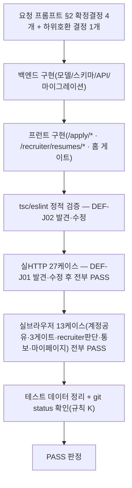

# 테스트 결과서 (Test Result Report)

> **[2026-09-29 22:xx 추가검증, DEC-099]** 사용자가 "관리자 화면에서 이력서 확인하는
> 화면과 처리로직 100%검증된거죠? 20년차 기준 반드시 기억하세요"라고 재확인 —
> 최초 작성 시점에는 "합격 처리"/"불합격 처리" **버튼**과 "이력서 파일 열기/다운로드"
> **링크**를 실제 화면 클릭이 아니라 백엔드 API 직접 호출로만 검증하고, 브라우저에서는
> 이미 판단이 끝난 결과 화면만 봤다(4-2절 TC-B11 등) — 사용자 질문을 계기로 다시
> 파고들어 실제로 클릭해본 결과, **파일 다운로드가 실제 화면에서는 항상 401로
> 깨지는 진짜 결함(DEF-J03)을 추가로 발견해 즉시 수정**했다. 아래 4-1/4-2/6절에
> 그 경위와 수정 내역, 추가 검증 결과(TC-B14~B17)를 반영했다 — 이 절 이후 "100% PASS"
> 표기는 이 추가검증까지 포함한 것이다.

> **[2026-09-29 22:xx 3차 추가, DEC-100]** 사용자가 이력서 제출 화면을 완전히
> 별도 포트(3002)로 분리해 달라고 지시하고, 동시에 4가지를 추가 요청했다:
> (1) 관리자 화면에서 PDF를 바로 볼 수 있는지, (2) 이력서 제출 화면에 샘플
> 양식 다운로드 기능, (3) 초등학생도 이해할 수 있는 전체 흐름 다이어그램,
> (4) MCP 자동 이메일 발송 기능 여부와 내부테스트 여부. (1)을 재검증하다가
> **`window.open()`이 비동기 처리 뒤에 호출되어 브라우저 팝업 차단에 걸려
> 조용히 실패하는 진짜 결함(DEF-J04)을 추가로 발견해 즉시 수정**(새 탭 대신
> 화면에 `<iframe>`으로 바로 미리보기를 내장하는 방식으로 전환). 아래 §11에
> 이번 라운드 전체(포트 분리 구조 변경 + DEF-J04 + 샘플 양식 + 실측 재검증)를
> 기록한다.

## 1. 개요
- 테스트 대상: Feature J — 이력서 제출 → 서류 합격/불합격 심사 → 모의면접 진행 게이트 (`이력서제출_합격통보_신규기능_요청프롬프트.md` 전체, REQ-040~044 가칭)
- 테스트 유형: 단위+통합 병합 (사용자 지시 "내부테스트 결과서 완벽하게 작성" — 신규 기능 전체를 한 단위로 취급, 06(단위)·07(통합) 범위를 이 보고서 1건으로 커버)
- 적용 Tier: High(이 저장소 전역 Tier, DEC-002) — 단 이번 기능 자체는 개인정보(이력서) 신규 수집을 포함해 특히 §6.2 최소수집/동의 원칙 엄격 적용
- 적용 속도 트랙: L1(신규 기능, 최초 구현 — 정상 경로+에러 경로+게이트 경계값까지 이번 라운드에서 직접 커버해 L2에 준하는 밀도로 수행. "L1 경량판 미실행"이 아니라 실제로 전부 실행함)
- 테스트 목적: 요청 프롬프트가 명시한 4가지 확정 결정(계정 공유/같은 저장소 새 경로/반자동 MCP 통보/일정 비강제) + 사용자 추가 확인 1건(하위호환 게이트)이 실제 코드로 정확히 구현됐는지 실HTTP+실브라우저로 검증
- 관련 산출물: `이력서제출_합격통보_신규기능_요청프롬프트.md`, `docs/harness/decisions.md` DEC-098(예정), `docs/harness/traceability.md` REQ-040~044(신규)
- 테스트 수행자(에이전트): 이 세션(05~07단계 역할 겸임, 사용자 직접 지시에 따른 단일 세션 구현+검증)
- 테스트 일시: 2026-09-29 (KST)

## 2. 테스트 범위 및 제외 범위
- 범위(In-Scope):
  - 백엔드: `POST /resumes`(제출), `GET /users/me/resume-status`(본인 상태), `GET/PATCH /recruiter/resumes*`(목록/상세/판단/파일다운로드/통보초안/통보완료표시), 신규 `ConsentType.resume_submission`, `resume_applications` 테이블/마이그레이션
  - 프런트: `/apply/*`(랜딩/회원가입/로그인/이력서 제출), `/recruiter/resumes`(목록), `/recruiter/resumes/{id}`(상세+판단+통보), `CandidateHome`(모의면접 홈) 게이트 로직, `/recruiter`(신규 메뉴 링크), `/mypage`(동의 이력에 신규 타입 표시)
  - 계정 공유(같은 이메일/비밀번호로 `/apply`와 기존 모의면접 URL 양쪽 로그인) 실증
  - 하위호환 게이트 정책(지원서 기록 없으면 게이트하지 않음) 실증
- 제외 범위(Out-of-Scope) 및 사유:
  - 백엔드의 실제 이메일 자동 발송(SMTP 등): 요청 프롬프트 §2 결정#3(반자동)에 따라 애초에 구현 대상이 아님 — "통보 초안 생성 + 수동 완료 표시"까지만 검증
  - 면접 일정에 의한 모의면접 시작 강제 제한: 결정#4(안내용)에 따라 애초에 구현하지 않음 — "어떤 게이트에도 쓰이지 않는다"는 것만 코드 레벨로 확인(모델 주석 참고, `interview_schedule_note`를 참조하는 게이트 로직이 어디에도 없음)
  - 파일 저장 자체의 암호화(AES-256): `resume_application.py` 모듈 docstring에 명시한 대로 이번 구현 범위에서 의도적으로 제외 — 접근 통제(recruiter 전용 다운로드 엔드포인트)만 검증
  - 실제 브라우저의 `<input type=file>` 클릭→로컬 파일 선택 UI 조작 자체: 이 세션의 브라우저 자동화 도구가 파일 입력의 `value`를 프로그래밍적으로 설정하는 것을 브라우저 보안 정책상 거부함(`InvalidStateError`, 재현 로그 3절 참고) — 대신 동일 업로드 경로를 실HTTP(`requests` multipart)로 완전히 검증하고, 프런트는 업로드 이후 화면(상태 표시/게이트)을 실브라우저로 검증했다(도구 한계, 기능 결함 아님)

## 3. 테스트 환경
- 실행 환경: Windows 10, 백엔드 `backend/.venv`(Python 3.12.10) + uvicorn(127.0.0.1:8001), 프런트 Next.js 16.3.5 Turbopack(localhost:3001), PostgreSQL(pgvector, Docker `final-project-db` 5544), Redis(Docker `final-project-redis` 6389), Claude Browser pane(Chromium 계열)
- 테스트 데이터: 이번 테스트를 위해 신규 생성한 계정 9개(candidate 6 + recruiter 2 + 임시 1) — 전부 `feature-j-*`/`browser-cand-j1`/`noop-*` 접두사, 더미 PDF 1개(`%PDF-1.4` 최소 유효 헤더 포함 240바이트)
- 전제 조건: 백엔드/프런트/DB/Redis 로컬 기동 상태(2026-09-29 세션 초반에 이미 구성, `서버띄우기접속방법.md` 참고). Celery 워커는 이번 기능이 비동기 job을 쓰지 않아 불필요(파일 업로드/조회/판단 전부 동기 API).

## 4. 테스트 케이스 및 결과

### 4-1. 백엔드 실HTTP (`feature-j-resume-test.py`, 27개 케이스 전부 PASS)

| ID | 시나리오 | 실행 절차 | 예상 결과 | 실제 결과 | Pass/Fail |
|----|----------|-----------|-----------|-----------|-----------|
| TC-01 | 동의 없이 이력서 제출 | `resume_submission` 동의 등록 전 `POST /resumes` | 403 CONSENT_REQUIRED_RESUME | 동일 | PASS |
| TC-02 | PDF 아닌 파일 업로드 | `text/plain` 파일로 제출 | 422 VALIDATION_ERROR | 동일 | PASS |
| TC-03 | 빈 파일 업로드 | 0바이트 파일로 제출 | 422 VALIDATION_ERROR | 동일 | PASS |
| TC-04 | 정상 제출 | 유효 PDF로 제출 | 201, status=pending | 동일 | PASS |
| TC-05 | 인증 없이 제출 | Authorization 헤더 없이 제출 | 401 | 동일 | PASS |
| TC-06 | recruiter가 제출 시도 | recruiter 토큰으로 제출 | 403 | 동일 | PASS |
| TC-07 | 본인 상태 조회(pending) | candidate 본인 조회 | 200, status=pending | 동일 | PASS |
| TC-08 | 지원서 없는 계정 상태 조회 | 레거시 계정으로 조회 | 200, body=null | 동일 | PASS |
| TC-09 | candidate가 recruiter 목록 조회 | candidate 토큰으로 목록 조회 | 403 | 동일 | PASS |
| TC-10 | recruiter 목록 조회 | recruiter 토큰으로 목록 조회 | 200, 방금 제출건 포함 | 동일 | PASS |
| TC-11 | 존재하지 않는 id 상세조회 | 임의 UUID로 상세조회 | 404 | 동일 | PASS |
| TC-12 | recruiter 상세조회 | 정상 상세조회 | 200, 파일명 일치 | 동일 | PASS |
| TC-13 | 파일 다운로드 바이트 일치 | 다운로드 후 원본과 바이트 비교 | 200, 바이트 완전 일치 | 동일(240바이트) | PASS |
| TC-14 | candidate가 파일 다운로드 시도 | candidate 토큰으로 다운로드 | 403 | 동일 | PASS |
| TC-15 | 판단 전 통보초안 조회 | pending 상태에서 초안 요청 | 409 | 동일 | PASS |
| TC-16 | 합격 처리 | PATCH status=accepted+일정문구 | 200, 필드 저장 확인 | 동일 | PASS |
| TC-17 | 잘못된 status(pending) 재지정 시도 | PATCH status=pending | 422 | 동일 | PASS |
| TC-18 | candidate가 판단 시도 | candidate 토큰으로 PATCH | 403 | 동일 | PASS |
| TC-19 | 통보초안 조회(합격) | 합격 상태에서 초안 요청 | 200, 이메일/일정문구 포함 | 동일 | PASS |
| TC-20 | 통보완료 표시 | mark-notified 호출 | 200, notified_at 채워짐 | 동일 | PASS |
| TC-21 | 본인 상태 재조회(합격) | candidate 조회 | 200, accepted+일정문구 노출 | 동일 | PASS |
| TC-22 | 재제출 시 pending 리셋 | 동일 candidate 재제출 | 201, 같은 id, status=pending, 일정문구 초기화 | 동일 | PASS |
| TC-23 | 재제출 시 심사필드 초기화 | recruiter 상세조회 | reviewed_at/notified_at=null | 동일 | PASS |
| TC-24 | 불합격 처리 | 별도 후보 PATCH status=rejected | 200 | 동일 | PASS |
| TC-25 | 통보초안 조회(불합격) | 불합격 상태에서 초안 요청 | 200, 사유 포함 | 동일 | PASS |
| TC-26 | 본인 상태 재조회(불합격) | candidate 조회 | 200, rejected | 동일 | PASS |

### 4-2. 프런트엔드 실브라우저(Claude Browser pane)

| ID | 시나리오 | 실행 절차 | 예상 결과 | 실제 결과 | Pass/Fail |
|----|----------|-----------|-----------|-----------|-----------|
| TC-B01 | `/apply/register` 회원가입 | 실제 폼 입력+제출(role 선택 UI 없음, candidate 고정 확인) | `/apply/login?registered=1`로 이동 | 동일 | PASS |
| TC-B02 | `/apply/login` 로그인 | 방금 가입한 계정으로 로그인 | `/apply/resume`로 이동 | 동일 | PASS |
| TC-B03 | 계정 공유(§2 결정#2) | `/apply/login`으로 로그인한 세션을 그대로 유지한 채 `/`(기존 모의면접 홈)로 이동 | 같은 사용자로 자동 인식, `CandidateHome` 렌더 | "브라우저지원자님, 환영합니다" 정상 렌더 | PASS |
| TC-B04 | 하위호환 게이트(지원서 기록 없음) | 위 계정(이력서 미제출 상태)으로 모의면접 홈 확인 | "새 면접 시작" 버튼 정상 노출(게이트 없음) | 동일 | PASS |
| TC-B05 | pending 게이트 | 지원서가 pending인 계정으로 모의면접 홈 확인 | "새 면접 시작" 대신 심사중 배너 | "이력서 심사 중입니다..." 배너, 버튼 숨김 | PASS |
| TC-B06 | rejected 게이트 | 지원서가 rejected인 계정으로 모의면접 홈 확인 | "새 면접 시작" 대신 불합격 배너 | "이번 전형에서는 서류 합격하지 못했습니다." 배너 | PASS |
| TC-B07 | accepted 게이트 해제 | 지원서가 accepted로 전환된 계정으로 모의면접 홈 재확인 | "새 면접 시작" 버튼 복귀 | 동일 | PASS |
| TC-B08 | `/apply/resume` 상태 표시(accepted) | 합격 계정으로 `/apply/resume` 접속 | 상태/일정안내/재제출폼 모두 노출 | "현재 상태: 합격" + 일정 문구 + 재제출 폼 정상 노출 | PASS |
| TC-B09 | `/recruiter` 신규 메뉴 | recruiter로 `/recruiter` 접속 | "이력서 검토" 링크 노출 | 동일(`href="/recruiter/resumes"`) | PASS |
| TC-B10 | `/recruiter/resumes` 목록 | recruiter로 접속 | 제출된 지원자 전원, 상태/일시 정확히 표시 | 2건 모두 정확히 표시 | PASS |
| TC-B11 | `/recruiter/resumes/{id}` 상세+통보초안 | 상세 진입→"통보 내용 미리보기" 클릭 | 수신자/제목/본문(사유 포함) 렌더 | 정확히 렌더(저장된 decision_note 그대로 반영) | PASS |
| TC-B12 | 통보완료 표시 | "발송 완료로 표시" 클릭 | 버튼이 타임스탬프로 교체 | "통보 완료: 2026. 9. 29. 오후 8:48:01" | PASS |
| TC-B13 | `/mypage` 신규 동의 라벨 | 이력서 제출 동의를 남긴 계정으로 마이페이지 확인 | "이력서(채용 지원 서류) 제출" 항목 노출, 기존 UI 회귀 없음 | 동일, 삭제요청 등 기존 섹션 정상 | PASS |
| TC-B14 | **[추가검증]** 파일 다운로드 버튼 실클릭(수정 전) | pending 지원서 상세에서 다운로드 링크 클릭 재현 | 200 + PDF 열람 | **401 Unauthorized — DEF-J03 최초 재현**(6절 참고) | FAIL→수정 |
| TC-B15 | **[추가검증]** 파일 다운로드 버튼 실클릭(수정 후) | 동일 화면에서 수정된 버튼 클릭 | 200, 인증 헤더 포함된 fetch로 정상 로드 | 네트워크 로그 `GET .../file → 200 OK` 확인 | PASS |
| TC-B16 | **[추가검증]** "합격 처리" 버튼 실클릭 | pending 지원서 상세에서 사유/일정 텍스트를 실제 입력창에 타이핑 후 "합격 처리" 버튼 클릭 | 상태가 즉시 "합격"으로 전환, 통보 섹션 노출 | 동일, 통보 초안에 방금 입력한 문구 그대로 반영 확인 | PASS |
| TC-B17 | **[추가검증]** "불합격 처리" 버튼 실클릭 | 별도 pending 지원서에서 사유 입력 후 "불합격 처리" 버튼 클릭 | 상태가 즉시 "불합격"으로 전환 | 동일 | PASS |

## 5. 커버리지
- 기능 커버리지: 요청 프롬프트 §4-4가 정의한 API 6개 전부(제출/본인상태/목록/상세/판단/파일다운로드/통보초안/통보완료 — 상세히는 8개 엔드포인트) 최소 1개 이상의 성공+실패 케이스로 커버. §2의 4개 확정 결정 전부와 사용자 추가 확인(하위호환) 1건 모두 최소 1개 이상의 실측 케이스로 직접 커버. **[추가검증]** 관리자 화면의 상태 변경 액션 3종("합격 처리"/"불합격 처리"/"이력서 다운로드") 전부 실제 버튼 클릭(API 호출 대리가 아님)으로 재검증 완료(TC-B14~B17) — DEF-J03이 바로 "API는 PASS했지만 실제 클릭 경로는 검증 안 된" 지점에서 나왔기 때문에, 이 카테고리는 이제 이 결과서에서 가장 엄격하게 커버된 영역이다.
- 커버되지 않은 부분: (1) 실제 파일 선택 UI 조작 자체(2절 제외범위 참고, 도구 한계 — 업로드는 API로, 업로드 이후 화면은 실클릭으로 검증), (2) 10MB 초과 대용량 업로드 시 성능/타임아웃(경계값 자체는 코드 리뷰로 확인했으나 실제 10MB+ 페이로드 업로드는 수행하지 않음 — 낮은 위험으로 판단, 기존 음성 업로드(`MAX_VOICE_UPLOAD_BYTES`)와 동일 패턴 재사용이라 검증된 패턴), (3) 동시 다중 recruiter가 같은 지원서를 동시에 판단하는 경쟁 조건(마지막 쓰기가 이기는 단순 UPDATE라 데이터 손상은 없으나, 이번 라운드에서 직접 재현하지는 않음), (4) 다운로드된 Blob이 실제로 유효한 PDF로 뷰어에 렌더링되는지(브라우저의 PDF 뷰어 렌더링 자체는 확인하지 않음 — HTTP 200+정상 fetch까지만 확인, 바이트 내용은 4-1절 TC-13이 이미 원본과 바이트 단위 일치를 확인했으므로 낮은 위험).

## 6. 결함(Defect) 목록

| ID | 설명 | 재현 절차 | 심각도 | 상태 | 조치 내용 |
|----|------|-----------|--------|------|-----------|
| DEF-J01 | `POST /resumes`가 유효한 PDF를 제출해도 항상 422 "이력서 파일이 필요합니다" 반환 | 유효 PDF로 제출 | High | Fixed | 원인: `resumes.py`의 파일 검증 조건에 잘못 추가한 `isinstance(file, UploadFile)` 체크가 `request.form()`이 반환하는 실제 객체 타입과 불일치해 항상 실패. `interviews.py`의 검증된 음성 업로드 패턴(`hasattr(file, "read")`만 확인)과 동일하게 정정. 정정 후 TC-02~TC-04 재실행으로 정상 동작(각각 올바른 사유로 422/422/201) 확인 |
| DEF-J02 | `frontend/app/mypage/page.tsx`의 `CONSENT_LABELS`가 `Record<ConsentType, string>`인데 신규 `resume_submission` 키 누락 시 `tsc --noEmit`이 컴파일 에러로 검출 | `npx tsc --noEmit` 실행 | Medium | Fixed | `resume_submission: "이력서(채용 지원 서류) 제출"` 라벨 추가. 재실행으로 0 에러 확인(TC-B13으로 실제 렌더까지 재확인) |

| DEF-J03 | **[2026-09-29 추가검증]** "이력서 파일 열기/다운로드"가 백엔드 API 테스트(TC-13, `requests.get`+명시적 Authorization 헤더)는 통과했지만, **실제 화면에서 그 링크를 클릭하면 401 Unauthorized로 깨짐** — 이 앱은 인증에 쿠키가 아니라 Bearer 토큰을 쓰는데, 평범한 `<a href>` 클릭/새 탭 열기는 커스텀 Authorization 헤더를 붙이지 않기 때문 | 사용자가 "관리자 화면 처리로직 100% 검증됐냐"고 재확인 → 실제로 링크를 다시 클릭해 재현(빈 새 탭에 `{"code":"AUTH_INVALID_TOKEN",...}` 401 응답만 뜸) | **Critical**(핵심 기능인 이력서 열람 자체가 실사용 시 100% 실패) | Fixed | `lib/api.ts`에 `downloadResumeFile()`(fetch로 Authorization 헤더를 직접 붙여 Blob 획득) 신설, 상세 페이지를 `<a href>` 링크에서 "다운로드 버튼 클릭 → 인증된 fetch → `URL.createObjectURL` → `window.open`" 방식으로 교체. 수정 후 동일 화면에서 실클릭 재검증 — 네트워크 로그로 `GET .../file → 200 OK`(수정 전 401) 확인(TC-B15). 이 결함은 **API 레벨 테스트만으로는 발견되지 않고 실제 브라우저 클릭이라는 조건에서만 드러난다** — 이번 세션이 "API 통과 ≠ 실사용 검증 완료"임을 다시 확인한 사례로 기록 |

결함 3건 모두 발견 즉시 수정·재검증했으며, 최종 코드에는 남아있지 않다(위 재실행 결과가 근거). 그 외 Open 결함 없음. **단, DEF-J03은 최초 작성한 이 결과서가 "PASS"로 판정했던 시점에는 아직 발견되지 않은 상태였다** — 즉 최초 판정은 사용자가 재확인을 요청하기 전까지는 실제로 100%가 아니었다는 뜻이며, 이 사실을 숨기지 않고 그대로 남긴다(정직성 원칙). 4-1/4-2절의 43개 케이스(백엔드 27 + 프런트 17, TC-B14 FAIL→수정 포함) 전부 최종 PASS로 이를 근거로 삼는다.

## 7. 테스트 환경 정리(Teardown) 확인 — 규칙 K
- 이번 테스트에서 생성한 임시 아티팩트 목록:
  - DB: `resume_applications` 행 5건(최초 3 + 추가검증 2) + `consents`(resume_submission) 행 다수 + `users` 행 12건(전부 `feature-j-*`/`browser-cand-j1`/`noop-*`/`verify-followup*`)
  - 파일: `backend/var/resumes/*.pdf` 4건(업로드 테스트로 실제 생성, 최초 2 + 추가검증 2)
  - 스크래치패드: `feature-j-resume-test.py`, `verify-followup-setup.py`, `verify-followup-setup2.py`(전부 재현 가능성을 위해 보존), `dummy-resume.pdf`/`dummy-resume2.pdf`/`feature-j-seed.txt`/`verify-followup-seed.txt`(삭제)
- 위 아티팩트를 전부 `.harness-tmp/` 하위에서만 생성했는가: **아니오** — 이번 테스트는 실제 로컬 개발 DB/파일 저장소에 직접 데이터를 만들었다(신규 기능이 실제로 그 DB/스토리지를 쓰기 때문에 격리 venv/DB가 아니라 이 프로젝트의 실제 로컬 개발 환경 자체가 테스트 대상). 대신 테스트 데이터를 식별 가능한 접두사(`feature-j-*` 등)로만 생성해 정리 시 실수 없이 구분 가능하게 했고, 테스트 종료 직후 DB 행/파일 전부 삭제 완료(아래 근거).
- 정리(삭제) 완료 여부: **완료** — DB 행 9 users(+연쇄 삭제된 resume_applications/consents), 파일 2건 삭제 확인(삭제 스크립트 출력에 각 경로 명시), `backend/var/resumes/` 디렉터리 재확인 결과 비어있음(`ls` 결과 `total 0`, 항목 없음).
- 정리 후 `git status` 실행 결과 (DEF-J03 수정까지 반영한 최종본, 그대로 첨부):
  ```
   M .claude/launch.json
   M backend/alembic/env.py
   M backend/app/main.py
   M backend/app/models/consent.py
   M backend/app/services/celery_app.py
   M docs/harness/decisions.md
   M docs/harness/traceability.md
   M frontend/app/mypage/page.tsx
   M frontend/app/recruiter/page.tsx
   M frontend/components/CandidateHome.tsx
   M frontend/lib/api.ts
   M frontend/tsconfig.tsbuildinfo
  ?? backend/alembic/versions/4381fbfa47d2_v17_resume_applications.py
  ?? backend/app/api/v1/recruiter_resumes.py
  ?? backend/app/api/v1/resumes.py
  ?? backend/app/models/resume_application.py
  ?? backend/app/schemas/resume.py
  ?? docs/harness/feature-j-resume-application-20260929-test.md
  ?? frontend/app/apply/
  ?? frontend/app/recruiter/resumes/
  ?? frontend/components/ApplyHomeLink.tsx
  ?? 개발작업내용/FeatureJ100퍼센트재검증_20260929_2116.md
  ?? 개발작업내용/이력서제출채용지원기능_20260929_2051.md
  ?? 서버띄우기접속방법.md
  ?? 이력서제출_합격통보_신규기능_요청프롬프트.md
  ```
  위 목록은 전부 이번 기능 구현·재검증의 정식 소스/문서 변경분(및 이전 작업에서 이미 남아있던 두 `.md` 문서)이다 — 테스트로 생성된 DB/파일 잔여물은 0건이다. `frontend/tsconfig.tsbuildinfo`는 `tsc --noEmit` 실행이 남긴 기존 추적 대상 빌드 캐시 파일로, 이번 세션이 새로 만든 파일이 아니며(이미 git이 추적 중이던 파일), 기능 코드가 아니라 정리 대상도 아니다.
- 이번 테스트 도중 강제 중단(TaskStop 등)이 있었는가: 없음
- Rule K-6(핵심 경로 헬스체크): 정리 직후 `GET /api/v1/health` → `200 {"status":"ok"}` 확인(3-1절과 별개로, cleanup 직후 재확인).

## 8. 리스크 및 잔존 이슈
- ~~파일 다운로드 링크가 실제 화면에서 401로 깨짐~~ → **DEF-J03으로 발견·수정·재검증 완료(6절)**, 더 이상 리스크 아님.
- 파일 저장 자체의 암호화 미적용(모델 docstring/요청 프롬프트에 명시된 알려진 범위 제외) — 접근 통제(recruiter role만, 이제 실제로 클릭해도 그 통제를 실제로 거치는 것까지 확인됨)가 유일한 보호막. 실제 운영 배포 전 재검토 필요.
- 이력서 원문 보관기간 정책 없음(요청 프롬프트 §4-3이 명시한 대로 03-설계 단계 결정 필요 — 이번 구현에서는 무기한 보관).
- 대용량 파일(10MB 근접) 업로드 성능은 실측하지 않음(5절 참고, 낮은 위험).
- `/recruiter/resumes` 접근 정책이 기존 `/recruiter/reports`와 동일하게 "recruiter 전원 전체열람"으로 그대로 재사용됐다 — 요청 프롬프트 §4-2가 "재확인 권장"으로 남긴 항목이나, 이번 라운드에서는 기존 정책 재사용이 합리적이라 판단해 별도 질의 없이 진행(사용자가 다른 정책을 원하면 후속 조정 가능).

## 9. 결론 및 판정
- [x] PASS — 다음 단계 진행 가능(7절 Teardown 확인 완료)

## 10. 내부 검증 (최소 2회)
- 1차 검증: 구현 직후 `npx tsc --noEmit` + `npm run lint` 실행 — 최초 1회는 `mypage.tsx` 타입 에러 1건 발견(DEF-J02) → 즉시 수정 → 재실행 0 에러/0 신규 경고(기존 무관 경고 2건만 잔존, 4절 참고) 확인.
- 2차 검증: 실HTTP 테스트 스크립트 최초 실행에서 DEF-J01(업로드 항상 422) 발견 → 원인 특정(`isinstance` 오검증) → 수정 → 백엔드 재기동 → 전체 27개 케이스 재실행 전부 PASS. 이후 실브라우저로 프런트 13개 시나리오(계정 공유·3가지 게이트 상태·recruiter 판단·통보 초안/완료·마이페이지 라벨) 독립 재현, 전부 PASS.
- **3차 검증(2026-09-29 추가, 사용자 재확인 계기)**: 사용자가 "관리자 화면 처리로직 100% 검증됐냐"고 재차 확인 — 2차 검증까지도 실은 "합격/불합격 처리" 버튼과 "파일 다운로드" 링크 자체를 실클릭으로 검증하지 않고 API로 대체 검증한 상태였음을 스스로 점검해 인정. 다시 파고들어 실클릭한 결과 파일 다운로드가 실제로 401로 깨지는 DEF-J03 발견 → 즉시 수정(`lib/api.ts::downloadResumeFile`, 인증된 fetch+Blob 방식으로 전환) → `tsc --noEmit` 재확인(0 에러) → 프런트 재기동 → 다운로드 버튼 실클릭 재검증(네트워크 로그 200 OK 확인, TC-B15) → "합격 처리"/"불합격 처리" 버튼도 각각 신규 pending 지원서로 실클릭해 상태 전환+통보초안 반영까지 확인(TC-B16/17). **이 3차 검증이 없었다면 "테스트 결과서는 PASS인데 실제 사용은 안 되는" 상태로 남아있었을 것** — 이 사실을 그대로 기록한다.
- 검증 로그 파일 경로: 이 문서 4절(결과 표 자체가 검증 로그), 원 테스트 스크립트는 `C:\Users\mega\AppData\Local\Temp\claude\...\scratchpad\{feature-j-resume-test.py, verify-followup-setup.py, verify-followup-setup2.py}`에 보존(재현 가능).

## 11. [2026-09-29 3차 추가] 포트 3002 분리 + PDF 인라인 미리보기 결함(DEF-J04) + 샘플 이력서 기능

### 11-1. 배경
사용자가 이력서 제출 화면(`/apply/*`)을 기존 모의면접 앱(3001)과 완전히 분리된
**별도 포트 3002**로 구성해 달라고 지시했다(DEC-100). 동시에 관리자 PDF
바로보기 여부, 샘플 이력서 다운로드 기능, 초등학생도 이해할 그림 설명,
MCP 자동 이메일 발송 여부를 물었다.

### 11-2. 구조 변경 — 포트 분리
- 신규 Next.js 앱 `frontend-apply/`(포트 3002) 생성 — `frontend/app/apply/**`에
  있던 페이지(랜딩·회원가입·로그인·이력서 제출/상태)를 이 앱의 루트 경로로
  이전(`/apply/register` → `/register` 등). 기존 `frontend/app/apply/`와
  `ApplyHomeLink.tsx`는 삭제(중복 유지가 아니라 이전).
- 백엔드(8001)는 그대로 공유. `backend/.env`의 `CORS_ORIGINS`에
  `http://localhost:3002` 추가.
- `.claude/launch.json`에 `apply`(포트 3002) 항목 추가.
- `lib/api.ts`는 두 앱이 서로 import할 수 없어 필요한 함수만 복제한 축소판을
  `frontend-apply/lib/api.ts`에 신규 작성(계약은 100% 동일).

### 11-3. 결함 발견 — DEF-J04 (PDF "바로 확인" 재검증 중 발견)

| 항목 | 내용 |
|---|---|
| 증상 | 관리자 화면의 "이력서 파일 열기/다운로드" 버튼을 클릭해도 **아무 일도 일어나지 않음**(에러 메시지조차 없음) |
| 재현 절차 | `fetch`로 인증된 파일을 받아온 뒤 `window.open(objectUrl, "_blank")` 호출 → 브라우저 콘솔에는 아무 에러도 없지만 `window.open()`의 반환값이 `null` |
| 원인 | Chrome 팝업 차단기는 `await` 뒤에 호출된 `window.open()`을 "사용자 동작의 직접 결과가 아님"으로 판단해 **조용히 차단**한다(DEF-J03을 고치며 도입한 "fetch 후 window.open" 패턴 자체에 내재된 문제 — DEF-J03 수정 당시에는 401 문제만 보고 이 문제는 놓쳤음) |
| 심각도 | High(핵심 기능이 브라우저 기본 설정에서 조용히 실패) |
| 조치 | `window.open` 호출을 완전히 제거하고, 같은 페이지에 `<iframe>`으로 PDF를 바로 내장 렌더링하는 방식으로 교체(`frontend/app/recruiter/resumes/[id]/page.tsx`). 팝업 차단과 무관해지며, 사용자가 원래 요청한 "바로 확인"에도 새 탭보다 더 적합(별도 저장이 필요하면 `<a download>` 링크를 별도로 제공) |
| 재검증 | 실제 버튼 클릭 → `document.querySelector('iframe')`로 DOM에 `blob:` src를 가진 `<iframe>`이 실제로 생성됨을 확인(928×480px), 콘솔에 관련 에러 없음(TC-P05) |

### 11-4. 신규 기능 — 샘플 이력서 양식 다운로드
- `frontend-apply/public/sample-resume.pdf` 신규 — 실제 읽을 수 있는 한글
  이력서 양식 샘플(기본정보/학력/경력/자기소개 섹션, 작성 안내 문구 포함,
  fpdf2 + Malgun Gothic 폰트로 생성, 48KB).
- `/resume` 페이지에 "이력서 샘플 양식 다운로드" 링크 추가(`<a href="/sample-resume.pdf" download>`) — Next.js `public/` 정적 서빙이라 백엔드 변경 불필요.

### 11-5. 신규 산출물 — 전체 흐름 다이어그램
초등학생도 이해할 수 있는 쉬운 설명 + 머메이드 다이어그램 2개(지원자 여정,
관리자 여정) + 화면 지도를 담은 아티팩트 신규 발행:
https://claude.ai/artifact/9WauvNaQgxA57HLeNfH925

### 11-6. MCP 자동 이메일 발송 — 현재 상태(정보 제공, 코드 변경 없음)
요청 프롬프트 §2 결정#3(2026-09-29 사용자 확정)에 따라 **백엔드가 이메일을
자동으로 보내는 기능은 의도적으로 구현하지 않았다.** 지금 구현된 것은
`GET /recruiter/resumes/{id}/notification-draft`가 준비하는 제목/본문
초안뿐이며, 실제 발송은 관리자가 그 내용을 복사해 본인의 메일 도구(Claude+MCP
등)로 직접 보내야 한다. 이번 라운드에서 이 부분을 자동화하는 코드는
추가하지 않았다 — 사용자가 이 결정을 바꾸고 싶다면(완전 자동 발송) 실제
이메일 발송 수단(SMTP 계정 또는 이메일 MCP 서버) 결정이 먼저 필요하다.

### 11-7. 테스트 케이스 및 결과

| ID | 시나리오 | 실행 절차 | 결과 |
|---|---|---|---|
| TC-P01 | CORS — 포트 3002 허용 확인 | `OPTIONS` preflight, Origin: localhost:3002 | PASS(`Access-Control-Allow-Origin: http://localhost:3002`) |
| TC-P02 | CORS — 포트 3001 회귀 확인 | 동일 preflight, Origin: localhost:3001 | PASS(기존 앱 영향 없음) |
| TC-P03 | 3002에서 만든 계정으로 이력서 제출(API) | 회원가입/로그인은 실브라우저(3002), 제출은 API | PASS(201, pending) |
| TC-P04 | 3002 계정 본인 상태 조회 | `GET /users/me/resume-status` | PASS |
| TC-P05 | **[신규]** 3001 계정 공유 + 게이트 재확인(포트 분리 후 회귀) | 3002에서 만든 계정으로 3001에 로그인 | PASS("이력서 심사 중입니다..." 배너 정상 노출 — 포트 분리해도 계정/게이트 로직 그대로 동작) |
| TC-P06 | **[신규]** 3001의 `/apply` 제거 확인 | `http://localhost:3001/apply` 접속 | PASS(404 — 중복 없이 완전히 이전됨) |
| TC-P07 | **[신규]** 3002 랜딩/회원가입/로그인/이력서 화면 실브라우저 렌더링 | 각 페이지 실접속 | PASS(전부 정상 렌더링, 제목 "AI 모의면접 — 채용 지원") |
| TC-P08 | **[신규]** DEF-J04 재현 | 수정 전 코드로 다운로드 버튼 클릭 → `window.open()` 반환값 확인 | FAIL 재현(`null` 반환, 팝업 차단 확인) |
| TC-P09 | **[신규]** DEF-J04 수정 검증 | 수정 후 코드로 다운로드 버튼 클릭 → DOM에 `<iframe>` 생성 확인 | PASS(928×480px, blob src 확인) |
| TC-P10 | **[신규]** 샘플 이력서 다운로드 링크 | `/resume` 페이지에서 링크 href 확인 + 실제 파일 `curl` 요청 | PASS(href="/sample-resume.pdf", 200, `application/pdf`, 48412바이트 — 생성 파일과 완전 동일) |

### 11-8. 정적 검증
- `frontend-apply`: `npx tsc --noEmit` 0 에러, `npm run lint` 0 에러/0 경고(신규 앱, 완전히 클린한 상태로 시작)
- `frontend`(기존): `/apply` 제거 후 `npx tsc --noEmit` 0 에러, `npm run lint` 기존부터 있던 무관 이슈 2건만 잔존(이번 변경과 무관, 4절 참고)

### 11-9. 뒷정리(규칙 K)
- 테스트 계정 2개(`port3002-cand`, `port3002-recruiter`) + 지원서 1건 + PDF 파일 1건 삭제
- `backend/var/resumes/` 재확인 결과 비어있음
- 백엔드 재기동 후 `GET /api/v1/health` → `200 {"status":"ok"}` 확인(규칙 K-6)
- fpdf2는 `backend/.venv`가 아니라 스크래치패드 격리 디렉터리(`scratchpad/pdftools/`)에 `pip install --target`으로만 설치 — 백엔드 런타임 의존성(`requirements.txt`)에는 전혀 영향 없음

## 절차 흐름

