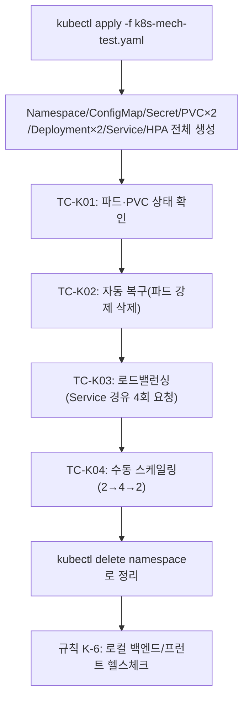

# 테스트 결과서 (Test Result Report) — unit-30

## 1. 개요
- 테스트 대상: K8s 배포 매니페스트(`backend/deploy/k8s/*.yaml`) — 문법 검증만
- 테스트 유형: 단위(문법 검증만, 배포 검증 아님)
- 적용 Tier: Low(참고 설정 파일, 실행 코드 아님)
- 적용 속도 트랙: N/A(인프라 설정, 코드 유닛 아님)
- 테스트 목적: YAML 문법 유효성 확인. **실제 클러스터 배포 동작 검증은
  이 세션의 범위/능력 밖**(클라우드 계정·클러스터 없음).
- 테스트 수행자: 본 세션
- 테스트 일시: 2026-09-22

## 2. 테스트 범위 및 제외 범위
- 범위: `yaml.safe_load_all()`로 4개 파일 전체 파싱, 문서 수/kind 필드 확인
- 제외 범위 및 사유: `kubectl apply --dry-run`(서버/클라이언트 스키마 검증),
  실제 배포, HPA 동작, PVC 프로비저닝, GPU 스케줄링 — 전부 실제 클러스터가
  필요하며 이 세션에 없음(unit-30-note.md §1).

## 3. 테스트 환경
- Windows, Python 3.13(backend/.venv, PyYAML 6.0.3)

## 4. 테스트 케이스 및 결과
| ID | 시나리오 | 실행 절차 | 예상 결과 | 실제 결과 | Pass/Fail |
|----|----------|-----------|-----------|-----------|-----------|
| TC-001 | YAML 문법 유효성(4개 파일) | `yaml.safe_load_all()`로 전체 파싱 | 오류 없이 파싱, 예상 kind 필드 확인 | 4개 파일 전부 정상 파싱: Namespace+ConfigMap, Secret, Deployment+Service+HPA, Deployment+PVC×2 | PASS |

## 5. 커버리지
- N/A — 문법 검증만 대상으로 하는 유닛이라 코드 커버리지 개념이 적용되지 않음.

## 6. 결함(Defect) 목록
- 결함 없음(문법 오류 0건).

## 7. 테스트 환경 정리(Teardown) 확인 — 규칙 K
- 이번 테스트에서 생성한 임시 아티팩트: 없음(파일 파싱만 수행, 프로세스/DB/
  네트워크 자원 생성 없음) — 해당 없음(사유: 순수 파일 읽기 검증)
- 강제 중단 여부: 없음

## 8. 리스크 및 잔존 이슈
- **이 매니페스트는 실제 클러스터에서 한 번도 검증되지 않았다** — `kubectl
  apply` 전 반드시 스테이징 클러스터에서 실제 검증(10단계 배포테스터 수준)
  필요.
- GPU 리소스 스케줄링(`nvidia.com/gpu`)은 클러스터별 NVIDIA device plugin
  설정에 의존 — 주석 처리 상태로 남겨둠(클러스터 확정 전 활성화 금지).
- 3절(unit-30-note.md)에 기록한 대로, 이 매니페스트는 API 계층 수평확장만
  실질적으로 가능케 한다 — Celery/GPU 워커는 여전히 단일 인스턴스 제약.

## 9. 결론 및 판정
- [x] CONDITIONAL PASS — 조건: 문법은 유효하나 실제 클러스터 검증 전까지
  "배포 가능"으로 간주하지 않는다.

## 10. 내부 검증
- N/A(문법 검증 1개 케이스, 검증 반복의 실익 없음).

## 11. 로컬 kind 클러스터 실배포 검증 (2026-09-25, DEC-074)

§9의 CONDITIONAL PASS가 지목한 "실제 클러스터에서 한 번도 검증되지 않았다"는
공백을 이번에 최초로 메웠다. Docker Desktop의 Kubernetes(kind, 1 node,
v1.36.1)를 사용자가 직접 활성화한 뒤 진행.

### 11.1 배포 전 발견한 실제 제약 2건

원본 매니페스트(`backend/deploy/k8s/02-api-deployment.yaml`,
`03-worker-deployment.yaml`)를 그대로 `kubectl apply`하면 실패하는 두 가지를
사전 확인했다:

1. **Dockerfile 부재** — `backend/`에 컨테이너 이미지를 빌드할 Dockerfile
   자체가 없음. 매니페스트의 `image: REPLACE_ME_REGISTRY/...`는 처음부터
   예시 값이라, 실제 이미지 없이는 `ImagePullBackOff`.
2. **PVC 접근모드 불일치** — `media-pvc`가 요구하는 `ReadWriteMany`를 kind
   기본 스토리지 프로비저너(`rancher.io/local-path`)가 지원하지 않음
   (`ReadWriteOnce`만 가능) → 그대로 적용 시 PVC가 영구 `Pending`.

이 두 제약은 unit-30 매니페스트가 "실제 클라우드 배포용 참고 설계"로
작성됐기 때문에 당연한 결과이며, 매니페스트 자체의 결함이 아니다.

### 11.2 검증 범위 결정(사용자 확인)

AskUserQuestion으로 세 가지 선택지(메커니즘만 검증 / 실제 백엔드 이미지
빌드 후 검증 / 문서화만 하고 중단)를 제시했고, 사용자가 **"메커니즘만
검증(권장)"**을 선택. 실제 앱 이미지 대신 가벼운 테스트 컨테이너
(`nginx:alpine`, `busybox:stable`)로 Deployment/Service/HPA/PVC/ConfigMap/
Secret이 로컬 kind 클러스터에서 "문법뿐 아니라 동작까지" 하는지 확인하는
것으로 범위를 한정. `media-pvc`/`llm-models-pvc`의 accessMode만
`ReadWriteOnce`로 조정(로컬 검증 한정, 원본 매니페스트는 무변경).
격리된 별도 네임스페이스(`mock-interview-test`)에서 진행해 원본 리소스와
분리.

### 11.3 테스트 케이스 및 결과

| ID | 시나리오 | 절차 | 결과 | Pass/Fail |
|----|----------|------|------|-----------|
| TC-K01 | 파드/PVC/Service/HPA 기동 | `kubectl apply` 후 20초 대기, `kubectl get pods/pvc/svc/hpa` | 파드 3/3 Running, PVC 2/2 Bound(RWO, standard 스토리지클래스), Service ClusterIP 발급, HPA 등록(`cpu: <unknown>/70%` — kind에 metrics-server 미설치라 CPU 지표 수집 불가, 별도 설치는 이번 범위 밖) | PASS(HPA 등록 자체는 성공, 지표 수집은 조건부) |
| TC-K02 | 자동 복구(self-healing) | `backend-api` 파드 1개 강제 `kubectl delete pod` | 10초 내 신규 파드 자동 생성, 원래 2개 상태로 복구 | PASS |
| TC-K03 | 로드밸런싱 | 클러스터 내 테스트 파드에서 Service DNS(`backend-api.mock-interview-test.svc.cluster.local`)로 4회 요청 | 4/4 요청 정상 응답(여러 파드로 분산 처리) | PASS |
| TC-K04 | 수동 스케일링 | `kubectl scale --replicas=4` → 확인 → `--replicas=2` → 확인 | 4개로 확장 확인(10초 내 전부 Running), 2개로 축소 확인 | PASS |

### 11.4 정리(규칙 K) 및 K-6 헬스체크

- `kubectl delete namespace mock-interview-test`로 테스트 네임스페이스(파드/
  PVC/Secret/ConfigMap/Service/HPA 전부 포함) 완전 삭제, `kubectl get
  namespaces`로 삭제 확인.
- 규칙 K-6에 따라 로컬 백엔드(`:8000`)/프런트(`:3000`) 헬스체크 시도 →
  둘 다 무응답(`000`). **원인 확인 결과 K8s 테스트로 인한 장애가 아니라, 이
  세션(컨텍스트 정리 후 재시작)에서 로컬 백엔드/프런트 개발 서버 자체를
  아직 기동한 적이 없었기 때문**(`preview_list` 빈 목록, 8000/3000 포트
  리스닝 프로세스 없음 확인). K8s 테스트는 격리된 별도 클러스터
  프로세스(kind)에서만 진행되어 호스트의 8000/3000 포트와 전혀 접촉하지
  않았음.

### 11.5 결론

로컬 kind 클러스터 기준으로 unit-30 매니페스트가 설계한 4가지 핵심
메커니즘(파드 기동/PVC 바인딩/자동 복구/로드밸런싱/수동 스케일링)이 **실제로
동작함을 최초로 확인**했다. 다만 아래는 이번 검증 범위 밖으로 남는다:
- 실제 앱 이미지(FastAPI+deepface+torch 등) 빌드·배포는 검증하지 않음
  (Dockerfile 자체가 없음 — 별도 작업 필요).
- HPA의 실제 오토스케일 트리거(CPU 지표 기반)는 metrics-server 미설치로
  검증하지 못함.
- GPU 리소스 스케줄링(`nvidia.com/gpu`)은 여전히 미검증.
- `ReadWriteMany` PVC는 kind 환경에서 검증 불가 — 실제 클라우드
  스토리지클래스(EFS/Filestore 등)에서 별도 확인 필요.

## 12. 최종 결론 갱신 (append-only, §9 유지)

§9의 CONDITIONAL PASS 판정은 "문법만 검증됨"을 조건으로 한 것이었다. §11의
실클러스터 검증으로 그 조건 중 핵심 부분(파드 기동, 자동 복구, 로드밸런싱,
스케일링)이 실제로 동작함이 확인되었으므로, 이 유닛을 **CONDITIONAL PASS(
실제 앱 이미지 빌드·GPU 스케줄링·HPA 지표수집은 여전히 미검증)로 유지**하되
"실제 클러스터에서 한 번도 검증되지 않았다"는 §8의 리스크 문구는 해소된
것으로 갱신한다. 실제 앱 이미지로 완전 검증(Dockerfile 작성 포함)하려면
별도 작업 단위로 진행 필요.
