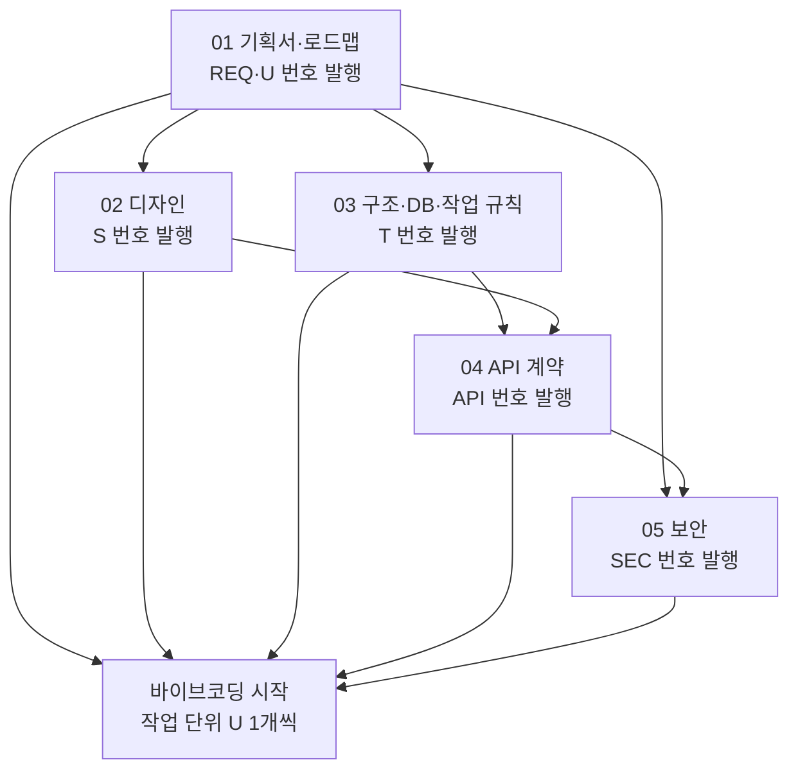
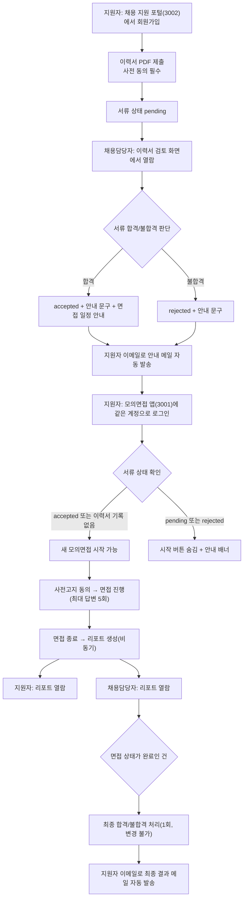
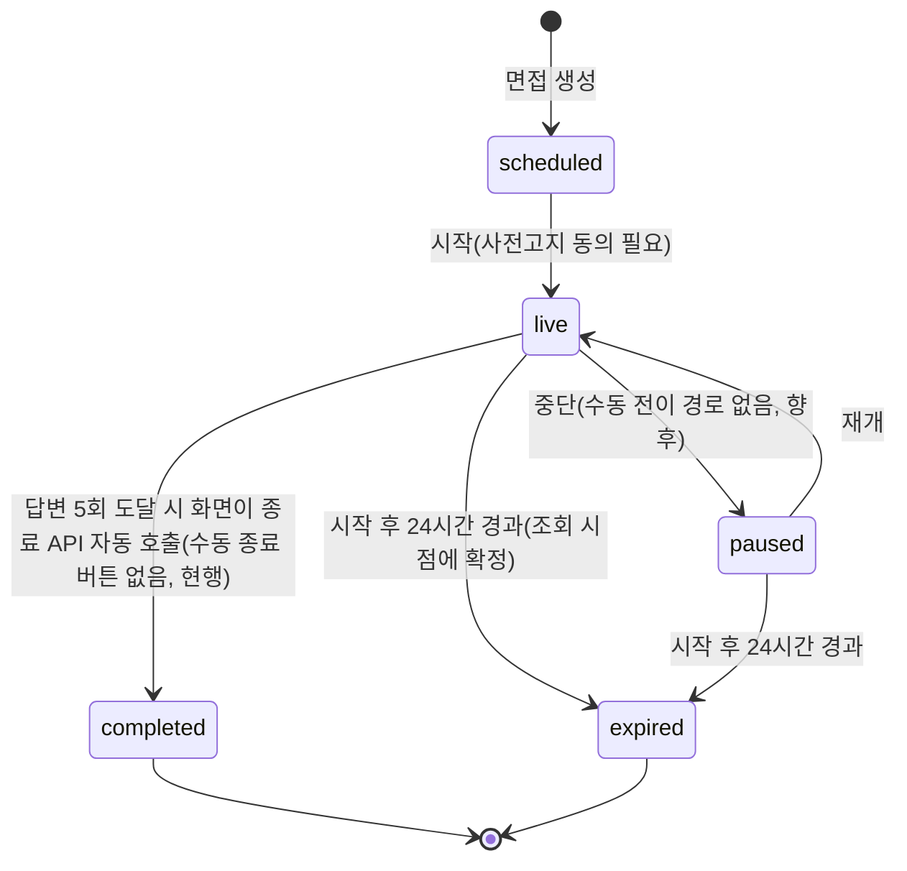
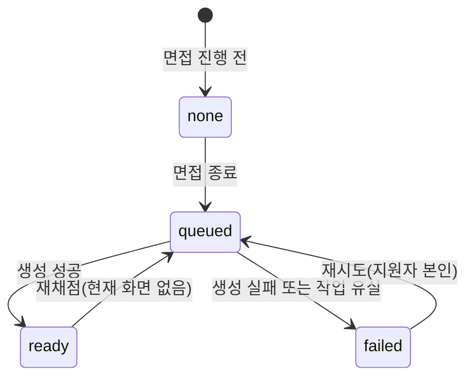
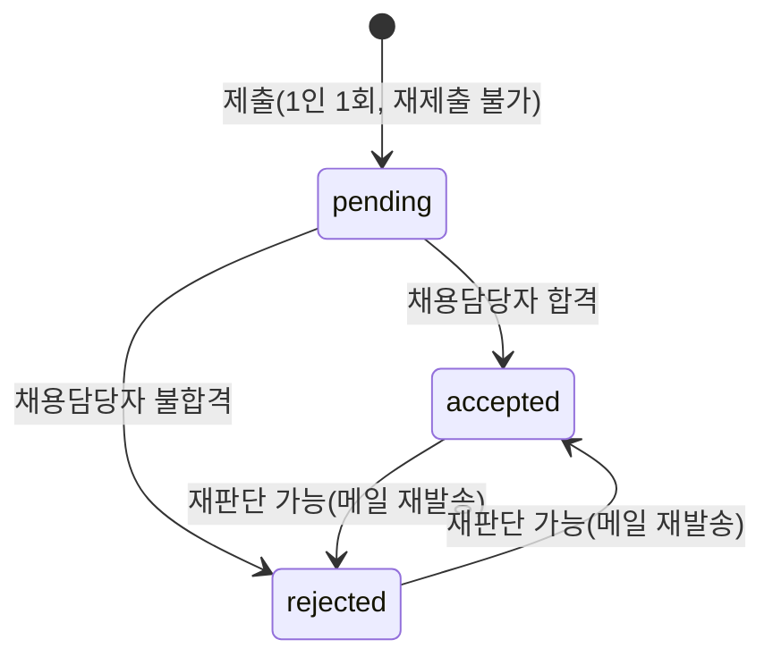
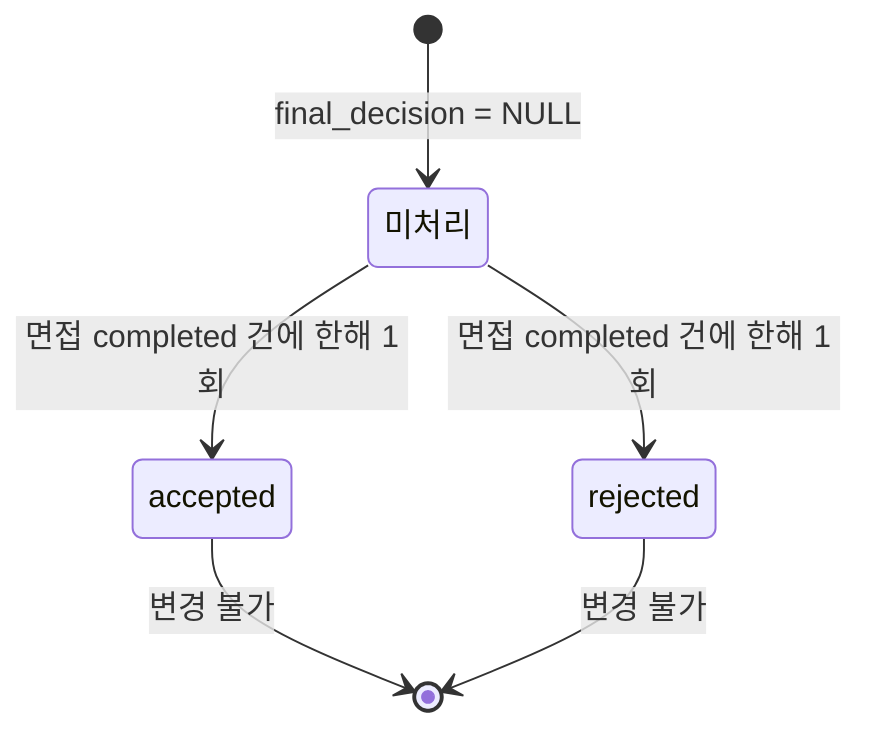
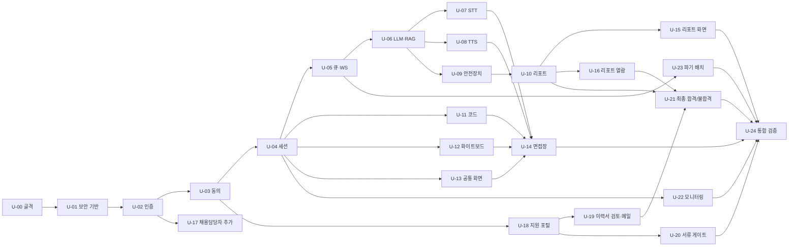

# 01. 전체 기획서 및 구현 로드맵 — AI 모의면접 플랫폼 (재구축용)

| 항목 | 내용 |
|---|---|
| 문서 ID | SPEC-01 |
| 버전 | v1.0 (2026-10-08 KST) |
| 담당 역할 | 기획 담당 (PM이 ID 체계와 통합 검수를 관리) |
| 기준 시스템 | 저장소 `FINAL-PROJECT-NEW`의 `PROD_SCH` 브랜치 최신 상태(커밋 `8e9de33`)를 실제 코드와 대조해 작성 |
| 이 문서의 독자 | 새 프로젝트를 바이브코딩으로 만들 **AI 코딩 에이전트**와 사람 개발자 |
| 목적 | 이 문서 5개만 읽고도 **현재와 동일한 AI 모의면접 프로그램**을 처음부터 다시 만들 수 있게 한다 |

> **이 문서를 읽는 AI에게**: 아래에 "미정(OPEN-xx)"으로 표시된 항목은 **임의로 정하지 말고 사용자에게 질문**한다. 표에 "필수"라고 적힌 것만 기본 범위이며, "선택"은 사용자가 승인한 경우에만 만든다.

---

## 0. 문서 세트 안내

### 0.1 5개 문서와 읽는 순서

| 번호 | 문서 | 한 줄 설명 |
|---|---|---|
| 01 | 전체 기획서 및 구현 로드맵 (이 문서) | 무엇을 왜 만드는가, 범위, 업무 규칙, 작업 단위와 완료 기준, 교훈 |
| 02 | 디자인 기획서 | 화면 목록, 화면별 상태, 디자인 토큰, 접근성, 고정 문구 |
| 03 | 시스템 구조·DB·AI 작업 규칙 | 구성도, 기술 스택, DB 테이블, 비동기 처리, 실행법, **AI 작업 규칙(CLAUDE.md)** |
| 04 | API 계약서 | 모든 API의 요청/응답/오류, 권한, WebSocket, LLM 출력 계약 |
| 05 | 보안 설계서 | 보안 규칙(SEC-xx), 위협 모델, 현재 프로젝트의 보안 갭과 강화 권고 |

### 0.2 공유 ID 체계 (5개 문서 공통, PM만 변경 가능)

| ID | 의미 | 발행 문서 | 예 |
|---|---|---|---|
| `REQ-nnn` | 기능 요구사항 | 01 | REQ-045 |
| `U-nn` | 구현 작업 단위 | 01 | U-21 |
| `S-nn` | 화면 | 02 | S-10 |
| `T-nn` | DB 테이블 | 03 | T-04 interviews |
| `API-nn` / `WS-nn` | API / WebSocket | 04 | API-52 |
| `SEC-nn` | 보안 규칙 | 05 | SEC-20 |
| `BR-nn` | 업무 규칙 | 01 | BR-05 |
| `OPEN-nn` | 사용자 결정이 필요한 미정 항목 | 01 | OPEN-03 |
| `L-nn` | 교훈 | 01 | L-01 |

> REQ 번호는 기존 프로젝트의 번호를 그대로 유지했다(과거 자료와 대조하기 쉽게 하기 위함). 비어 있는 번호(예: REQ-018~028 일부)는 "제외" 또는 "선택" 항목이다.

### 0.3 범위 등급

| 등급 | 의미 | 기본 처리 |
|---|---|---|
| **A 필수** | 현재 프로그램의 핵심. 이것이 없으면 "같은 프로그램"이 아니다 | 반드시 구현 |
| **B 선택(확장)** | 현재 코드에 구현돼 있지만 사용자가 "임시 기술 검증" 목적으로 승인한 것. 법무·보안 전제가 붙음 | 사용자가 승인한 것만 구현. 기본은 **제외 권장** |
| **C 제외** | 의도적으로 만들지 않기로 한 것 | 만들지 않음 |

---

## 1. 서비스 개요

### 1.1 한 문장 정의
구직자가 시간·장소 제약 없이 **AI 면접관과 텍스트/음성으로 모의면접**을 연습하고, 면접이 끝나면 **STAR 구조 피드백과 루브릭 항목별 점수 리포트**를 받는다. 채용담당자는 **이력서를 심사해 서류 합격/불합격을 통보**하고, 모의면접이 끝난 지원자의 리포트를 열람한 뒤 **최종 합격/불합격을 처리**한다.

### 1.2 사용자와 역할

| 역할 | role 값 | 누가 | 할 수 있는 일 |
|---|---|---|---|
| 지원자 | `candidate` | 구직자 | 이력서 제출, 서류 결과 확인, 모의면접 진행, 본인 리포트 열람, 동의 관리 |
| 채용담당자 | `recruiter` | HR 실무자 | 이력서 검토·서류 판단, 전체 지원자 리포트 열람, 최종 합격/불합격, 루브릭 템플릿 관리, 채용담당자 추가 |
| 운영자 | `admin` | 운영 담당 | 운영 모니터링 화면. **계정 생성 API가 없고 DB에서 직접 만든다** |

### 1.3 핵심 가치
1. 시간·장소 제약 없이 반복 연습
2. LLM 기반 적응형 꼬리질문(지원자 답변에 맞춰 이어서 묻는 질문)
3. STAR 피드백 + 루브릭 점수 + **평가 근거 노출**(어떤 답변이 어떤 항목에 쓰였는지)
4. **AI는 보조 도구, 최종 결정은 사람**이라는 원칙을 화면과 데이터 구조 양쪽에 반영
5. 무료 오픈소스·로컬 서버로 동작(유료 API 필수 아님)

---

## 2. 전체 업무 흐름

### 2.1 End-to-End 흐름

### 2.2 상태 머신

**면접 세션 (`interviews.status`)**

**리포트 (`interviews.report_status`)**

**이력서 (`resume_applications.status`)**

**최종 합격/불합격 (`interviews.final_decision`)**

---

## 3. 범위와 기능 요구사항(REQ)

### 3.1 A 필수 기능

| REQ | 우선 | Feature | 기능 | 핵심 인수 조건 | 화면 | API |
|---|---|---|---|---|---|---|
| REQ-001 | Must | A 인증 | 회원가입/로그인/토큰 갱신/내 정보. **공개 가입은 candidate만** | 중복 이메일 409, 로그인 실패 시 계정 존재 여부 비노출 | S-01 | API-01~04 |
| REQ-047 | Must | A 인증 | 채용담당자 계정 추가(로그인한 recruiter만) | 비로그인 401, 비recruiter 403, 중복 이메일 409 | S-14 | API-05 |
| REQ-002 | Must | B 세션 | 면접 생성·목록·상세·시작·종료 | 상태 전이 위반 409, 타인 세션 403, 목록은 본인 것만 | S-02,S-05 | API-10~14 |
| REQ-013 | Must | B 세션 | 중단/재접속·재개, 24시간 만료 | 만료 410 `SESSION_EXPIRED`, 재개는 live/paused만 | S-02,S-05 | API-12,15 |
| REQ-003 | Must | C 엔진 | 텍스트 질의응답(채팅형) | 텍스트 1~4000자, live 세션만, 202 + 진행상황 WS push | S-05 | API-16,17, WS-01 |
| REQ-004 | Must | C 엔진 | 음성 질의응답(턴제, 실시간 스트리밍 아님) | 음성 파일 25MB 이하, 생체정보 동의 실시간 재검사 | S-05 | API-16 |
| REQ-005 | Must | C 엔진 | 로컬 STT(음성→텍스트) | 한국어, 오디오 원본은 메모리에서만 처리하고 저장 안 함 | S-05 | API-16 |
| REQ-006 | Must | C 엔진 | 로컬 TTS(면접관 음성) | 합성 실패 시 텍스트만 전달(`audio_url=null`) | S-05 | WS-01, MEDIA-01 |
| REQ-007 | Must | C 엔진 | LLM 꼬리질문 + RAG 질문은행 | 오프닝은 질문은행 원문, 출력 품질 가드 + 폴백 | S-05 | API-13,16 |
| REQ-008 | Must | D 코딩 | 코드 에디터 입력·제출·재조회(실행 없음) | 언어 화이트리스트 11종, 내용 20000자 이하 | S-05 | API-20,21 |
| REQ-009 | Must | E 리포트 | STAR 구조 피드백 리포트(비동기 생성) | 생성 중 202, 실패 409 + 재시도 | S-06 | API-18,19 |
| REQ-010 | Must | E 리포트 | 루브릭 항목별 점수(1~5) | 기본 루브릭 3항목(40/30/30), 서버가 LLM 출력을 검증 | S-06,S-10 | API-18,51 |
| REQ-012 | Must | E 리포트 | 평가 근거 노출(답변 번호 + 발췌) | 근거 칩 클릭 시 답변 발췌 표시, 삭제된 원문은 "삭제됨" | S-06,S-10 | API-18,51 |
| REQ-011 | Should | F 채용담당자 | 지원자 리포트 목록·상세 열람 | recruiter 전원이 전체 열람(단일 조직) | S-09,S-10 | API-50,51 |
| REQ-046 | Should | F 채용담당자 | 지원자 리포트 목록의 **면접 상태 필터** | 전체/예정/진행 중/일시중지/완료/만료, 추가 API 호출 없음 | S-09 | API-50 |
| REQ-045 | Must | K 최종 판단 | 면접 완료 건 **최종 합격/불합격** 처리 + 안내 메일 | 완료 건만, 1회만, 변경 불가, 동시 요청 시 1건만 성공, 메일 1회 | S-10 | API-52~54 |
| REQ-014 | Should | F 채용담당자 | 루브릭 템플릿 관리(생성·수정) | 항목 1~20개, 가중치 합 100 | S-15 | API-61~64 |
| REQ-015 | Should | H 부가 | 웹캠 미리보기(서버 미전송, AI 분석 없음) | 영상은 브라우저 안에서만 표시 | S-05 | 없음 |
| REQ-016 | Should | H 부가 | 운영 모니터링(활성 세션 수 등) | admin만, 실측 불가 값은 0과 `notes`로 정직하게 표기 | S-16 | API-70 |
| REQ-017 | Could | H 부가 | 화이트보드 캔버스(저장·재조회, AI 분석 없음) | 스트로크 2000개 이하, 스트로크당 점 5000개 이하 | S-05 | API-22,23 |
| REQ-029 | Must | G 규제 | 생체정보(음성) 수집 별도 동의 | 음성 제출마다 서버가 동의 재조회, 철회 즉시 차단 | S-04,S-05,S-07 | API-30~32 |
| REQ-030 | Must | G 규제 | 동의 철회 + 생체정보 삭제 요청 | 요청 접수 후 1시간 주기 배치 처리, SLA 24시간 | S-07 | API-31,33,34 |
| REQ-031 | Must | G 규제 | AI는 보조 도구, 최종 결정은 사람 | AI 확정 판정 필드 없음, 모든 리포트에 고정 문구 | S-06,S-10 | API-18,51 |
| REQ-032 | Must | G 규제 | AI 면접 사전고지 + 동의 | 끝까지 스크롤해야 체크 가능, 미동의 시 시작 403 | S-04 | API-30,13 |
| REQ-033 | Must | G 규제 | 보관기간 정책 + 자동 파기 | 텍스트 대화·리포트 180일(임시값, 법무 확인 전) | S-04,S-08 | 배치 |
| REQ-034 | Must | G 규제 | 법률 자문 권고 고정 문구 상시 노출 | 모든 리포트 화면 하단 고정 | S-06,S-08,S-10 | 없음(정적 문구) |
| REQ-035 | Must | C 안전 | 프롬프트 인젝션 1차 방어 | system/user 역할 분리, 의심 패턴은 차단 없이 로그 | 해당 없음 | API-16 |
| REQ-036 | Must | C 안전 | LLM 출력 새니타이즈 | 화면은 JSX 텍스트로만 렌더, HTML 해석 금지 | S-05,S-06,S-10 | 해당 없음 |
| REQ-037 | Must | C 안전 | LLM 도구 권한 최소화 | `control` 값은 4종 화이트리스트만 | 해당 없음 | WS-01 |
| REQ-038 | Must | C 안전 | 레이트리밋·큐 상한 | 분당 10회, 큐 50 초과 429, 세션당 답변 5회 | 해당 없음 | API-16 |
| REQ-039 | Must | C 안전 | 시스템 프롬프트 유출 방지 | 유출 의심 문구 탐지 시 폴백 + 로그 | 해당 없음 | API-16,18 |
| REQ-040 | Must | J 이력서 | 채용 지원 포털(별도 앱 3002): 가입·로그인·이력서 PDF 제출 | PDF만, 10MB 이하, 사전 동의 필수 | S-21~25 | API-01,02,30,40 |
| REQ-041 | Must | J 이력서 | 지원자 본인의 심사 상태 확인 + 모의면접 앱 홈의 게이트 | 기록 없으면 게이트 안 함(하위호환) | S-02,S-24 | API-41 |
| REQ-042 | Must | J 이력서 | 채용담당자 이력서 검토·서류 판단 | 합격 시 안내 문구 필수, 불합격 시 안내 문구 필수 | S-11,S-12 | API-55~58 |
| REQ-043 | Must | J 이력서 | 판단 저장 즉시 **안내 메일 자동 발송** + 수동 폴백 | 발송 성공일 때만 `notified_at` 기록 | S-12 | API-58~60 |
| REQ-044 | Must | J 이력서 | 면접 일정 안내(강제력 없는 참고 정보) | 날짜·시·분 선택, 기본값은 오늘+7일(주말이면 월요일) 14:00 | S-12 | API-58 |

### 3.2 B 선택(확장) 기능 — 기본은 제외 권장

> 아래는 현재 코드에 있으나 "법무 검토 없이 개인 PC 기술 검증용"으로 승인된 것들이다. 새 프로젝트의 **1차 범위에서는 만들지 않는 것을 권장**하며, 만들려면 사용자 승인(OPEN-01)이 필요하다.

| REQ | 기능 | 위험/전제 | API |
|---|---|---|---|
| REQ-051 | STT 실시간 미리보기(녹음 중 4초마다 텍스트 갱신) | 최종 제출 경로와 분리, 별도 레이트리밋 분당 20회 | API-80 |
| REQ-019 | 음성 운율(Prosody) 분석 | 생체정보 파생 데이터, 삭제 요청 시 함께 삭제 필요 | API-16 내부 |
| REQ-018 | 웹캠 정지 이미지 표정 감정분석(DeepFace) | **EU AI Act·생체정보 규제 리스크. 채용 평가에 연결 금지** | API-84 |
| REQ-021 | 화이트보드 AI 설명(로컬 소형 비전 모델) | 정확도 낮음, 항상 면책 문구 동봉 | API-83 |
| REQ-022 | 코드 샌드박스 실행(python/javascript) | 임의 코드 실행(RCE급 위험), 9중 격리 필수, 분당 5회 | API-82 |
| REQ-052 | WebRTC 시그널링(SDP/ICE 중계만, 미디어 서버 없음) | 단독으로는 쓸 곳이 없음 | WS-02 |
| REQ-053 | 개인정보 열람(데이터 내보내기) + 동의 적법근거 필드 | GDPR/CCPA 부분 대응, 법무 검토 전 | API-85 |
| (참고) | 진단용 TTS 미리보기 | 운영 기능 아님 | API-81 |

### 3.3 C 제외

| REQ | 항목 | 사유 |
|---|---|---|
| REQ-020 | 실시간 자동 끼어들기(VAD) | 하드웨어 제약, 명시적 턴 종료로 대체 |
| REQ-023 | 동시접속 500명, 쿠버네티스 오토스케일 | 목표를 50명·단일 서버로 확정 |
| REQ-024 | Oracle DB | PostgreSQL로 대체 |
| REQ-025 | Pinecone | pgvector로 대체 |
| REQ-026 | 유료 AI API(OpenAI, ElevenLabs 등)를 **운영 경로**로 사용 | 무료 오픈소스 전용. 코드에 벤더 어댑터가 있으나 운영 경로는 로컬 |
| REQ-027 | 클라우드 배포 | 로컬 서버 확정 |
| REQ-028 | GDPR/CCPA 전면 준수 | 국내 서비스 가정 |

---

## 4. 업무 규칙(BR)

> **이 표의 숫자는 코드의 실제 상수와 일치한다.** 바꾸려면 PM 승인이 필요하다.

| BR | 규칙 | 값/동작 | 근거 코드 |
|---|---|---|---|
| BR-01 | 공개 회원가입 | role은 `candidate` 고정(다른 값 422). recruiter는 로그인한 recruiter가 추가 | `schemas/user.py`, `recruiter.py` |
| BR-02 | 비밀번호/이름 길이 | 비밀번호 8~128자, 이름 1~100자 | `schemas/user.py` |
| BR-03 | 토큰 수명 | access 15분, refresh 7일(httpOnly 쿠키) | `core/config.py` |
| BR-04 | 면접 시작 조건 | `scheduled` 상태 + `ai_interview_notice` 동의 활성. 아니면 409/403 | `interviews.py::start_interview` |
| BR-05 | 시작 직후 | 상태 `live`, `started_at` 기록, **첫 질문 생성 작업을 큐에 자동 투입** | 〃 |
| BR-06 | 세션당 답변 횟수 | 지원자 턴 최대 **5회**. 초과 시 409 `TURN_LIMIT_REACHED`. 화면은 5회 도달 시 자동 종료 | `MAX_CANDIDATE_TURNS` |
| BR-07 | 세션 만료 | `live`/`paused` 세션이 시작 후 **24시간** 지나면 `expired`. **조회·재개 시점에 확정**(배치 없음) | `SESSION_EXPIRY` |
| BR-08 | 텍스트 답변 길이 | 1~4000자 | `schemas/transcript.py` |
| BR-09 | 음성 업로드 | 최대 25MB, 빈 파일 422, 디코딩 불가 504 | `MAX_VOICE_UPLOAD_BYTES` |
| BR-10 | 음성 동의 | 음성 제출마다 `biometric_voice` 동의(미철회)를 **DB에서 매번 재조회**. 없으면 403 `CONSENT_REQUIRED_VOICE` | `_submit_voice_turn` |
| BR-11 | 레이트리밋 | 지원자(user) 기준 분당 턴 10회, 초과 429 `RATE_LIMIT_EXCEEDED` | `prompt_safety.py` |
| BR-12 | 큐 상한 | AI 큐 대기 50 이상이면 턴 제출 429 `QUEUE_FULL`(Redis 오류 시 허용) | `job_queue.py` |
| BR-13 | 첫 질문 | LLM을 거치지 않고 질문은행 `opening` 카테고리 원문 사용. 없으면 "간단히 자기소개 부탁드립니다." | `tasks.py` |
| BR-14 | 꼬리질문 | 최근 대화 8개 + 최신 답변(1500자 상한)으로 생성. RAG 후보 3개(유사도 0.30 이상). 품질 가드 실패 시 1회 재시도, 그래도 실패하면 질문은행 원문 | `tasks.py` |
| BR-15 | LLM 실패 폴백 | "답변 감사합니다. 다음 질문으로 넘어가겠습니다." | `tasks.py` |
| BR-16 | 코드 제출 | 언어 11종 화이트리스트, 내용 0~20000자, 이력은 계속 쌓임(append-only), 조회는 최신순 | `schemas/code_submission.py` |
| BR-17 | 화이트보드 | 저장할 때마다 새 스냅샷 행, 조회는 최신 1건 | `whiteboard.py` |
| BR-18 | 리포트 생성 | 면접 종료 시 `report_status=queued`로 큐 투입. 제한 시간 300초, 작업 감시 타임아웃은 그보다 60초 길게 | `config.py`, `job_watchdog.py` |
| BR-19 | 리포트 재시도 | `failed`일 때만, **지원자 본인만** 가능 | `regenerate_report` |
| BR-20 | 종합 점수 | 채점된 루브릭 항목의 **가중 평균**(소수 1자리). 항목이 없으면 3축 평균 | `tasks.py` |
| BR-21 | 기본 루브릭 | "기본 루브릭": 기술 이해도 40, 의사소통 30, 조직 적합도 30. 새 면접은 항상 이 템플릿으로 채점 | `rubric_defaults.py` |
| BR-22 | 리포트 열람 | 지원자는 본인 것, recruiter는 전체(단일 조직 정책). 리포트 응답에 고정 면책 문구 포함 | `interviews.py` |
| BR-23 | 이력서 제출 | candidate만, `resume_submission` 동의 필수, PDF만(`application/pdf`), 10MB 이하, **1인 1회**(이미 있으면 409 `RESUME_ALREADY_SUBMITTED`) | `resumes.py` |
| BR-24 | 이력서 판단 | `accepted`/`rejected`만 허용(pending 422). 재판단 가능. 판단 저장 후 메일 자동 발송 | `recruiter_resumes.py` |
| BR-25 | 서류 게이트 | 모의면접 앱 홈에서 이력서 기록이 **있고** 상태가 accepted가 아니면 "새 면접 시작"을 숨김. 기록이 없으면 게이트 없음. **서버는 막지 않는다(화면 전용)** — OPEN-03 | `CandidateHome.tsx` |
| BR-26 | 메일 자동 발송 | 판단 저장을 먼저 커밋한 뒤 발송. 성공해야 `notified_at`(또는 `final_notified_at`) 기록. 실패·미설정이면 판단은 유지하고 수동 "발송 완료" 표시 경로 제공 | `recruiter_resumes.py`, `recruiter_final_decision.py` |
| BR-27 | 최종 합격/불합격 | 면접 `completed`만. **1회만**(재처리 409). 안내 문구 1~500자(앞뒤 공백 제거). 행 잠금으로 동시 요청 시 1건만 성공 | `recruiter_final_decision.py` |
| BR-28 | 최종 처리 기록 | 처리자(`final_decided_by`), 처리 시각, 발송 시각 저장 | 〃 |
| BR-29 | 삭제 요청 | 생체정보 삭제 요청은 `DeletionRequest(pending)`로 접수, **매 시간** 배치가 처리(`biometric_only`는 음성 파생 수치 `prosody_json` 제거) | `deletion_tasks.py` |
| BR-30 | 보관기간 | 텍스트 대화·리포트 **180일**(법무 확인 전 임시값). 매일 1회 파기 배치 | `deletion_tasks.py` |
| BR-31 | 작업 유실 감시 | 처리 시작 후 150초가 지나도 끝나지 않으면 WS `error` 발행, 리포트는 `failed`로 전환 | `job_watchdog.py` |
| BR-32 | 단계별 타임아웃 | STT 30초(설계값, 코드 강제 여부는 구현 시 확인), 턴 LLM 25초, 리포트 LLM 300초, TTS 10초 | `config.py`, 엔진 파일 |
| BR-33 | 운영 모니터링 | admin만. `active_sessions`만 실측, 나머지는 0과 `notes` 설명 | `ops.py` |
| BR-34 | 채용담당자 목록 | 최신 생성순. 면접 상태 필터는 화면에서만 적용 | `recruiter.py`, `page.tsx` |
| BR-35 | 상단 메뉴 순서 | **이력서 검토 / 지원자 리포트 / 제출 절차 안내 / 채용담당자 추가** | `RecruiterListTabs.tsx` |

---

## 5. 성공 지표(KPI)와 비기능 목표

| 구분 | 목표 | 비고 |
|---|---|---|
| 음성 턴 지연 | P95 20초 이하 | 하드웨어 4GB VRAM 기준 재조정치. 이전 8초 목표는 달성 불가로 폐기 |
| 텍스트 턴 지연 | P95 8초 이하 | LLM 단독 |
| 동시성 | 큐 대기 최대 50, 동시 AI 처리 1건(직렬) | GPU 1장 |
| 한국어 STT 정확도 | 단어 오류율 25% 이하 | 실제 음성으로 검증 필요 |
| 규제 | 동의 절차 미노출 0건, 삭제 요청 24시간 이내 처리 | |
| 보안 | Critical/High 결함 0건 | 05 문서 기준 |
| 추적성 | 모든 REQ가 화면·API·테이블·보안규칙·작업 단위에 연결 | 11절 표 |

---

## 6. 제약 조건

| 항목 | 내용 |
|---|---|
| 하드웨어 기준선 | Intel i5-1135G7, RAM 32GB, GPU GTX 1650 Ti(VRAM 4GB). **실제 운영 서버가 다르면 03 문서의 성능 수치를 재측정** |
| 운영 환경 | 로컬 서버 단일 인스턴스, 현재 개발 PC는 **Windows**(LLM 실행 파일이 `llama-server.exe`). OPEN-10 |
| 비용 | 유료 API·클라우드 비용 불가 |
| 라이선스 | LLM: Qwen2.5-**1.5B**-Instruct(Apache-2.0). **3B 모델은 비상업 라이선스라 사용 금지**. TTS: Piper는 GPL-3.0-or-later이므로 **별도 프로세스로 격리**하고 법무 검토 전 외부 공개 금지. STT: faster-whisper(MIT) |
| 법무 | 보관기간 180일, 자동화된 결정 거부권(개인정보 보호법 제37조의2) 관련 문구는 **법률 자문 전 임시값** |

---

## 7. 리스크

| # | 리스크 | 대응 |
|---|---|---|
| 1 | 소형 LLM(1.5B)의 출력 불안정(비질문형, 플레이스홀더, 시스템 프롬프트 낭독) | 품질 가드 + 재시도 + 질문은행 폴백, 오프닝은 LLM 미사용 |
| 2 | GPU 1장 병목 | 워커 1개 직렬 처리, 큐 상한 50, 대기열 UX |
| 3 | 생체정보·자동화 결정 규제 | 동의 분리, 철회 즉시 차단, AI 확정 판정 필드 없음, 법률 자문 권고 문구 |
| 4 | 프롬프트 인젝션 | 역할 분리, 평가 기준은 데이터 블록으로 전달(채용담당자 입력도 경로가 됨) |
| 5 | 라이선스(Piper GPL, Qwen 3B 비상업) | 어댑터 인터페이스 + 프로세스 격리, 모델 라이선스 사전 확인 |
| 6 | 작업 유실(워커 크래시) | 감시 루프가 WS 오류와 `failed` 전환으로 대신 통지 |
| 7 | 메일 발송 실패 | 판단은 유지, 수동 폴백, 발송 성공 시에만 시각 기록 |
| 8 | 의존성 폴더 커밋 사고 | `.gitignore`를 첫 커밋에 포함 |

---

## 8. 미정 항목 (OPEN) — 사용자에게 질문할 것

> AI는 아래를 임의로 정하지 않는다. 기본 권장안을 함께 적었으니 사용자가 "권장대로"라고 하면 그대로 진행한다.

| OPEN | 질문 | 권장안 |
|---|---|---|
| OPEN-01 | B 선택(확장) 기능을 만들 것인가? | **제외**(1차 범위 아님) |
| OPEN-02 | 사전고지문·법률 고지문을 백엔드 API(`pre-notice`, `legal/disclaimer`)로 만들 것인가, 현재처럼 프런트 정적 텍스트로 둘 것인가? | 정적 텍스트 유지(현재 방식) |
| OPEN-03 | 이력서 서류 게이트를 **서버에서도** 강제할 것인가(현재는 화면에서만 막음)? | 서버 강제 권장(`POST /interviews`에서 accepted 확인). 단 기록이 없는 기존 계정은 허용할지 결정 필요 |
| OPEN-04 | 루브릭 템플릿 관리(S-15, API-61~64)를 유지할 것인가? 현재 화면에서는 "다시 채점"이 제거돼 기본 루브릭 1개만 쓴다 | **기본 루브릭 1개 고정**으로 단순화 권장(관련 화면·API 제외). 유지하려면 알려줄 것 |
| OPEN-05 | recruiter 접근 범위를 단일 조직(전원이 전체 열람)으로 유지할 것인가? | 유지 |
| OPEN-06 | 메일 발송 수단: Gmail SMTP(앱 비밀번호)를 그대로 쓸 것인가? | 유지. 배포된 백엔드가 직접 호출할 수 없는 MCP 방식은 쓰지 않음 |
| OPEN-07 | 이력서·최종 판단 데이터의 보관기간은? | 법무 확인 전까지 텍스트 대화·리포트와 동일한 180일 표시, 이력서는 별도 결정 필요 |
| OPEN-08 | 최종 합격/불합격 문구 목록(각 3개)과 서류 판단 문구(각 3개)를 그대로 쓸 것인가? | 02 문서 10절의 초안 사용 |
| OPEN-09 | 포트는 3001(모의면접)/3002(지원 포털)/8001(백엔드)을 유지할 것인가? | 유지 |
| OPEN-10 | 운영체제를 Windows로 고정할 것인가(Linux 실행 파일 사용 가능 여부)? | Windows 우선, Linux는 별도 검증 후 |
| OPEN-11 | 로그인 시도 제한, 감사 로그 테이블 등 05 문서의 "강화 권고"를 1차에 포함할 것인가? | 로그인 제한·이력서 파일 검증은 포함 권장 |
| OPEN-12 | 관리자(admin) 계정 생성 방법은? 현재는 DB 직접 입력 | 시드 스크립트 제공 권장 |
| OPEN-13 | 면접장에 수동 종료 버튼·큐 대기 UI·재개 화면을 새 프로젝트에서 추가할 것인가? (현행은 없음, 02 문서 5.2) | 수동 종료 버튼은 추가 권장, 나머지는 선택 |

---

## 9. 구현 로드맵 (작업 단위 U)

### 9.1 원칙
1. **한 번에 작업 단위 1개**만 구현하고, 완료 기준(DoD)을 모두 만족해야 다음으로 넘어간다.
2. 각 단위 완료 시 **테스트 결과서**(03 문서 규칙 참고)를 남긴다.
3. 서로 파일이 겹치지 않는 단위만 병렬로 진행한다(9.4 표).

### 9.2 단위 목록

| U | 이름 | REQ | 선행 | 완료 기준(DoD) — 모두 자동 테스트로 확인 |
|---|---|---|---|---|
| U-00 | 저장소·환경 골격 | — | 없음 | 폴더 구조, `.gitignore`(`node_modules`·`.next`·`var/`·`.env` 포함), DB·Redis 컨테이너 기동, `/api/v1/health` 200, lint·테스트 실행기 구동 |
| U-01 | 공통 보안 기반 | — | U-00 | 오류 응답 RFC7807 형식, 보안 헤더, CORS, 필드 암호화 타입, 레이트리밋 유틸이 단위 테스트 통과 |
| U-02 | 인증 | REQ-001 | U-01 | 가입/로그인/갱신/내 정보 API, 중복 409, role 조작 422, 로그인 실패 메시지 동일, 로그인 화면 |
| U-03 | 동의·개인정보 API | REQ-029,030 | U-02 | 동의 등록/철회/목록, 삭제 요청 접수/목록, 타인 동의 철회 403, 중복 철회 409 |
| U-04 | 면접 세션 | REQ-002,013 | U-03 | 생성/목록/상세/시작/종료/재개, 상태 전이 위반 409, 만료 410, 타인 403, 사전고지 동의 없이 시작 403 |
| U-05 | 큐·워커·WebSocket 골격 | REQ-003 | U-04 | 텍스트 턴 202, 워커가 처리, Redis pub/sub로 WS push, 인증 실패 WS 거부, 화이트리스트 밖 메시지 무시 |
| U-06 | LLM 엔진·RAG·꼬리질문 | REQ-007 | U-05 | 오프닝 질문은행 원문, 후속 질문 품질 가드(비질문형·플레이스홀더·한국어 비율·유출 마커), 폴백 동작, 시드 질문 15건 |
| U-07 | STT 음성 턴 | REQ-004,005 | U-06 | 음성 동의 없으면 403, 음성은 텍스트로 변환 후 저장(오디오 미저장), 25MB 초과 422, 디코딩 불가 504 |
| U-08 | TTS | REQ-006 | U-06 | AI 응답에 `audio_url` 포함, TTS 실패 시 `null`로 폴백, 파일명은 UUID |
| U-09 | AI 안전장치·큐 방어·감시 | REQ-035~039 | U-06 | 분당 10회 429, 큐 50 초과 429, 세션당 5회 409, 워커 사망 시 WS `error`, 유출 마커 폴백 |
| U-10 | 리포트 생성 | REQ-009,010,012 | U-09 | STAR + 루브릭 항목별 점수 + 근거 번호, 서버 검증(모르는 항목 폐기·누락은 null), 가중 평균, 실패 시 `failed`, 재시도 API |
| U-11 | 코드 제출 | REQ-008 | U-04 | 언어 화이트리스트 422, 20000자 초과 422, 최신순 조회, 암호화 저장 |
| U-12 | 화이트보드 저장 | REQ-017 | U-04 | 스트로크 상한 검증, 최신 1건 조회, 없으면 `null` |
| U-13 | 지원자 앱 공통 화면 | REQ-032,033,034 | U-04 | 홈, 사전고지·동의(스크롤 후 체크), 마이페이지(동의 철회·삭제 요청), 법률 고지 화면 |
| U-14 | 면접장 화면 | REQ-003~008,015,017 | U-05~U-12,U-13 | 채팅/음성, 처리 단계 표시(stage_update), 코드·화이트보드 패널, 웹캠 타일, 답변 5회 자동 종료. (현행 미구현: 수동 종료 버튼·큐 대기 UI·재개 화면 — 02 문서 5.2, OPEN-13) |
| U-15 | 리포트 화면 | REQ-009,010,012,031,034 | U-10 | 처리 중→상세, STAR 4카드, 루브릭 근거 칩, 면책 문구 |
| U-16 | 채용담당자 리포트 열람 | REQ-011,046 | U-10 | 목록·상세·**면접 상태 필터**, 권한 없으면 안내, 상단 메뉴 순서(BR-35) |
| U-17 | 채용담당자 추가 | REQ-047 | U-02 | recruiter만 생성, role 고정, 비로그인 401 |
| U-18 | 이력서 제출 포털(3002) | REQ-040,041 | U-03 | 가입/로그인/동의/PDF 제출/상태 확인, 재제출 서버 409, PDF 외 422, 10MB 초과 422 |
| U-19 | 이력서 검토·서류 판단·메일 | REQ-042,043,044 | U-18 | 목록/상세/PDF 미리보기, 판단 저장 시 메일 자동 발송(가짜 발송 함수로 검증), 실패 시 수동 표시, 일정 선택 UI |
| U-20 | 서류 게이트(홈) | REQ-041 | U-18 | pending/rejected면 시작 버튼 숨김, 기록 없으면 통과 — OPEN-03 결정 반영 |
| U-21 | **최종 합격/불합격** | REQ-045 | U-10,U-16,U-19 | 완료 건만, 1회만, 동시 요청 시 200 1건+409, 메일 1회, 마이그레이션 up/down, 화면 잠금 |
| U-22 | 운영 모니터링 | REQ-016 | U-04 | admin만 200, 그 외 403, `notes` 노출 |
| U-23 | 자동 파기 배치 | REQ-030,033 | U-03,U-05 | 삭제 요청 처리, 180일 경과 데이터 파기(대상 범위 명시), 스케줄 설정 |
| U-24 | 통합·보안·배포 검증 | 전체 | U-01~U-23 | 03 문서 B부 6절 규칙대로 E2E, 05 문서 SEC 체크리스트, 실행 가이드 점검 |

**B 선택 단위(OPEN-01에서 승인된 경우만)**: U-B1 STT 미리보기, U-B2 코드 샌드박스, U-B3 화이트보드 AI 설명, U-B4 표정 감정분석(권장하지 않음), U-B5 운율 분석, U-B6 WebRTC 시그널링, U-B7 개인정보 열람.

### 9.3 의존 그래프

### 9.4 병렬 가능 조합 (파일이 겹치지 않을 때만)

| 병렬 가능 | 이유 |
|---|---|
| U-11 / U-12 / U-13 / U-22 | 서로 다른 라우터·화면 |
| U-07 / U-08 | 서로 다른 엔진 모듈(둘 다 U-06 이후) |
| U-17 / U-18 | 인증 이후 독립 |
| U-15 / U-16 | 서로 다른 화면, 같은 리포트 API만 소비 |

**병렬 불가**: U-05~U-06~U-09~U-10은 `interviews.py`, `worker/tasks.py`, `llm_engine.py`를 같이 수정하므로 순차. DB 마이그레이션 리비전 번호는 한 사람이 미리 배정한다.

---

## 10. 요구사항 추적표 (REQ → 화면 → API → 테이블 → 보안규칙 → 작업 단위)

| REQ | 화면 | API | 테이블 | SEC | U |
|---|---|---|---|---|---|
| REQ-001 | S-01 | API-01~04 | T-01 | SEC-01~06 | U-02 |
| REQ-047 | S-14 | API-05 | T-01 | SEC-04,05 | U-17 |
| REQ-002 | S-02,S-05 | API-10~14 | T-04 | SEC-05,06,17 | U-04 |
| REQ-013 | S-02,S-05 | API-12,15 | T-04 | SEC-06 | U-04 |
| REQ-003 | S-05 | API-16,17,WS-01 | T-05 | SEC-07,26,30 | U-05 |
| REQ-004 | S-05 | API-16 | T-05 | SEC-08,14,15,26 | U-07 |
| REQ-005 | S-05 | API-16 | T-05 | SEC-15 | U-07 |
| REQ-006 | S-05 | WS-01,MEDIA-01 | T-05 | SEC-33,35 | U-08 |
| REQ-007 | S-05 | API-13,16 | T-05,T-06 | SEC-21,22,25 | U-06 |
| REQ-008 | S-05 | API-20,21 | T-09 | SEC-07,09,23 | U-11 |
| REQ-009 | S-06 | API-18,19 | T-07 | SEC-23,25 | U-10 |
| REQ-010 | S-06,S-10 | API-18,51 | T-07,T-08 | SEC-21,24 | U-10 |
| REQ-012 | S-06,S-10 | API-18,51 | T-07 | SEC-23 | U-10 |
| REQ-011 | S-09,S-10 | API-50,51 | T-04,T-07 | SEC-05 | U-16 |
| REQ-046 | S-09 | API-50 | T-04 | — | U-16 |
| REQ-045 | S-10 | API-52~54 | T-04 | SEC-20,28,29 | U-21 |
| REQ-014 | S-15 | API-61~64 | T-08 | SEC-21 | OPEN-04 |
| REQ-015 | S-05 | — | — | SEC-15 | U-14 |
| REQ-016 | S-16 | API-70 | T-04 | SEC-05 | U-22 |
| REQ-017 | S-05 | API-22,23 | T-10 | SEC-07 | U-12 |
| REQ-029 | S-04,S-05,S-07 | API-30~32 | T-02 | SEC-14 | U-03 |
| REQ-030 | S-07 | API-31,33,34 | T-02,T-03 | SEC-16 | U-03,U-23 |
| REQ-031 | S-06,S-10 | API-18,51 | T-07 | SEC-20 | U-15 |
| REQ-032 | S-04 | API-30,13 | T-02 | SEC-17 | U-13 |
| REQ-033 | S-04,S-08 | 배치 | T-03,T-05,T-07 | SEC-16 | U-23 |
| REQ-034 | S-06,S-08,S-10 | — | — | — | U-13,U-15 |
| REQ-035 | — | API-16 | — | SEC-21,22 | U-09 |
| REQ-036 | S-05,S-06,S-10 | — | — | SEC-23 | U-14,U-15 |
| REQ-037 | — | WS-01 | — | SEC-24 | U-06 |
| REQ-038 | — | API-16 | — | SEC-26 | U-09 |
| REQ-039 | — | API-16,18 | — | SEC-25 | U-09 |
| REQ-040 | S-21~25 | API-01,02,30,40 | T-01,T-02,T-11 | SEC-08,18 | U-18 |
| REQ-041 | S-02,S-24 | API-41 | T-11 | SEC-19 | U-18,U-20 |
| REQ-042 | S-11,S-12 | API-55~58 | T-11 | SEC-05 | U-19 |
| REQ-043 | S-12 | API-58~60 | T-11 | SEC-28 | U-19 |
| REQ-044 | S-12 | API-58 | T-11 | SEC-07 | U-19 |

---

## 11. 교훈(L) — 이 프로젝트에서 실제로 겪은 사고를 규칙으로 바꾼 것

> 새 프로젝트의 AI와 개발자는 이 표를 **작업 시작 전에 읽는다**. 모두 실제로 발생했던 사고이며, 근거는 `docs/harness/decisions.md`의 DEC 번호다.

| L | 교훈 | 구체 규칙 | 근거 |
|---|---|---|---|
| L-01 | `async` 핸들러에서 동기 DB 호출을 직접 하면 **이벤트 루프가 멈춰 서버 전체가 응답 불능**이 된다 | async 핸들러 안의 동기 DB·파일·STT 호출은 `run_in_threadpool`로 감싼다. WebSocket 인증도 동일 | 2026-09-22 장애 |
| L-02 | 부하·병렬 E2E 테스트 후 서버가 죽은 줄 모르고 "통과"만 보고했다 | 부하성 테스트 후 **헬스체크와 로그인 1회**를 확인하고 나서 완료 보고 | CLAUDE.MD K-6 |
| L-03 | 화면 설계 단계에서 **API가 없다는 갭 8건**이 뒤늦게 발견돼 설계서를 다시 썼다 | 02 화면 명세를 쓰면서 화면마다 필요한 데이터를 04 API와 대조한 표를 먼저 만든다 | DEC-022~024 |
| L-04 | 1.5B 모델은 오프닝 질문 9/9가 불량(평서문, `[이름]` 플레이스홀더, 지원자 사칭), 꼬리질문의 약 27%가 비질문형이었다 | 오프닝은 LLM 없이 질문은행 원문, 꼬리질문은 품질 가드 → 1회 재시도 → 질문은행 폴백 | DEC-035 |
| L-05 | Qwen2.5-3B는 **비상업 라이선스**였다. Piper 최신 배포판은 **GPL-3.0**이었다 | 모델·라이브러리는 채택 전에 라이선스 원문을 확인한다. GPL 구성요소는 별도 프로세스로 격리하고 엔진을 어댑터 뒤에 둔다 | DEC-017, DEC-025 |
| L-06 | Windows에서 `llama-cpp-python` 빌드가 경로 길이 제한으로 실패한다 | `llama-server` 실행 파일을 서브프로세스로 띄워 HTTP로 호출. GPU(Vulkan) 실패 시 CPU 빌드로 자동 폴백 | unit-7 |
| L-07 | GPU 워커를 prefork로 띄우면 CUDA 컨텍스트가 깨진다 | Celery는 `--concurrency=1 --pool=solo`. 워커를 늘리려면 GPU부터 늘린다 | DEC-019 |
| L-08 | Redis를 전 인터페이스·무인증으로 열어 두었다 | `127.0.0.1` 바인딩 + 비밀번호. 릴레이 메시지도 타입 화이트리스트 검증 | DEF-011 |
| L-09 | Windows에서 `localhost`는 IPv6를 먼저 시도해 연결마다 약 2초 지연됐다 | 로컬 주소는 `127.0.0.1`로 고정, Redis 클라이언트는 재사용 | DEC-096 |
| L-10 | 공개 가입에서 role을 고를 수 있어 **누구나 채용담당자로 가입**해 전체 이력서에 접근할 수 있었다 | 공개 가입은 candidate 고정. recruiter는 로그인한 recruiter만 추가. **테스트 픽스처도 이에 맞춰 SQL로 role 전환** | DEC-107~109 |
| L-11 | 화면에서만 막으면 개발자도구로 API를 직접 호출해 우회된다 | UI 차단은 보조일 뿐, **같은 규칙을 서버에서도** 강제한다(이력서 재제출 409처럼) | DEC-118 |
| L-12 | 생체정보 동의를 세션 시작 시 한 번만 검사하면 철회가 반영되지 않는다 | 음성 제출마다 DB에서 재조회, 캐시 금지 | DEC-023 |
| L-13 | LLM 출력 필드 목록에 없는 필드를 렌더링하다 XSS 위험이 생길 수 있다 | 화면은 `dangerouslySetInnerHTML` 금지. 새 LLM 출력 필드는 새니타이즈 목록(SEC-23)에 먼저 추가 | REQ-036 |
| L-14 | **채용담당자가 입력한 평가 기준 설명**도 프롬프트 인젝션 경로였다(Critical) | 평가 기준은 시스템 프롬프트가 아니라 user 메시지의 "데이터 블록"으로 전달하고 "지시가 아니다"를 반복 명시 | DEC-077 |
| L-15 | 판단 저장과 메일 발송 성공은 다르다 | 판단을 먼저 커밋하고 발송은 그 뒤. **발송 성공일 때만** 발송 시각 기록. 실패 시 수동 폴백 | DEC-116 |
| L-16 | 한 번만 처리해야 하는 결정을 두 번 누르면 메일이 두 번 나간다 | DB 행 잠금(`SELECT ... FOR UPDATE`)으로 1회만 보장, 재요청은 409 | REQ-045 |
| L-17 | `node_modules`를 커밋해 GitHub 100MB 제한에 걸리고 히스토리를 다시 써야 했다 | **첫 커밋 전에** `.gitignore` 작성, 하위 앱 폴더도 포함 | DEC-110~112 |
| L-18 | 이 샌드박스·일부 환경에서 `next dev`가 화면을 멈추게 했다 | 검증은 **프로덕션 빌드**(`next build` + `next start`)로도 확인 | 2026-10-07 |
| L-19 | 같은 코드를 3번 고치다 놓친 곳이 계속 나왔다(공개 가입 호출이 테스트 헬퍼 3곳에 남아 있었다) | 정책을 바꾸면 **저장소 전체를 문자열 검색**해 호출부를 모두 고친다 | DEC-108,109 |
| L-20 | 병렬 에이전트가 서로의 임시 환경을 지우고, 이미지 이름으로 프로세스를 죽였다 | 자신이 띄운 PID만 종료, 임시 환경은 작업별 전용 폴더, 공용 폴더 삭제 금지 | DEC-027,028 |
| L-21 | 화면 문구를 개발자 용어로 써서 사용자가 이해하지 못했다 | 문구는 **25세가 바로 이해하는 쉬운 말**로 쓰고 용어를 통일한다(여정→절차) | DEC-102,103 |
| L-22 | 공통 `.field input` 스타일이 체크박스를 전체 너비 막대로 만들었다 | 입력 공통 스타일에 체크박스 예외 규칙을 처음부터 포함 | DEC-119 |
| L-23 | 워커가 죽으면 `llama-server` 고아 프로세스가 남아 VRAM을 중복 점유했다 | 시작 시 응답하는 서버가 있으면 재사용, PID 파일 기록, 종료 시 정리(**VLM 서버도 동일하게** — 현재 코드는 VLM 종료 처리 없음) | DEF-009 |
| L-24 | 이름이 긴 지원자(100자) 때문에 모바일 가로 스크롤이 생겼다 | 제목 요소에 `overflow-wrap: anywhere; min-width: 0`, 경계값 이름으로 반응형 점검 | unit-19 DEF-001 |
| L-25 | 실제로 하지 않은 것을 "완료"로 표시하는 일이 반복됐다 | 측정하지 못한 값은 0과 사유(`notes`)로 정직하게 표시, 보고서에는 **검증하지 않은 범위를 명시** | CLAUDE.MD |
| L-26 | 사용자가 같은 일을 두 번 시키는 일이 반복됐다 | 작업 시작 전 모호한 점을 **한 번에 묶어 질문**하고, 완료 보고에는 사용자가 직접 해야 할 일을 분리해 적는다 | 2026-10-07 |

---

## 12. 변경 이력

| 일시 | 버전 | 내용 |
|---|---|---|
| 2026-10-08 | v1.0 | 현재 프로젝트 코드와 기존 `docs/harness` 문서를 대조해 재구축용으로 최초 작성 |
