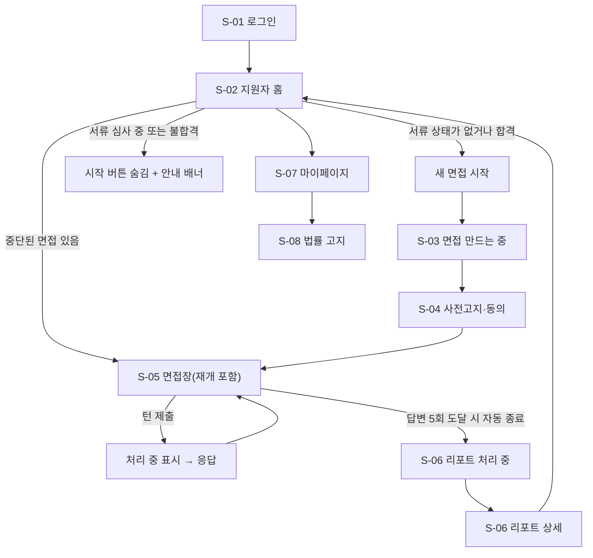
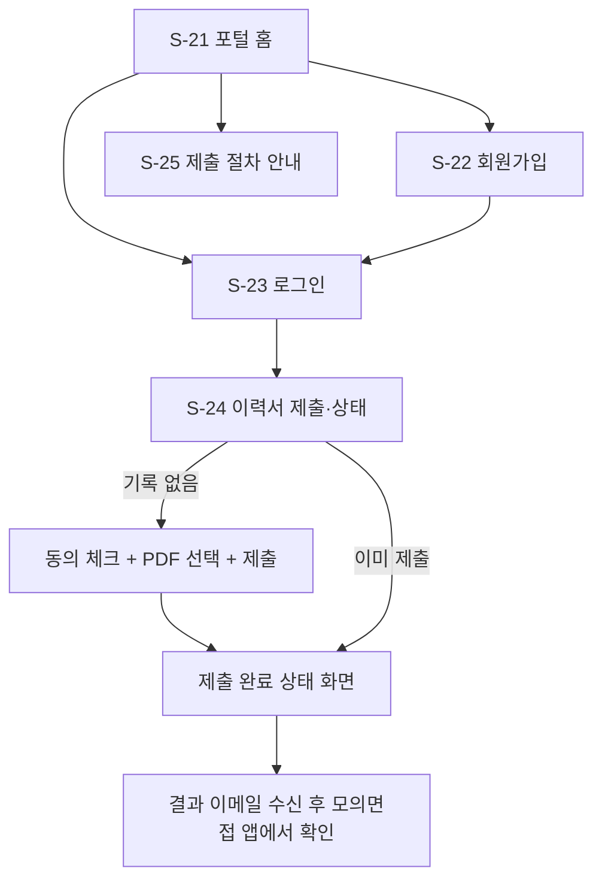
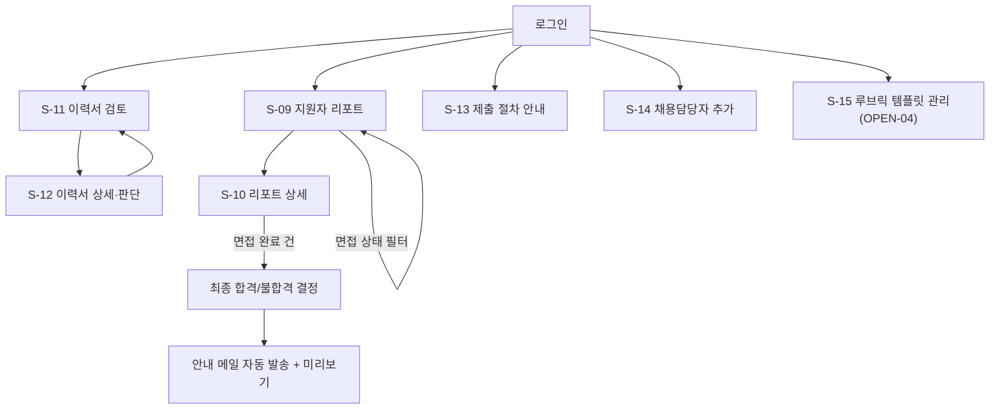

# 02. 디자인 기획서 — AI 모의면접 플랫폼 (재구축용)

| 항목 | 내용 |
|---|---|
| 문서 ID | SPEC-02 |
| 버전 | v1.0 (2026-10-08 KST) |
| 담당 역할 | 디자이너 |
| 기준 시스템 | 현재 `frontend`(포트 3001) + `frontend-apply`(포트 3002) 실제 화면과 `04-ux-design.md`를 대조 |
| 선행 | 01 문서의 REQ·BR 번호 |

> **이 문서를 읽는 AI에게**: 화면은 **정상 / 로딩 / 빈 상태 / 오류** 4가지 상태를 모두 구현한다. 문구는 10절 "고정 문구 사전"을 그대로 쓴다. LLM이 만든 텍스트는 **항상 JSX 텍스트로만** 렌더링하고 HTML로 해석하지 않는다(SEC-23).

---

## 1. 디자인 원칙

| # | 원칙 | 구체 규칙 |
|---|---|---|
| 1 | 쉬운 말 | 문구는 25세가 바로 이해하는 말. "여정" 대신 "절차", 개발 용어 금지 (L-21) |
| 2 | 지원자 우선 | 지원자 화면이 Must, 채용담당자·운영자 화면은 최소 뷰어 수준 |
| 3 | 접근성 | WCAG AA, 키보드로 모든 조작 가능, 색만으로 의미 전달 금지 |
| 4 | 정직한 상태 표시 | 없는 데이터를 있는 것처럼 그리지 않음. 처리 중·실패·미설정을 그대로 보여 줌 |
| 5 | 실수 방지 | 되돌릴 수 없는 동작(면접 종료, 최종 합격/불합격)은 시작 전에 "변경할 수 없다"고 알린다 |
| 6 | 라이트 테마 단일 | 다크 모드 없음 |
| 7 | 텍스트 대체 경로 | 마이크·웹캠 권한이 없어도 텍스트만으로 면접 전 과정을 마칠 수 있다 |

---

## 2. 앱 구성

| 앱 | 포트 | 사용자 | 설명 |
|---|---|---|---|
| 모의면접·채용관리 앱 | 3001 | 지원자, 채용담당자, 운영자 | 모의면접, 리포트, 이력서 검토, 최종 판단 |
| 채용 지원 포털 | 3002 | 지원자 | 가입, 이력서 제출, 서류 결과 확인. **3001과 완전히 분리된 별도 앱**이며 같은 백엔드와 계정을 공유 |

---

## 3. 사용자 흐름

### 3.1 지원자 (모의면접 앱)

### 3.2 지원자 (채용 지원 포털)

### 3.3 채용담당자

---

## 4. 화면 목록

### 4.1 모의면접·채용관리 앱 (3001)

| S | 화면 | 경로 | 대상 | REQ | 주요 API | 옛 번호 |
|---|---|---|---|---|---|---|
| S-01 | 로그인 | `/login` | 전체 | REQ-001 | API-02 | C-02 |
| S-02 | 지원자 홈 / 채용담당자 진입 링크 | `/` | 지원자, 채용담당자 | REQ-002,013,041 | API-11,41 | C-03 |
| S-03 | 면접 만드는 중(중간 경로) | `/interviews/new` | 지원자 | REQ-002 | API-10 | — |
| S-04 | 사전고지·동의 | `/interviews/{id}/consent` | 지원자 | REQ-029,032,033,034 | API-12,30,13 | C-04 |
| S-05 | 면접장 | `/interviews/{id}` | 지원자 | REQ-003~008,013,015,017 | API-12,14,16,17,20~23,30,WS-01 | C-05~09,12 |
| S-06 | 리포트(처리 중·상세) | `/interviews/{id}/report` | 지원자 | REQ-009,010,012,031,034 | API-18,19 | C-10,11 |
| S-07 | 마이페이지(동의·삭제 요청) | `/mypage` | 지원자 | REQ-029,030 | API-04,31~34 | C-13 |
| S-08 | 법률/컴플라이언스 고지 | `/legal` | 전체 | REQ-033,034 | 없음 | C-14 |
| S-09 | 지원자 리포트 목록 | `/recruiter` | 채용담당자 | REQ-011,046 | API-50 | R-01 |
| S-10 | 리포트 상세 + 최종 합격/불합격 | `/recruiter/{id}` | 채용담당자 | REQ-011,031,034,045 | API-51~54 | R-02 |
| S-11 | 이력서 검토 목록 | `/recruiter/resumes` | 채용담당자 | REQ-042 | API-55 | — |
| S-12 | 이력서 상세·합격/불합격 판단 | `/recruiter/resumes/{id}` | 채용담당자 | REQ-042,043,044 | API-56~60 | — |
| S-13 | 제출 절차 안내(채용담당자용) | `/recruiter/process-guide` | 채용담당자 | REQ-040 | 없음 | — |
| S-14 | 채용담당자 추가 | `/recruiter/add-recruiter` | 채용담당자 | REQ-047 | API-05 | — |
| S-15 | 루브릭 템플릿 관리 | `/recruiter/rubric-templates` | 채용담당자 | REQ-014 | API-61~63 | R-03 |
| S-16 | 운영 모니터링 | `/admin/ops` | 운영자 | REQ-016 | API-70 | O-01 |
| S-17 | 오류·404·권한 없음 | (전역) | 전체 | — | 없음 | G-01,02 |

### 4.2 채용 지원 포털 (3002)

| S | 화면 | 경로 | REQ | 주요 API |
|---|---|---|---|---|
| S-21 | 포털 홈 | `/` | REQ-040 | 없음 |
| S-22 | 회원가입 | `/register` | REQ-040 | API-01 |
| S-23 | 로그인 | `/login` | REQ-040 | API-02 |
| S-24 | 이력서 제출·상태 확인 | `/resume` | REQ-040,041 | API-30,40,41 |
| S-25 | 제출 절차 안내 | `/guide` | REQ-040 | 없음 |

> 모의면접 앱(3001)에는 **회원가입 화면이 없다**. 지원자 가입은 3002에서만 한다(DEC-107).

---

## 5. 화면별 명세

> 공통 4상태 정의. **정상**: 데이터 표시. **로딩**: 스켈레톤 또는 "불러오는 중..." 문구. **빈 상태**: 데이터 없음 안내. **오류**: 배너(`banner-error`)와 재시도 경로. 해당 없는 상태는 "해당 없음"으로 적는다.

### S-01 로그인
- 구성: 이메일, 비밀번호, 로그인 버튼. 3001에는 가입 링크 없음.
- 오류: 실패 시 "이메일 또는 비밀번호가 올바르지 않습니다." (계정 존재 여부 노출 금지, SEC-03)
- 성공: access 토큰을 `sessionStorage`에 저장 후 홈으로 이동.

### S-02 지원자 홈
- 구성(위→아래): 제목 "**{이름}님, 환영합니다**"와 오른쪽 "마이페이지" 링크·"로그아웃" 버튼 → **"새 면접 시작"** 버튼 → 중단된 면접 배너 → "**최근 면접**" 카드 목록(상태, 일시, 점수, "리포트 준비 완료" 배지).
  - 중단된 면접 배너: "중단된 면접이 있습니다." + "{일시}에 시작한 면접을 이어서 진행할 수 있어요." + **"이어서 진행"** 링크. 링크는 **면접장(S-05)으로 바로 이동**한다(별도 재개 화면 없음, 5.2절).
  - 채용담당자 계정으로 `/`에 들어오면 "지원자 리포트 목록으로 이동" / "이력서 검토 목록으로 이동" 링크를 보여 준다.
- **서류 게이트(BR-25)**: 이력서 기록이 있고 accepted가 아니면 시작 버튼 대신 안내 배너를 보여 준다.
  - pending: "이력서 심사 중입니다. 서류 합격 후 모의면접을 시작할 수 있어요."
  - rejected: "이번 전형에서는 서류 합격하지 못했습니다."
- 빈 상태: "아직 진행한 면접이 없습니다. 첫 모의면접을 시작해보세요." + 버튼 강조(굵은 윤곽선)
- 오류: 목록만 오류 표시, 시작 버튼은 계속 동작
- 경계값: 이름이 100자여도 헤더가 줄바꿈되어 **가로 스크롤이 생기지 않아야 한다**(L-24).

### S-03 면접 만드는 중
- "새 면접 세션을 만드는 중입니다..." 문구만 보이고 `POST /interviews` 후 `/interviews/{id}/consent`로 이동. **무한 대기 금지**: 실패 시 오류 배너 + 홈 링크. 클릭 시 정확히 1건만 생성(중복 생성 금지 — 과거 목록이 1~2건씩 늘어난 사고, DEC-064/065).

### S-04 사전고지·동의
- 구성: 고지문 스크롤 영역, **필수** 체크박스(AI 면접 진행·평가 사실 확인), **선택** 체크박스(음성 수집 동의), "동의하고 시작" 버튼, 법률 고지 링크.
- 규칙: 고지문을 **끝까지 스크롤해야** 필수 체크박스가 활성화된다(맨 아래 24px 이내). 필수 체크만 하면 버튼 활성화(선택은 조건 아님).
- 동의하지 않고 나가면 "동의하지 않으면 면접을 시작할 수 없습니다" 안내만(강제 유도 금지).
- 이미 종료·만료된 세션이면 "이 세션은 이미 종료되었거나 만료되어 사전고지 동의를 진행할 수 없습니다."
- 동작: `POST /consents`(필수 1건, 선택 체크 시 1건 추가) → `POST /interviews/{id}/start` → 면접장 이동.
- 하단 법률 고지 링크 문구는 "법률/컴플라이언스 고지 전문 보기"로 쓴다. (현재 화면은 문구 끝에 내부 번호 "(REQ-034)"가 그대로 노출돼 있다 — **재구축 시 제거**, 11절 4번.)

### S-05 면접장 (핵심 화면)
> **현재 구현 기준**으로 적는다. `04-ux-design`에 있었으나 아직 만들어지지 않은 것은 5.2절에 모았다.

- 레이아웃: **데스크톱(≥1200px)** 채팅 60% + 보조 패널 40% 분할 / **태블릿(768~1199px)** 1:1 분할 / **모바일(<768px)** 채팅 전체 화면 + 보조 패널은 **전체 화면 모달**(`dialog`, 배경 `inert`, `Esc`로 닫기, 닫으면 포커스 복귀).
- 구성(위→아래):
  1. **헤더**: 홈 링크, 제목 "면접장", 면접 상태 배지(현재는 `live`·`completed` 같은 **영문 값을 그대로 표시** — 재구축 시 10.1의 한글 라벨 사용 권장)
  2. **배너**: 답변 5회를 채웠으면 "답변 5회를 모두 제출하여 면접이 종료되었습니다. 수고하셨습니다." / live가 아니면 "이 세션은 현재 진행 중(live)이 아니라 대화 이력만 열람할 수 있습니다 (상태: …)." / 완료된 면접이면 "**리포트 보기 →**" 링크
  3. **도구줄**: 보조 패널 탭 2개(**코드 에디터**, **화이트보드**, `aria-pressed`) — live가 아니면 비활성 + "면접이 진행 중(live)일 때만 사용할 수 있습니다." / **웹캠 보기·숨기기** 토글(`aria-expanded`)과 웹캠 타일
  4. **채팅 타임라인**: 말풍선(메타 줄 "AI 면접관" 또는 "나" + "· 음성/텍스트", 전송 중이면 "· 전송 중..."), 맨 아래로 자동 스크롤
  5. **입력 영역**: 여러 줄 입력창(최대 4000자), 카운터 2개("답변 n/5", "n/4000"), **"음성으로 답변"** 버튼, **"전송"** 버튼
  6. **보조 패널**: 코드 에디터 / 화이트보드(5.3 참고)
- 상태표:

| 상태 | 트리거 | 표현 |
|---|---|---|
| 첫 질문 대기 | 시작 직후 대화가 비어 있음 | "AI 면접관이 첫 질문을 준비하고 있습니다... 잠시만 기다려주세요." **3초 간격으로 최대 15회(45초)** 대화를 다시 조회. 그래도 없으면 "첫 질문을 불러오는 데 예상보다 시간이 걸리고 있습니다." + **"다시 확인하기"** 버튼 |
| 입력 대기 | AI 질문 도착 | 입력창·버튼 활성 |
| AI 처리 중 | 턴 제출 후 | AI 말풍선(처리 중 스타일). 서버 단계에 따라 `stt` "음성 인식 중...", `llm` "AI가 답변을 준비하고 있어요...", `tts` "음성 합성 중...", 단계 정보가 없으면 llm 문구. 입력창 비활성 |
| 응답 지연 | 12초 동안 WS 이벤트 없음 | 대화 이력을 REST로 다시 조회해 저장 여부를 확인(WS 유실 대비 폴백) |
| 녹음 중 | 마이크 버튼 | 버튼 "녹음 중지 (Ns)". 최대 **120초**에서 자동 종료. (선택 기능) 4초마다 짧은 조각을 보내 "나 · 음성 · 실시간 인식 중" 말풍선에 "듣고 있어요..." 또는 인식된 텍스트 표시 |
| 음성 업로드 중 | 녹음 종료 | 버튼 "인식 중...", 말풍선 "음성 인식 중..." |
| 음성 동의 필요 | 처음 마이크를 누를 때 동의가 없거나 서버가 403 `CONSENT_REQUIRED_VOICE` | 안내 박스: "음성으로 답변하려면 생체정보(음성) 수집 동의가 필요합니다. 동의 시 답변 음성은 텍스트 변환 즉시 폐기되며, 변환된 텍스트만 저장됩니다." + **"동의하고 녹음 시작"** / **"취소"** |
| 제출 오류 | 4xx/5xx, WS `error` | 입력창 아래 오류 배너(서버 메시지 또는 "AI 응답 처리 중 오류가 발생했습니다. 다시 시도해주세요."). 입력은 유지 |
| 답변 5회 도달 | 지원자 발화가 5개 | 입력창 비활성(placeholder "답변 횟수를 모두 사용했습니다.") + 배너 + **자동으로 `POST /end` 호출**(성공하면 상태 갱신, 실패해도 조용히 무시) |
| 마이크 미지원·권한 없음 | 브라우저 | 음성 버튼 숨김 또는 비활성, 텍스트로 계속 진행 |
| 보조 패널 자동 열림 | WS `turn_result.control.action = switch_to_coding` | 코드 에디터 패널 자동 노출. 화이트보드는 사용자가 탭으로만 연다 |

- 이 화면이 처리하는 WS 이벤트는 `stage_update`, `turn_result`, `error` 3종이다(`queue_status`·`report_ready`는 처리하지 않는다).
- `control.action`은 `switch_to_coding`만 반응한다(`end_interview`는 무시 — 5.2절).
- 음성 녹음 버튼 `aria-pressed`로 상태를 전달한다.

### S-05-a 코드 패널
언어 선택(11종), Monaco 에디터, 저장 상태, 제출. 재접속 시 최신 제출본 복원(복원 중 상태 표시). 닫아도 **미제출 편집 내용은 유지**. 입력 전용(HTML 렌더링 경로 없음, SEC-23).

### S-05-b 화이트보드 패널
펜·색·두께·지우기, 저장, 재접속 시 최신 스냅샷 복원.

### S-06 리포트
- 레이아웃: 가운데 카드(최대 640px).
- **상태별 화면**(한 화면이 3초 간격으로 서버를 다시 조회해 자동 전환):
  - 리포트 없음(면접이 끝나지 않음): 제목 "리포트 없음" + 안내 + "면접장으로 돌아가기"
  - 생성 중: 제목 "리포트 생성 중" + "AI가 면접 대화를 분석해 리포트를 작성하고 있습니다. 잠시만 기다려주세요 (자동으로 갱신됩니다)."
  - 실패: 제목 "리포트 생성 실패" + "리포트 생성에 실패했습니다." + **"다시 생성하기"**(재시도 중 "재시도 중...")
  - 조회 오류: 오류 배너 + "면접장으로 돌아가기"
- **상세 구성(위→아래)**: 제목 "면접 리포트" → 큰 글씨 종합 점수 "n / 5" → 배지 "AI 참고 의견: 긍정적/중립/부정적" → 배지 "⚠ 참고용 합격/불합격 의견: 합격 쪽에 가까움 / 불합격 쪽에 가까움 / 판단 보류(애매함)" → **세부 점수**(기술 이해도·의사소통·조직 적합도 각 n/5) → **루브릭 항목별 평가** → **대화 요약 (STAR)** → 면책 문구 → "면접장으로 돌아가기 · 홈으로"
- 루브릭 항목별 평가: 섹션 제목 + 템플릿 이름(예: 기본 루브릭). 항목 행: 항목명 · 가중치(%) · 점수 `n / 5`(없으면 `-`와 "평가 근거 부족") · 근거 문장 · **근거 답변 칩**(`답변 #N`). 칩 클릭 시 발췌(최대 120자)를 아래에 펼침(`<button aria-expanded>`). 원문이 삭제됐으면 "답변 #N (삭제됨)"으로 비활성 표시. `rubric = null`이면 "세부 근거 없음 — 이 리포트는 항목별 평가 없이 생성되었습니다".
- STAR: **하나의 섹션 안에 네 문단**(상황(Situation) / 과제(Task) / 행동(Action) / 결과(Result), 각 라벨 굵게). STAR가 없고 요약만 있으면 제목 "총평" + 문단.
- 면책 문구 = 서버가 내려주는 `disclaimer`("이 결과는 참고용 AI 평가이며, 최종 채용 결정은 인간이 내립니다.").
- 지원자 리포트 화면에는 **채점 템플릿 변경·다시 채점 UI가 없다**(DEC-121).

### S-07 마이페이지
- 제목 "마이페이지" + 설명 "동의 이력 관리, 생체정보(음성) 삭제 요청은 여기서 처리할 수 있습니다."
- **계정 정보**: 이름, 이메일
- **동의 이력** 표: 열 "동의 항목 / 동의 일시 / 상태(동의함·철회됨(일시)) / 동의 철회". 철회 버튼은 이미 철회됐거나 처리 중이면 비활성("철회 중..."). 빈 상태 "아직 동의 내역이 없습니다."
- **생체정보(음성) 삭제 요청**: 안내 "음성 데이터의 즉시 삭제를 요청할 수 있습니다. 진행 중인 면접이 있다면 삭제 요청 후 해당 면접은 텍스트 전용으로 전환됩니다." → **"생체정보 즉시 삭제 요청"** 버튼 → 같은 자리에서 확인 문구 "정말 생체정보(음성) 삭제를 요청하시겠습니까?" + **확인 / 취소**(별도 모달 아님)
- **삭제 요청 이력** 표(요청일·처리 상태). 빈 상태 "아직 삭제 요청 내역이 없습니다."
- 하단: 법률/컴플라이언스 고지 전문 링크. 조회 실패 시 오류 배너 + "다시 시도".

### S-08 법률/컴플라이언스 고지
- 10.5의 고정 문구 전문 + 보관기간(임시값 180일) 안내. 모달로 열려도 메인 흐름을 막지 않는다.

### S-09 지원자 리포트 목록
- 구성(위→아래): 상단 메뉴 탭 → 제목 "지원자 리포트 목록" → 설명 "우리 조직의 모든 지원자 면접 내역을 볼 수 있어요." → **면접 상태 선택 상자** → 표.
- **상단 메뉴 순서(BR-35)**: `이력서 검토` / `지원자 리포트` / `제출 절차 안내` / `채용담당자 추가`. 현재 화면 탭은 `aria-current="page"` 로 강조.
- **면접 상태 선택 상자**: 라벨 "면접 상태", 옵션 **전체 / 예정 / 진행 중 / 일시중지 / 완료 / 만료**(기본 "전체"). 서버가 준 목록을 **화면에서만** 거른다(추가 API 호출 없음).
- 표 열: 지원자, 이메일, 면접 상태, 리포트 상태, 응시 시작, 종합 점수. 행 클릭 시 S-10.
- 빈 상태: 전체 0건 "아직 열람 가능한 리포트가 없습니다." / 필터 결과 0건 "선택한 면접 상태의 내역이 없습니다."
- 라벨 맵: 면접 상태(예정·진행 중·일시중지·완료·만료), 리포트 상태(미요청·생성 중·준비됨·실패).
- 권한 없음: "권한이 없습니다 — 채용담당자 대시보드는 채용담당자 계정으로만 볼 수 있어요."

### S-10 리포트 상세 + 최종 합격/불합격
- 상단: "← 목록으로", 지원자 이름, 면접 상태 배지, 이메일·응시 시작·종료·종합 점수.
- 본문: S-06과 같은 리포트 내용(열람 전용). **채점 템플릿 선택·"다시 채점" 버튼은 없다.**
- **최종 합격/불합격 영역 — 면접 상태가 `완료`인 건에만 표시**:
  - 섹션 제목 "**최종 합격/불합격 결정**"
  - 미처리 안내: "처리하면 지원자에게 안내 메일이 자동으로 발송돼요. 한 번 처리하면 변경할 수 없으니 신중히 선택해주세요."
  - 선택 상자 2개: "합격 안내 문구 (합격 처리 시 필수)", "불합격 안내 문구 (불합격 처리 시 필수)" — 10.4 문구 3개씩
  - 버튼 2개: **합격 처리**(기본색), **불합격 처리**(보조 회색). 해당 문구를 고르기 전까지 비활성, 처리 중에는 둘 다 비활성(더블클릭 방지)
  - **면접 일정 입력란 없음**(서류 판단과 다른 점)
  - 처리 후: "처리 일시 … · 이미 최종 결과가 처리되어 변경할 수 없어요." + 결과 배지(최종 합격/최종 불합격), 선택 상자와 버튼 전부 잠금, 저장된 문구가 선택 상태로 표시
  - **안내 영역**(처리 후에만 표시) 제목 "**최종 합격/불합격 안내**": 발송 시각이 있으면 "판단 저장 시 시스템이 지원자에게 안내 메일을 자동으로 발송했습니다…" + "안내 완료: 시각". 없으면 "자동 발송이 아직 되지 않았습니다(메일 설정 누락 또는 발송 실패). 아래 내용을 복사해서 직접 보내신 뒤 '발송 완료로 표시'를 눌러주세요." + **안내 내용 미리보기**(받는 사람/제목/본문) + **발송 완료로 표시** 버튼
  - 서버가 409(이미 처리됨 등)를 돌려주면 오류 배너를 보이고 최신 상태로 다시 불러와 잠금
- 하단: 고정 면책 문구 "본 리포트/평가는 참고용이며 법적 효력이 없습니다. 채용 의사결정에 대한 법률적 판단은 본 서비스가 대신하지 않습니다."

### S-11 이력서 검토 목록
- 상단 메뉴, 제목 "이력서 검토", 안내 "처리하면 지원자에게 안내 메일이 자동으로 발송돼요", 표(지원자, 이메일, 제출일시, 상태, 파일명, 통보 여부). 최신 제출순.

### S-12 이력서 상세·합격/불합격 판단
- 상단: 지원자 이름 "{이름}님의 이력서" + 상태 배지(심사 대기/합격/불합격), 이메일·제출일시.
- **이력서 미리보기**: 화면에 들어오면 **자동으로 PDF를 불러와 내장 영역(iframe)으로 표시**(새 창 팝업 금지 — 차단됨). "미리보기 새로고침", "내 컴퓨터에 저장" 버튼.
- **합격/불합격 결정** 영역:
  - "합격 안내 문구 (합격 처리 시 필수)" 선택 상자(10.2의 3개)
  - "불합격 안내 문구 (불합격 처리 시 필수)" 선택 상자
  - "면접 일정 안내 (합격 시에만 사용, 참고용이에요)": **날짜 선택 + 시(00~23) 선택 + 분(00/30) 선택 + 보충 설명 한 줄**. 기본값은 **오늘 + 7일**(토·일이면 다음 월요일) **14:00**. 날짜와 시간 중 하나만 있으면 "면접 날짜와 시간을 모두 입력해주세요."
  - 버튼: 합격 처리 / 불합격 처리(문구 미선택 시 비활성)
- **합격/불합격 안내** 영역(판단 후): 발송 완료 시 "판단 저장 시 시스템이 지원자에게 안내 메일을 자동으로 발송했습니다…", 아니면 수동 안내 + "발송 완료로 표시". "안내 내용 미리보기" 버튼.
- 이 영역은 S-10의 최종 결정 영역과 **같은 레이아웃·문구 체계**로 만든다(재처리 가능 여부만 다름).

### S-13 제출 절차 안내
- 채용 지원 → 이력서 제출 → 서류 심사 → 결과 안내 → 모의면접으로 이어지는 단계 카드(번호 + 한 줄 설명) + "이력서 검토는 이력서 검토 메뉴에서 진행해요" 링크.

### S-14 채용담당자 추가
- 이메일, 이름, 비밀번호(8자 이상) 입력 → "채용담당자 추가". 성공 안내, 중복 이메일 오류는 필드 하단에 표시. 채용담당자 계정이 아니면 "채용담당자 추가는 채용담당자 계정으로만 할 수 있어요."

### S-15 루브릭 템플릿 관리 (OPEN-04)
- 템플릿 목록(기본 + 내 것), 항목(이름·가중치·설명) 편집 폼, 저장. 가중치 합이 100이 아니면 오류. **기본 템플릿은 수정 불가, 복사해서 시작**.

### S-16 운영 모니터링
- 지표 카드 4개(큐 길이, GPU 메모리, 에러율, 활성 세션 수) + `notes`. 5~10초 간격 갱신, 실패 시 마지막 값 유지 + "갱신 실패" 배지(화면을 비우지 않음).

### S-21~S-25 채용 지원 포털
- **S-21 홈**: 서비스 소개 + "회원가입하고 이력서를 제출하면 서류 심사 결과를 이메일로 알려드려요." + 가입/로그인 버튼.
- **S-22 회원가입 / S-23 로그인**: 3001 로그인과 같은 형태. 가입 화면의 **개인정보 처리방침 동의 체크박스는 18×18px 체크박스**(전체 너비 막대로 보이면 결함, L-22).
- **S-24 이력서 제출·상태**: 상단 탭, 기록이 없으면 "샘플 양식 안내 + 개인정보 수집 동의 체크 + PDF 선택 + 제출". **이미 제출했으면 선택·동의·제출 UI를 모두 숨기고 상태만** 보여 준다(심사 중 / 합격 / 불합격, 안내 문구, 면접 일정 안내, 제출·심사 일시). 상태 라벨: `pending → 심사 중`, `accepted → 합격`, `rejected → 불합격`.
- **S-25 안내**: 절차 단계 카드.

### S-17 오류·권한
- 전역 오류: "일시적인 문제가 발생했습니다" + 새로고침/홈. 권한 없음: "권한이 없습니다" + 홈으로. 로그인 필요: "로그인이 필요합니다" + "로그인하러 가기".

### 5.2 `04-ux-design` 대비 현재 화면에 **없는 것** (OPEN-13)

> 재구축 시 "현재와 동일"을 원하면 만들지 않는다. 설계 의도대로 보완하려면 사용자 승인 후 아래를 추가한다.

| 설계상 화면·기능 | 현재 상태 | 영향 | 권장 |
|---|---|---|---|
| 면접 **수동 종료 버튼**·종료 확인 화면(C-09) | **없음.** 종료는 답변 5회 도달 시 자동 호출뿐. API(`POST /end`)는 수동 종료도 지원 | 지원자가 5회를 채우기 전에 끝낼 방법이 없음 | 추가 권장(확인 문구 포함) |
| 면접 준비·장치 점검 화면(C-05) | 없음(사전고지 동의 후 곧바로 면접장) | 마이크 권한 문제를 면접장에서 처음 만남 | 선택 |
| 큐 대기 순서·예상 시간 표시 | 없음. 서버도 `queue_status`를 발행하지 않음 | 대기가 길면 사용자는 "AI가 답변을 준비하고 있어요..."만 봄 | 서버·화면 함께 구현 시 추가 |
| 세션 재개 전용 화면(C-12) | 없음. 홈 배너 "이어서 진행"이 면접장으로 직접 이동하고, `POST /resume`은 화면에서 호출하지 않음 | paused 세션을 live로 되돌릴 화면 경로 없음(paused로 전환하는 경로도 없음) | 현행 유지 가능 |
| 리포트 처리 중 "나중에 확인하기" | 없음(화면이 자동 갱신) | 홈의 "리포트 준비 완료" 배지로 재방문 확인은 가능 | 현행 유지 가능 |
| STAR 4카드(분리 카드) | 한 섹션의 네 문단 | 기능 동일 | 현행 유지 |
| 지원자 리포트 하단 법률 고지 링크 | 면책 문구 배너만 | | 링크 추가 권장 |
| LLM 응답 `control.action = end_interview` 처리 | 화면이 무시(5회 자동 종료만) | | 현행 유지 |

### 5.3 보조 패널 공통
- 보조 패널은 면접이 **live일 때만** 열 수 있다. 탭을 다시 누르면 닫힌다(내용은 유지).
- 모바일 모달은 `role="dialog"`, 열려 있는 동안 뒤 화면은 `inert`.

---

## 6. 디자인 토큰

### 6.1 색상 (현재 `globals.css`에 실제 정의된 값)

| 토큰 | 값 | 용도 |
|---|---|---|
| `--color-bg` | `#ffffff` | 페이지 배경 |
| `--color-surface` | `#f7f8fa` | 카드·패널 배경, 상태 배지 배경 |
| `--color-border` | `#d8dce3` | 구분선·입력 테두리 |
| `--color-text-primary` | `#1a1d23` | 본문 |
| `--color-text-secondary` | `#545b66` | 보조 텍스트, 보조 버튼 배경 |
| `--color-primary-600` | `#2e5aac` | 주요 버튼·링크 |
| `--color-primary-700` | `#24478a` | 주요 버튼 hover |
| `--color-primary-100` | `#e8eefa` | 선택·강조 배경(활성 탭) |
| `--color-danger-600` | `#c22a2a` | 오류 텍스트 |
| `--color-danger-100` | `#fbe7e7` | 오류 배경 |
| `--color-focus-ring` | `#1456d6` | 포커스 윤곽(2px, 간격 2px) |

> 설계 문서(04-ux-design)에는 성공(`--color-success-600 #1E7F4D`)·경고(`--color-warning-700 #8A5A00`, `--color-warning-100 #FDF1DC`) 토큰도 있으나 **현재 코드에는 정의돼 있지 않다**. 재구축 시 큐 임계 경고·완료 배지에 필요하면 이 값으로 추가한다.

### 6.2 타이포·간격·형태

| 항목 | 값 |
|---|---|
| 글꼴 | `Pretendard`(없으면 시스템 글꼴) |
| 본문 | 15px / 줄 높이 1.5 |
| 제목 | 페이지 H1 24px(굵게), 섹션 H2 20px |
| 보조 글자 | 13px(라벨·안내), 12px(배지) |
| 간격 단위 | 4px 배수(4, 8, 12, 16, 24, 32, 48, 64) |
| 모서리 | 입력·배지 4px(`--radius-sm`), 카드·버튼 8px(`--radius-md`), 상태 배지는 알약 모양 |
| 컨테이너 | 채용담당자 화면 최대 960px, 가운데 정렬, 좌우 16px 여백 |
| 모션 | 120/200/320ms. `prefers-reduced-motion: reduce`이면 정적 표시 |

---

## 7. 컴포넌트 명세

| 컴포넌트 | 클래스·구현 | 상태·규칙 |
|---|---|---|
| 주요 버튼 | `.submit-button` — 배경 primary-600, 흰 글자, 굵게 600, 패딩 12px, 폭 100% | hover: primary-700. `disabled`: 투명도 0.6 + `not-allowed` |
| 보조 버튼 | 같은 클래스 + 배경 `text-secondary` | 불합격 처리 등 |
| 입력 | `.field` 래퍼: 라벨 13px 보조색 + 입력 패딩 10×12px, 테두리 border, 모서리 4px | focus-visible: 포커스 링 2px. 오류: `.field-error` 13px 오류색 |
| **체크박스** | `.field input[type="checkbox"]` 18×18px, `flex: none`, 패딩 0 | **공통 입력 스타일이 체크박스에 적용되지 않게 예외 필수**(L-22) |
| 선택 상자 | 입력과 같은 테두리·모서리, 라벨과 `htmlFor/id`로 연결 | 키보드 방향키로 조작 가능 |
| 배너 | `.banner-error`(오류색 배경), `.banner-info` | `role="alert"` |
| 상태 배지 | `.statusTag` — 알약 모양, surface 배경 + border + 보조색 글자 | 색 + 텍스트 라벨 병행 |
| 표 | 헤더 보조색 굵게, 셀 패딩 10×12px, 행 아래 테두리, 행 hover 시 surface 배경, 클릭 가능 행은 포인터 | 열 정렬 좌측 |
| 탭 | `.room-tab`, 활성 `.room-tab--active` + `aria-current="page"` | 라우트 이동형(링크). 순서는 BR-35 |
| 말풍선 | `.chat-bubble--ai` / `--user` / `--processing` | 화자를 텍스트로도 병기("AI 면접관:", "내 답변:") |
| 마이크 버튼 | `.mic-button`, 녹음 중 `.mic-button--recording` | 라벨 전환 |
| 큐 표시·스테퍼 | `aria-live="polite"` | 위치·단계가 **바뀔 때만** 갱신 |
| 스켈레톤 | "불러오는 중..." 또는 회색 블록 | 로딩 상태 전용 |
| 근거 칩 | 알약 버튼 `답변 #N` | `aria-expanded`, 삭제된 원문은 비활성 |
| 점수 게이지 | `n / 5` 텍스트 + 라벨 | 색만으로 의미 전달 금지 |
| 웹캠 타일 | `.webcam-tile` | 장식 요소 `aria-hidden`, 서버 미전송 |

---

## 8. 접근성 기준 (WCAG AA)

1. 본문 대비 4.5:1 이상, 큰 글자 3:1 이상. 렌더링 후 대비 검사 도구로 재확인.
2. 색만으로 의미 전달 금지(색 + 아이콘/텍스트).
3. 모든 조작은 키보드로 가능, 모달은 포커스 트랩 + `Esc`로 닫기(되돌리기 쉬운 모달만).
4. 포커스 링 제거 금지(커스텀 시 대체 스타일 필수).
5. 폼은 라벨 연결, 오류는 `aria-describedby` + `role="alert"`.
6. AI 음성 응답에는 **항상 텍스트가 함께 표시**(오디오 전용 정보 금지).
7. 터치 대상 최소 44×44px(모바일).
8. `<html lang="ko">`.
9. 마이크·웹캠을 못 써도 텍스트로 전 과정 완료 가능.

---

## 9. 반응형

| 구간 | 범위 | 방침 |
|---|---|---|
| 모바일 | <768px | 한 열, 하단 탭 전환, 코드·화이트보드는 전체 화면 모달, 웹캠 기본 최소화 |
| 태블릿 | 768~1199px | 면접장 보조 패널 1:1 분할 허용 |
| 데스크톱 | ≥1200px | 최대 폭 1200px(채용담당자 960px), 면접장 60:40 분할 |

- 세로·가로 전환 시 녹음·입력 중인 내용 보존.
- 경계값 점검 필수: **이름 100자**, 문구 500자, 목록 0건·수백 건.

---

## 10. 고정 문구 사전

### 10.1 상태 라벨

| 대상 | 값 → 화면 문구 |
|---|---|
| 면접 상태 | scheduled → 예정, live → 진행 중, paused → 일시중지, completed → 완료, expired → 만료 |
| 리포트 상태 | none → 미요청, queued → 생성 중, ready → 준비됨, failed → 실패 |
| 서류 상태(채용담당자) | pending → 심사 대기, accepted → 합격, rejected → 불합격 |
| 서류 상태(지원자) | pending → 심사 중, accepted → 합격, rejected → 불합격 |
| 최종 결정 | accepted → 최종 합격, rejected → 최종 불합격 |
| AI 참고 의견 | recommend → 긍정적, neutral → 중립, not_recommend → 부정적 |

### 10.2 서류 판단 안내 문구 (선택 상자 항목, OPEN-08)

**합격**
1. 축하드립니다. 안내해드린 일정에 맞춰 모의면접을 진행해주시기 바랍니다.
2. 우수한 서류 평가를 받으셨습니다. 다음 단계인 모의면접에서 뵙겠습니다.
3. 귀하의 경험과 역량이 저희가 찾는 인재상에 부합하여 합격하셨습니다.

**불합격**
1. 이번 채용에는 아쉽게 인연이 닿지 않았으나, 좋은 결과로 다시 뵙기를 바랍니다.
2. 서류 심사 결과 이번 채용 요건에는 부합하지 않아 아쉽게 되었습니다.
3. 많은 지원자 중 제한된 인원만 선발하는 과정에서 아쉬운 결과를 안내드립니다.

### 10.3 서류 판단 면접 일정 보충 문구 예시
"예: 이후 편한 시간에 모의면접을 진행해주세요."

### 10.4 최종 합격/불합격 안내 문구 (선택 상자 항목, OPEN-08)

**최종 합격**
1. 최종 합격을 진심으로 축하드립니다. 함께하게 되어 기쁩니다.
2. 모의면접에서 보여주신 역량이 훌륭하여 최종 합격하셨습니다.
3. 귀하의 경험과 면접 결과가 저희가 찾는 인재상에 부합하여 최종 합격하셨습니다.

**최종 불합격**
1. 아쉽게도 이번 채용에서는 최종 합격에 이르지 못했습니다. 좋은 결과로 다시 뵙기를 바랍니다.
2. 면접 결과를 종합적으로 검토했으나 이번에는 함께하지 못하게 되어 아쉽습니다.
3. 제한된 인원만 선발하는 과정에서 아쉬운 결과를 안내드립니다. 지원해주셔서 감사합니다.

### 10.5 법률/컴플라이언스 고정 문구 (S-08, 리포트 하단)

> 법률/컴플라이언스 고지
> - 본 서비스가 제공하는 AI 모의면접 결과(점수, 등급, STAR 피드백, 평가 근거 등)는 참고용 자료이며 법적 효력이 없습니다.
> - 본 서비스는 법률 자문을 제공하지 않으며, 채용절차의 법적 적정성(채용절차법, 개인정보 보호법 등 관련 법령 준수 여부 포함)을 보증하지 않습니다. 실제 채용 절차에 이 서비스의 결과를 활용하려는 경우, 반드시 변호사 등 관련 분야 전문가의 자문을 받으시기 바랍니다.
> - AI는 보조 도구입니다. 어떠한 경우에도 이 서비스가 산출한 점수나 등급이 최종 채용 여부를 자동으로 결정하지 않습니다 — 최종 결정은 항상 사람이 내립니다(개인정보 보호법 제37조의2, 자동화된 결정에 대한 거부권 대응).

리포트 응답의 면책 문구: **"이 결과는 참고용 AI 평가이며, 최종 채용 결정은 인간이 내립니다."**

### 10.6 사전고지문 (S-04) 요약 구조
제목 "AI 모의면접 진행 및 평가 사실 고지"
1. AI를 활용해 질문하고 평가함, 음성은 STT로 텍스트화, **웹캠 화면은 미리보기 용도이며 서버로 전송·저장되지 않음**
2. AI는 보조 도구이며 최종 결정은 사람이 함
3. 수집 항목과 보관기간: 음성 원본은 변환 직후 삭제, 답변 텍스트·리포트는 기본 **180일**(법률자문 전 임시값이며 그 사실을 화면에 그대로 노출), 제3자 제공 없음
4. 마이페이지에서 동의 철회·음성 데이터 삭제 요청 가능
5. 법률 자문 권고

### 10.7 주요 오류·안내 문구

| 상황 | 문구 |
|---|---|
| 목록 0건 | "아직 열람 가능한 리포트가 없습니다." |
| 필터 결과 0건 | "선택한 면접 상태의 내역이 없습니다." |
| 이미 최종 처리됨 | "이미 최종 결과가 처리되어 변경할 수 없습니다." |
| 이력서 재제출 | "이미 이력서를 제출했습니다. 재제출은 지원하지 않으며, 제출 상태만 확인할 수 있습니다." |
| 큐 초과 | "지금 처리 대기 중인 요청이 많습니다. 잠시 후 다시 시도해 주세요." |
| 턴 5회 | "답변 횟수 제한(5회)에 도달했습니다. 면접을 종료해주세요." |
| 만료 | "이 세션은 만료되어 재개할 수 없습니다. 새 면접을 시작해 주세요." |

---

## 11. 디자인 금지 사항

1. `dangerouslySetInnerHTML` 사용 금지(LLM·사용자 입력 전부).
2. 브라우저 `confirm()` 사용 금지 — 화면 안 확인 문구로 대체.
3. 새 창(`window.open`)으로 미리보기 열기 금지 — 팝업 차단됨, 내장 영역(iframe) 사용.
4. 개발자용 표기(DEC·REQ 번호, 내부 용어, `live` 같은 영문 상태값)를 사용자 화면에 노출 금지.
5. 색만으로 상태 구분 금지.
6. 화면에서만 막는 규칙을 "보안"이라고 주장 금지(서버 동일 규칙 필수).

---

## 12. 변경 이력

| 일시 | 버전 | 내용 |
|---|---|---|
| 2026-10-08 | v1.0 | 현재 화면·코드·`04-ux-design.md`를 대조해 재구축용으로 최초 작성 |
