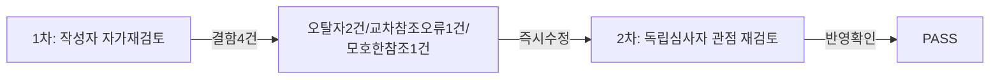

# 01단계 — 트렌드 분석 보고서

- **작업일**: 2026-09-18 (git 커밋 20260919_0734)
- **소스 문서**: `docs/harness/01-trend-analysis.md`, `verify-log_01-trend-analysis.md`
- **판정**: PASS (내부검증 2회, 결함 4건 즉시수정)

## 한 일

WebSearch로 2026년 AI 채용/모의면접 시장 동향, 오픈소스 STT/로컬LLM/TTS 실시간 처리 트레이드오프 조사. 원 계획서의 "총 지연 800ms~1.5s"가 유료 스트리밍 API 전제였음을 밝히고, 오픈소스 전환 시 이 목표가 낙관적임을 지적(2·3단계에 반영될 핵심 시사점).

## 내부검증 결과 (규칙 B, Tier=High → 최소 2회)

## 영향받은 산출물

`docs/harness/01-trend-analysis.md`(v1), `docs/harness/verify-log_01-trend-analysis.md`.
