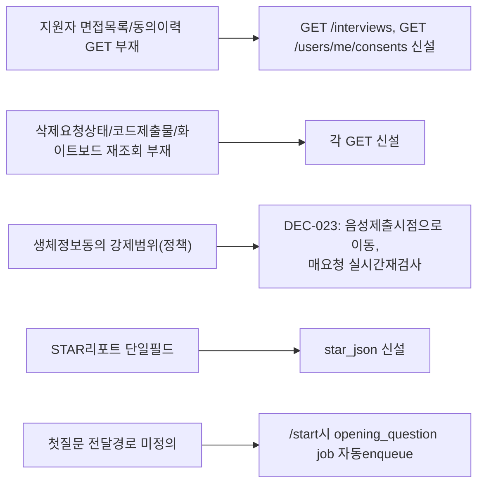

# 03단계 — 시스템 설계서 (v1→v2, 규칙F 재작업)

- **작업일**: 2026-09-18 작성, v2 재작업 2026-09-19 (git 커밋 20260923_2054)
- **소스 문서**: `docs/harness/03-system-design.md`, `verify-log_03-system-design.md`
- **판정**: PASS

## 배경

04단계 UX 설계 중 03단계 API/데이터모델만으로 해소 안 되는 화면요구사항 8건 발견(DEC-022), 정책 재검토 1건(생체정보 동의 강제범위)은 사용자 확인 거쳐 DEC-023 확정.

## v2 재작업 — 8건 갭 해소

## 영향받은 산출물

`docs/harness/03-system-design.md`(v1→v2), `docs/harness/verify-log_03-system-design.md`.
