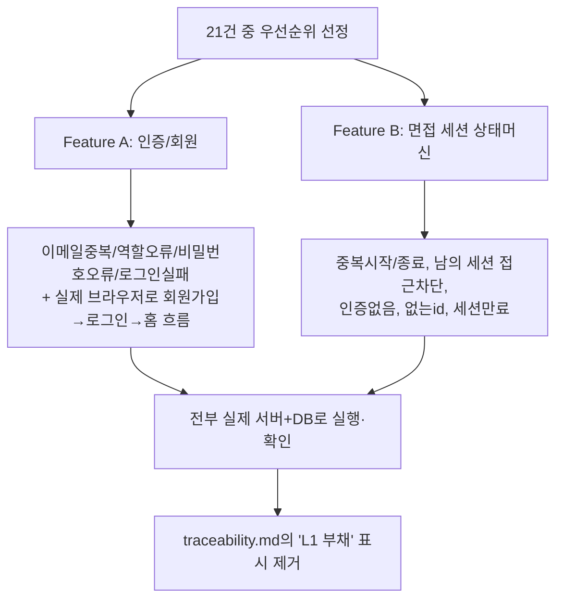

# 07단계 통합테스트 부채 정산 — Feature A(인증), Feature B(면접 세션 상태머신)

- **작업일**: 2026-09-28 14:50 (KST)
- **관련 결정 로그**: DEC-083, DEC-084
- **요청 내용**: 사용자가 승인한 "나머지 6개 후보" 중 #2 — "07단계 통합테스트 부채
  21건"을 어떻게 진행할지 확인 질문 후, "우선순위 높은 몇 개부터" 선택에 따라
  보안·핵심 경로에 가까운 2개 feature(인증, 면접 세션 상태머신)를 먼저 정식화

## 배경

이 프로젝트는 개발 속도를 위해 대부분의 기능을 "정상 경로만 빠르게 확인"하는 방식
(L1)으로 만들어왔다. 그 대가로 "에러가 나야 할 때 진짜로 에러가 나는지"(중복 요청,
권한 없는 접근, 만료된 세션 등)는 21개 항목에서 확인되지 않은 채 부채로 쌓여 있었다.
전부 한 번에 처리하기엔 너무 커서, 가장 중요한 것부터 먼저 처리하기로 했다.

## 한 일

## 검증 결과 요약

- Feature A: 5개 케이스 전부 실제로 확인. 특히 "회원가입→로그인→홈" 화면 흐름은
  이 프로젝트에서 처음으로 진짜 브라우저로 클릭해서 확인했다(과거에는 브라우저 도구가
  없어서 계속 건너뛰어 왔던 부분). 확인 도중 프론트가 옛날 포트(8010)를 보고 있어
  "네트워크 오류"가 나는 걸 발견해 고쳤다(코드 문제 아니라 로컬 설정 파일 문제).
- Feature B: 10개 케이스 전부 확인. 테스트를 만들 때 "만료된 세션은 조회해도 에러가
  나야 한다"고 잘못 가정했었는데, 실제로는 "조회는 항상 되고 상태만 '만료됨'으로
  보여준다"가 의도된 설계임을 코드를 다시 읽어보고 확인했다 — 결함이 아니라 내 예상이
  틀렸던 것으로 정직하게 정정해서 기록했다.

## 앞으로 남은 것

21건 중 이번에 처리한 2건(REQ-001, REQ-002/REQ-013)을 제외한 나머지(면접 진행 중
AI 응답 파이프라인 등 핵심이지만 더 큰 범위, 그 외 부가 기능들)는 아직 손대지 않았다
— 다음에 우선순위를 다시 정해 이어갈 수 있다.

## 영향받은 산출물

`docs/harness/feature-A-integration-test.md`(신규), `docs/harness/feature-B-integration-test.md`
(신규), `frontend/.env.local`(포트 정정), `docs/harness/traceability.md`(REQ-001/002/013),
`docs/harness/decisions.md`(DEC-083/084).
