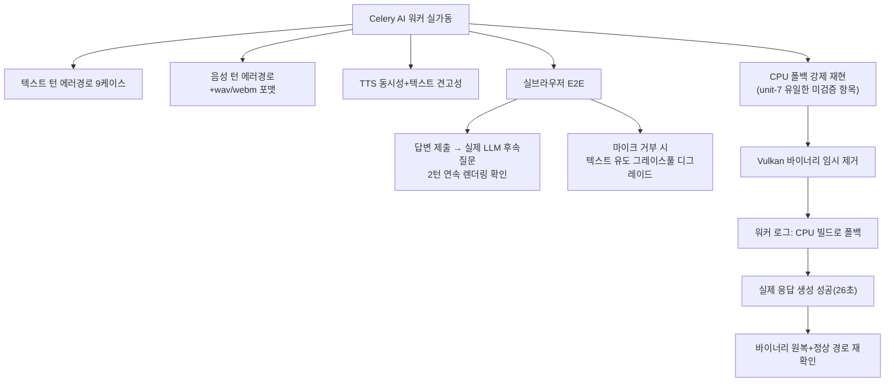

# 07단계 통합테스트 부채 정산 — Feature C(핵심 AI 파이프라인, 마지막 5건)

- **작업일**: 2026-09-28 17:55 (KST)
- **관련 결정 로그**: DEC-091
- **요청 내용**: 사용자가 "남은건 5건 진행해 주세요" 지시 — "07단계 통합테스트
  부채 21건" 중 마지막까지 남아있던 Feature C(REQ-003 텍스트답변/REQ-004 음성답변/
  REQ-005 STT/REQ-006 TTS/REQ-007 핵심 LLM+RAG) 전체 정산

## 배경

이 다섯 REQ는 이 프로젝트의 핵심 AI 턴 처리 파이프라인 전체(텍스트·음성 입력 →
STT → LLM → RAG → TTS → 화면 표시)를 묶은 것이라 가장 크고, 그래서 의도적으로
맨 마지막에 남겨뒀던 덩어리다. 이번이 이 프로젝트 07단계 역사상 **처음으로 LLM/
STT/TTS 워커를 전부 실제로 띄운 채** 검증한 회차다.

## 한 일과 발견

백엔드 에러 경로(인증없음/존재하지않는id/타인소유/상태충돌/만료/잘못된입력)는
텍스트·음성 합쳐 12케이스 전부 예상대로 동작했다. STT는 실제로 합성한 한국어
음성(wav, webm 두 포맷 모두)을 텍스트로 정확히 복원했다(원문과 100% 일치). TTS는
동시에 3건을 요청해도 순서대로 기다리지 않고 실제로 병렬 처리됨을 확인했다.

가장 의미 있었던 건 **실제 브라우저로 답변을 입력하고 전송했을 때, 진짜 LLM이
그 답변 내용을 반영한 자연스러운 꼬리질문을 만들어내는 것**을 2턴 연속으로
직접 눈으로 확인한 것이다("Redis 캐시와 메시지 큐를 도입해 응답속도를
개선했던 프로젝트를 소개해 주세요" — 지어낸 질문이 아니라 답변 내용을 실제로
읽고 만든 질문).

그리고 이전 세션(unit-7)이 "실제로 확인은 못 했다"고 정직하게 남겨뒀던 한 가지
— GPU(Vulkan)가 기동에 실패하면 CPU로 자동 전환되는 안전장치가 진짜로 동작하는지
— 를 이번에 직접 강제로 재현해봤다. GPU용 실행파일을 잠깐 이름을 바꿔서 못 쓰게
만들었더니, 로그에 "CPU 전용 빌드로 폴백"이라는 메시지가 뜨고, 느리긴 했지만(26초,
평소 5~7초) 실제로 정상적인 답변을 만들어냈다. GPU 메모리도 거의 늘지 않아서
정말로 CPU만 썼다는 것도 확인했다. 확인 후 바로 파일 이름을 원래대로 돌려놓고,
다시 정상적으로 GPU를 쓰는지도 재확인했다.

## 영향받은 산출물

`docs/harness/feature-C-integration-test.md`(신규), `docs/harness/traceability.md`
(REQ-003~007), `docs/harness/decisions.md`(DEC-091).

이로써 `traceability.md` 기준 "07단계 통합테스트 부채" 20건 전체가 정산 완료됐다.
