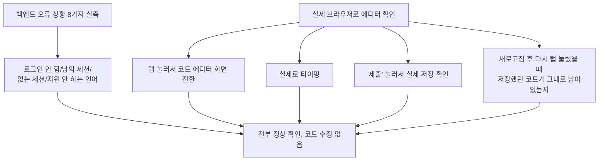

# 07단계 통합테스트 부채 정산 — Feature D(라이브 코딩 에디터)

- **작업일**: 2026-09-28 16:20 (KST)
- **관련 결정 로그**: DEC-088
- **요청 내용**: 사용자가 "07단계 통합테스트 부채 21건 나머지 계속 진행" 지시 —
  Feature 규제컴플라이언스 다음으로 라이브 코딩 에디터(REQ-008) 정식화

## 배경

면접 중 코드를 작성하는 화면(Monaco 에디터)은 실제로 탭을 눌러서 타이핑하고
저장하는 것까지는 한 번도 실제 브라우저로 확인한 적이 없었다.

## 한 일

## 검증 결과

8가지 오류 상황과 실제 에디터 사용 흐름(탭 전환→입력→저장→새로고침 후 복원) 전부
정상 동작을 확인했다. 특히 "새로고침해도 저장한 코드가 남아있는지"는 스크린샷으로
직접 눈으로 확인했다.

## 영향받은 산출물

`docs/harness/feature-D-integration-test.md`(신규), `docs/harness/traceability.md`
(REQ-008), `docs/harness/decisions.md`(DEC-088).
