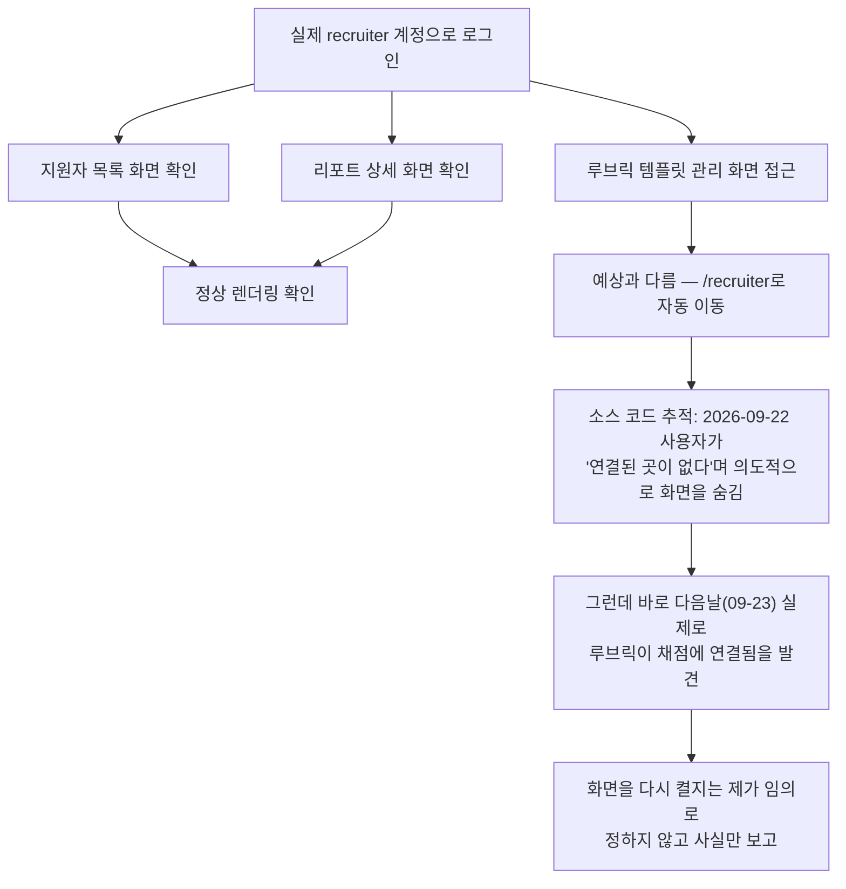

# 07단계 통합테스트 부채 정산 — Feature F(채용담당자 대시보드/루브릭)

- **작업일**: 2026-09-28 16:45 (KST)
- **관련 결정 로그**: DEC-089
- **요청 내용**: 사용자가 "07단계 통합테스트 부채 21건 나머지 계속 진행" 지시 —
  Feature D 다음으로 채용담당자용 화면(REQ-011/014) 정식화

## 배경

채용담당자가 보는 화면(지원자 목록, 리포트 상세, 루브릭 템플릿 관리)도 실제
브라우저로 확인한 적이 없었다.

## 한 일과 발견

지원자 목록·리포트 상세 화면은 실제로 잘 나왔다. 그런데 루브릭 템플릿을 만들고
수정하는 화면은 접근하면 곧바로 목록 화면으로 튕겨 나갔다 — 처음엔 버그인가 싶어
코드를 추적해보니, **2026-09-22에 사용자가 직접 "이 화면이 아무데도 연결 안 돼
있어서 혼란스럽다"며 일부러 숨겨둔 것**이었다(코드는 지우지 않고 이름만 바꿔서
보존해둠). 그런데 그 다음날(09-23) 다른 작업으로 루브릭 템플릿이 실제 채점 기능에
연결됐다 — 화면을 숨긴 이유가 지금은 더 이상 맞지 않을 수도 있다는 뜻이다.

이 화면을 다시 켤지 말지는 제품 방향에 대한 판단이라 제가 임의로 결정하지 않고,
사실관계만 정리해서 남겼다.

## 영향받은 산출물

`docs/harness/feature-F-integration-test.md`(신규), `docs/harness/traceability.md`
(REQ-011/014), `docs/harness/decisions.md`(DEC-089).
