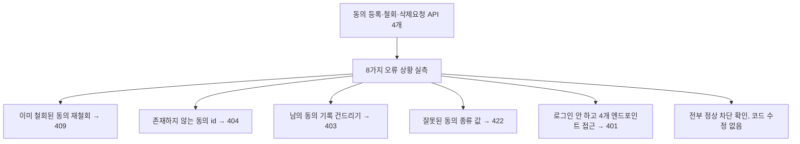

# 07단계 통합테스트 부채 정산 — Feature G(개인정보/동의 관리)

- **작업일**: 2026-09-28 15:30 (KST)
- **관련 결정 로그**: DEC-086
- **요청 내용**: 사용자가 "07단계 통합테스트 부채 21건 나머지 계속 진행" 지시 — Feature A/B
  다음으로 Feature G(REQ-029/030, 동의·삭제요청) 정식화

## 배경

지원자가 동의를 관리하는 기능(동의 등록/철회, 생체정보 삭제 요청)은 정상적으로 쓸 때는
잘 동작하는 것까지만 확인돼 있었고, "이미 철회한 걸 또 철회하면", "남의 동의 기록을
건드리려 하면", "로그인 안 하고 접근하면" 같은 상황은 확인된 적이 없었다.

## 한 일

## 검증 결과

8가지 상황 전부 예상대로 정확히 막혔다. 코드에 문제가 없어서 고칠 것도 없었다 — 이번
작업은 "이미 잘 만들어진 방어 로직이 실제로도 그렇게 동작하는지" 증명한 것.

## 영향받은 산출물

`docs/harness/feature-G-integration-test.md`(신규), `docs/harness/traceability.md`
(REQ-029/030), `docs/harness/decisions.md`(DEC-086).
