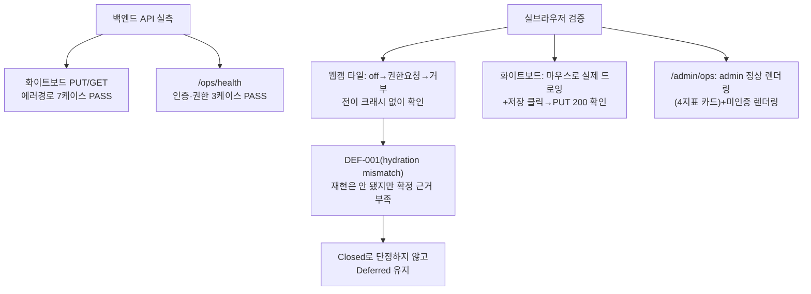

# 07단계 통합테스트 부채 정산 — Feature H(웹캠 프리뷰/운영 모니터링/화이트보드)

- **작업일**: 2026-09-28 17:15 (KST)
- **관련 결정 로그**: DEC-090
- **요청 내용**: 사용자가 "07단계 통합테스트 부채 21건 나머지 계속 진행" 지시 —
  Feature F 다음으로 REQ-015/016/017(웹캠 프리뷰, 운영 모니터링, 화이트보드
  캔버스) 정식화

## 배경

세 기능 모두 06단계에서는 정상 경로만 가볍게 확인했고, 에러 경로(401/403/404/422)
와 실제 브라우저 렌더링은 "L1 부채"로 07단계에 남겨져 있었다.

## 한 일과 발견

화이트보드와 운영 모니터링 API의 에러 경로 10케이스는 전부 예상대로 동작했다.
브라우저로는 웹캠 권한을 거부했을 때 화면이 깨지지 않고 안내 문구로 정상
전환되는 것, 화이트보드에 실제로 마우스로 그림을 그리고 저장 버튼을 눌렀을 때
진짜로 서버에 저장 요청이 가는 것(네트워크 로그로 200 확인), `/admin/ops`
화면이 관리자 로그인 상태와 비로그인 상태 둘 다 올바르게 나오는 것을 확인했다.

기존에 남아있던 의심 결함(DEF-001, 웹캠 타일의 hydration mismatch 가능성)은
이번에도 재현되지 않았다. 다만 이 세션의 브라우저 콘솔 로그가 하루 종일
여러 페이지를 오가며 쌓인 상태라 "이번 로드만의 깨끗한 결과"라고 확신하기엔
근거가 부족해서, 성급하게 "해결됨"으로 닫지 않고 Deferred 상태를 그대로 뒀다.

부수적으로 `active_sessions` 실측값이 646으로 꽤 크다는 것도 확인했는데, 이건
이번 작업 범위 밖이라 정리하지 않고 관측만 기록했다(실사용자 데이터라 임의로
건드리지 않음).

## 영향받은 산출물

`docs/harness/feature-H-integration-test.md`(신규), `docs/harness/traceability.md`
(REQ-015/016/017), `docs/harness/decisions.md`(DEC-090).
