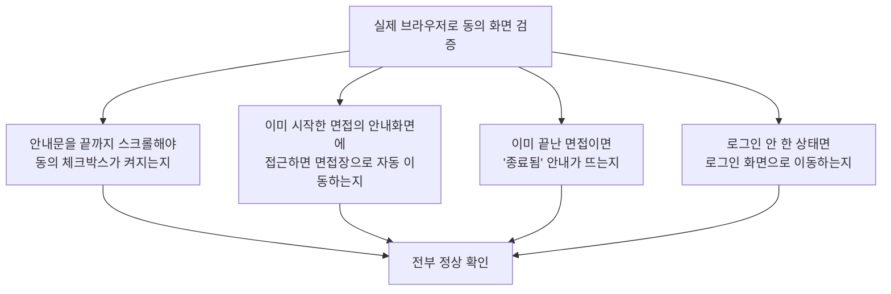

# 07단계 통합테스트 부채 정산 — Feature 규제컴플라이언스(REQ-031~034)

- **작업일**: 2026-09-28 16:00 (KST)
- **관련 결정 로그**: DEC-087
- **요청 내용**: 사용자가 "07단계 통합테스트 부채 21건 나머지 계속 진행" 지시 —
  Feature G 다음으로 사전고지/법률고지 화면(REQ-031~034) 정식화

## 배경

면접 시작 전 "동의 안내" 화면은 지금까지 실제 브라우저로 클릭해본 적이 한 번도
없었다 — 과거 모든 세션이 "브라우저 자동화 도구가 없다"는 이유로 계속 미뤄온
부분이었다. 이 세션에는 실제 브라우저 도구가 있어서 이번에 처음 확인했다.

## 한 일

## 검증 결과 및 특이사항

4가지 상황 전부 실제 화면에서 예상대로 동작했다. 검증 도중 사용량 한도로 세션이
한 번 끊겼는데, 재개할 때 테스트로 만든 데이터가 남아있는지부터 다시 확인하고
(잔여 0건 확인), 미확인 상태로 남아있던 부분(종료된 면접 안내, 비로그인 접근)만
처음부터 다시 검증해서 마무리했다.

부가로, 테스트 도구(자바스크립트로 직접 스크롤 위치를 바꾸는 방식)는 실제
브라우저 이벤트를 발생시키지 않아 화면이 반응하지 않는 특성을 발견했다 — 실제
사용자가 마우스나 터치로 스크롤할 때는 문제가 없고, 이건 테스트 방법상의 특성이지
서비스 결함이 아니다.

## 영향받은 산출물

`docs/harness/feature-Compliance-integration-test.md`(신규), `docs/harness/
traceability.md`(REQ-031~034), `docs/harness/decisions.md`(DEC-087).
