# 3001 회원가입 제거 + 채용담당자 등록 기능 — 보안 취약점 수정 포함

- **작업 일시**: 2026-09-30 (KST)
- **관련 DEC**: DEC-107 (`docs/harness/decisions.md`)

## 1. 무엇을 요청받았는가

사용자 원문 요청(3가지, 3번은 의도 확인 후 명확화):

1. "채용 지원 일때는 회원가입이 필수 -> 이력서를 제출해야 되기 때문." (3002는 그대로)
2. "AI 모의면접 플랫폼 -> 로그인만 가능처리(회원가입 필요없음)" (3001 회원가입 제거)
3. "채용자(관리자) 권한을 추가하는 기능도 있어야 하기에" → "채용자(관리자) 추가
   기능을 관리자 로그인 한 상태에서 탭 메뉴로, 회원가입메뉴 내용을 기준으로 하여
   채용자(관리자)를 추가하는 기능이 필요합니다."

## 2. 검토 단계에서 발견한 실제 보안 취약점 (작업 착수 전 보고)

코드를 먼저 확인한 결과, 지금까지 `POST /auth/register`가 **인증이 전혀 없고
role 값을 호출하는 쪽이 마음대로 정할 수 있는 완전 공개 엔드포인트**였다는
것을 확인했다. 즉 이 API를 직접 호출하면(화면을 거치지 않고도) **누구나
`role: "recruiter"`로 자가가입해 모든 지원자의 이력서·개인정보·면접 리포트에
접근하는 권한을 즉시 얻을 수 있는 상태**였다. 화면(3001의 회원가입 버튼)만
없애는 것으로는 이 문제가 전혀 해결되지 않는다고 판단해, 작업 착수 전
AskUserQuestion으로 확인을 시도했으나 사용자가 확인창을 닫고 "중지해
주세요"라고 요청 — 임의로 진행하지 않고 대기했다. 이후 사용자가 채팅으로
직접 요구사항 3가지(위 1~3번)를 정리해 제시했고, 에이전트가 이해한 내용을
그대로 되짚어 "100% 이해가 맞다"는 확인과 "보안 문제도 없도록 진행해달라"는
명시적 승인을 받은 뒤에 착수했다.

## 3. 무엇을 했는가

### 3-1. 백엔드 — 핵심 보안 수정

- `backend/app/schemas/user.py::RegisterRequest.role`: `Literal["candidate",
  "recruiter"]` → `Literal["candidate"] = "candidate"`로 제한. 이제 공개
  회원가입 API는 **Pydantic 스키마 검증 단계에서부터** `role: "recruiter"`
  요청을 거부한다(422, 코드 한 줄도 도달하기 전에 차단 — 가장 강력한 형태의
  방어).
- `backend/app/schemas/recruiter.py`: `RecruiterCreateIn` 신규(email/
  password/name만 — role 필드 자체가 스키마에 없어 호출자가 다른 role을
  지정할 방법이 원천적으로 없음).
- `backend/app/api/v1/recruiter.py`: `POST /recruiter/recruiters` 신규 —
  기존에 이미 있던 `_require_recruiter()` 가드를 그대로 재사용해 "이미
  로그인한 recruiter만" 호출 가능. 이메일 중복 시 409.

### 3-2. 프런트엔드

- `frontend/app/page.tsx`(3001 랜딩): "회원가입" 버튼 제거.
- `frontend/app/login/page.tsx`: 하단 "계정이 없으신가요? 회원가입" 링크
  제거. 이제 도달할 방법이 없어진 `registered=1` 쿼리파라미터 안내 배너와
  그걸 위해서만 필요했던 `useSearchParams`/`Suspense` 래퍼도 죽은 코드라
  함께 정리.
- `frontend/app/register/page.tsx`: **파일/라우트 자체 삭제** — 3001에서
  `/register`로 직접 접속해도 이제 404.
- `frontend/components/RecruiterListTabs.tsx`: 3번째 탭 "채용담당자 추가"
  신설(`/recruiter/add-recruiter`).
- `frontend/app/recruiter/add-recruiter/page.tsx`: 신규 화면. 기존 회원가입
  화면과 동일한 필드(이메일/비밀번호/비밀번호 확인/이름)를 그대로 재사용하되
  역할 선택 라디오는 제거(항상 recruiter 고정). 다른 `/recruiter/**` 화면과
  동일하게 **이 화면 자체도 미인증·비recruiter 접근을 프런트에서부터 차단**
  (백엔드 403 이전에 한 겹 더).

### 3-3. 의도적으로 뺀 것 (사용자 재확인 필요)

기존 회원가입 화면에 있던 "개인정보 처리방침에 동의합니다" 체크박스는 이번
"채용담당자 추가" 화면에 넣지 않았다 — 그건 원래 **자기 자신의 개인정보
수집에 스스로 동의**하는 용도인데, 이 화면은 관리자가 **타인(신규
채용담당자)의 계정을 대신 만드는** 맥락이라 그대로 재사용하면 의미가
맞지 않는다고 판단해 에이전트가 임의로 뺐다. 필요하다면(예: 사내 규정상
관리자가 타인을 대신 동의 처리해야 하는 경우) 말씀해주시면 추가하겠다.

## 4. 실측 검증 — 전부 실HTTP + 실브라우저

```mermaid
flowchart TD
    A["공개 등록 API에 role=recruiter 직접 호출"] --> A1["422 차단 확인"]
    B["공개 등록 API에 role=candidate 호출"] --> B1["201 정상 확인(지원자 가입 안 깨짐)"]
    C["신규 보호 API 무인증 호출"] --> C1["401 확인"]
    D["신규 보호 API를 candidate 토큰으로 호출"] --> D1["403 확인"]
    E["신규 보호 API를 recruiter 토큰으로 호출"] --> E1["201 + 실제 로그인 가능 확인"]
    F["신규 보호 API 중복 이메일"] --> F1["409 확인"]
    G["3001 랜딩 화면"] --> G1["회원가입 버튼 사라짐 확인"]
    H["3001 /register 직접 접속"] --> H1["404 확인"]
    I["로그인 화면"] --> I1["회원가입 링크 사라짐 확인"]
    J["채용담당자 추가 탭 실사용"] --> J1["새 계정 생성 성공 배너+DB+로그인 확인"]
    K["candidate 토큰으로 새 화면 접근"] --> K1["프런트 게이트에서 '권한이 없습니다' 확인"]
    L["무인증으로 새 화면 접근"] --> L1["/login 리다이렉트 확인"]
```

| # | 시나리오 | 방법 | 결과 |
|---|---|---|---|
| 1 | 공개 등록 API, role=recruiter | `curl POST /auth/register` | `422 Validation Error` — 차단 |
| 2 | 공개 등록 API, role=candidate | `curl POST /auth/register` | `201` — 정상(지원자 가입 안 깨짐) |
| 3 | 신규 보호 API, 무인증 | `curl POST /recruiter/recruiters` (헤더 없음) | `401 AUTH_INVALID_TOKEN` |
| 4 | 신규 보호 API, candidate 토큰 | `curl` + `Authorization: Bearer <candidate>` | `403 AUTH_FORBIDDEN` |
| 5 | 신규 보호 API, recruiter 토큰 | `curl` + `Authorization: Bearer <recruiter>` | `201` + 생성된 계정 실제 로그인(`200`) 확인 |
| 6 | 신규 보호 API, 중복 이메일 | 같은 이메일로 5번 재호출 | `409 Conflict` |
| 7 | 3001 랜딩 | 실브라우저 `get_page_text` | "회원가입" 문자열 없음, "로그인"만 존재 |
| 8 | 3001 `/register` | 실브라우저 접속 | "404 This page could not be found." |
| 9 | 3001 로그인 화면 | 실브라우저 `get_page_text` | 회원가입 링크 없음 |
| 10 | 채용담당자 추가 탭 | 실브라우저 폼 작성+제출 | "OO 계정을 채용담당자로 추가했어요" 배너, DB에 role=recruiter로 실제 저장, 로그인 성공(`200`) |
| 11 | candidate 토큰으로 새 화면 접근 | sessionStorage에 candidate 토큰 주입 후 접속 | "권한이 없습니다 — 채용담당자 추가는 채용담당자 계정으로만 할 수 있어요" (백엔드 403 도달 전에 프런트에서부터 차단) |
| 12 | 무인증으로 새 화면 접근 | sessionStorage 비운 후 접속 | `/login`으로 자동 리다이렉트 |

## 5. 알려진 영향 — 숨기지 않고 보고

`frontend/e2e/unit-19/{api-list,home,home-states}.spec.ts`의 테스트
헬퍼(`AccountKit.create("recruiter", ...)`, `frontend/e2e/unit-19/helpers.ts`)가
지금까지 공개 `/auth/register`를 직접 호출해 테스트용 recruiter 계정을
만들어왔다. 이번 보안 수정 이후 그 호출은 422로 실패하므로, **이 e2e
스펙들을 다시 돌리면 관련 테스트가 깨진다.** 이번 작업 범위(화면 변경 +
보안 수정)에는 포함되지 않아 손대지 않았다 — 필요하시면 그 헬퍼가 recruiter
계정을 DB 직접 삽입 또는 새 보호된 엔드포인트(부트스트랩 토큰 필요)로
만들도록 별도로 고쳐드리겠다.

## 6. 뒷정리 (규칙 K) + 헬스체크 (규칙 K-6)

- 테스트 계정 3개(`security_test_candidate`, `security_test_recruiter`,
  `ui_test_recruiter`) DB에서 삭제, 임시 파일 삭제.
- `GET /api/v1/health` → `200`, 3001 랜딩/로그인 → `200`, 3002 랜딩(영향
  없어야 할 앱) → `200` 확인.
- 백엔드는 `--reload` 옵션 없이 떠 있어 코드 변경이 자동 반영되지 않는
  구성이라, 이번 변경 적용을 위해 `preview_stop`→`preview_start`로
  재기동했다(사용자 데이터/DB에는 영향 없음, 서버 프로세스만 재시작).

## 7. 영향받는 파일

- `backend/app/schemas/user.py`
- `backend/app/schemas/recruiter.py`
- `backend/app/api/v1/recruiter.py`
- `frontend/app/page.tsx`
- `frontend/app/login/page.tsx`
- `frontend/app/register/page.tsx` (삭제)
- `frontend/components/RecruiterListTabs.tsx`
- `frontend/app/recruiter/add-recruiter/page.tsx` (신규)
- `frontend/lib/api.ts`
- `docs/harness/decisions.md` (DEC-107 신규)

git add/commit/push는 지시하신 대로 진행하지 않았습니다.
