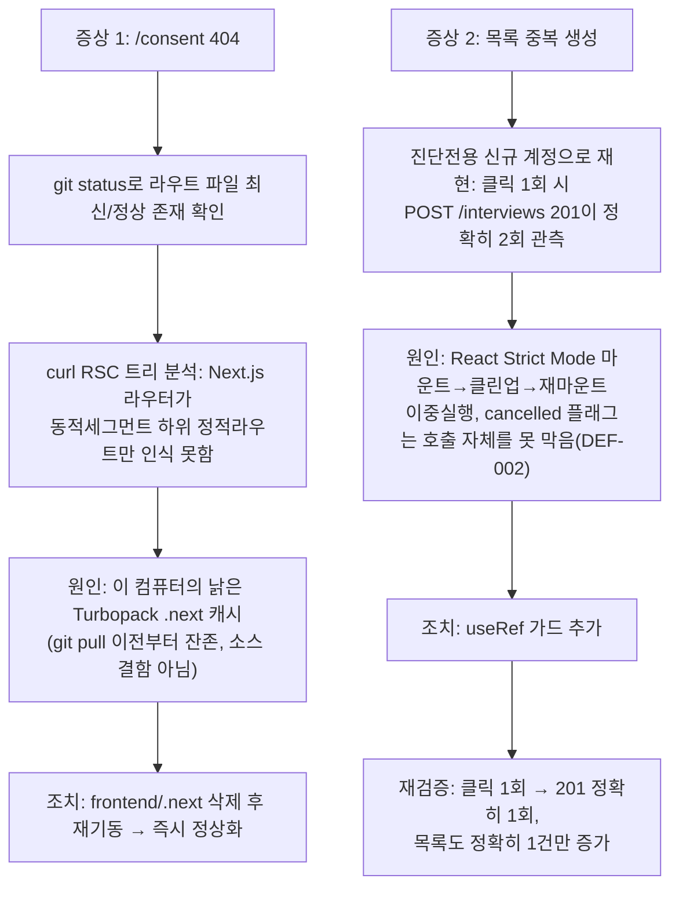

# "새 면접 시작" 404 및 목록 중복 생성 진단·수정

- **작업일**: 2026-09-24 09:12 (실제 작업 순서 기준 배치 시각, 정본은 `docs/harness/decisions.md` DEC-064)
- **관련 결정 로그**: DEC-064
- **요청 내용**: 사용자가 로컬 서버 사용 중 (1) "새 면접 시작" 클릭 시 `/interviews/{id}/consent` 404, (2) 지원자 홈 면접 목록이 클릭마다 1~2건씩 느는 현상을 스크린샷과 함께 신고. "다른 컴퓨터에서는 문제없었다"며 소스 복원 요청.

## 진단 원칙

임의로 소스를 되돌리지 않고, 먼저 실측으로 원인을 규명했다.

## 원인 및 조치

| 증상 | 원인 분류 | 조치 |
|---|---|---|
| `/consent` 404 | 이 PC 로컬 캐시 문제(소스 결함 아님) | `.next` 삭제 |
| 면접 목록 중복 생성(DEF-002) | 실제 소스 결함(Strict Mode 이중 호출) | `useRef` 가드 추가 |

## 정리(규칙 K)

진단 전용 계정과 그 계정이 만든 면접 3건은 검증 직후 삭제. 사용자 실계정이 이미 만든 데이터는 사용자 소유라 임의 삭제하지 않고 안내만 함.

## 영향받은 산출물

`frontend/app/interviews/new/page.tsx`(DEF-002 수정), `frontend/.next`(캐시 삭제, 추적 대상 아님), `docs/harness/units/unit-15-test.md` §11.
