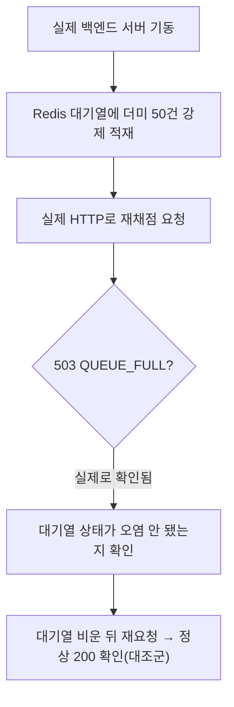

# 503 QUEUE_FULL 실측 검증

- **작업일**: 2026-09-28 14:25 (KST)
- **관련 결정 로그**: DEC-085
- **요청 내용**: 사용자가 승인한 "나머지 6개 후보" 중 #4 — "503 QUEUE_FULL 실측"

## 배경

처리 대기열이 가득 차면(50건 이상) 채용담당자 재채점 요청을 503으로 막는 코드는
이미 있었지만, 실제로 대기열을 50건까지 채워서 진짜로 막히는지는 이 프로젝트 전체에서
한 번도 확인된 적이 없었다.

## 한 일

실제로 큐를 채워보니 정확히 503으로 막혔고, 막힌 요청 때문에 면접 상태가 잘못
바뀌는 일도 없었다. 큐를 비우고 다시 요청하니 정상 처리됐다.

## 검증 중 발견한 특이사항(결함 아님)

테스트 도중 클라이언트 쪽에서 한 번 연결 재사용 문제로 타임아웃이 발생했는데, 서버
로그와 DB 상태를 확인해보니 서버는 정상적으로 처리를 마친 상태였다 — 새 연결로 즉시
재확인해 정상 동작임을 재검증했다(서버 코드 결함 아님, 자세한 내용은 테스트 결과서
참고).

## 영향받은 산출물

코드 변경 없음(기존 코드 실측 검증), `docs/harness/queue-full-20260928-test.md`(신규),
`docs/harness/decisions.md`(DEC-085).
