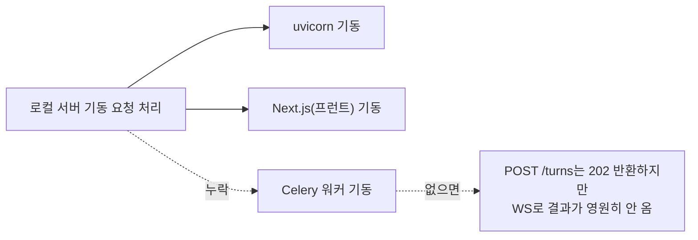

# Celery 워커 프로세스 누락 진단·복구

- **작업일**: 2026-09-24 10:25 (실제 작업 순서 기준 배치 시각, 정본은 `docs/harness/decisions.md` DEC-066)
- **관련 결정 로그**: DEC-066
- **요청 내용**: DEF-003 수정 확인 후 사용자가 실제 면접 진행 중 "AI 면접관이 첫 질문을 준비하고 있습니다"가 끝나지 않고 "예상보다 시간이 걸리고 있습니다"로 넘어가는 현상을 신고. "다른 컴퓨터에서는 잘 나왔다"고 지적.

## 진단

코드를 보기 전에 먼저 **프로세스 목록부터 확인** — `celery -A app.services.celery_app worker --concurrency=1 --pool=solo -Q ai_pipeline` 프로세스가 아예 떠 있지 않았음을 확인.

이 세션이 ".claude/launch.json"에 uvicorn·Next.js 2종만 등록하고 Celery 워커를 빠뜨린 것이 원인 — **소스 코드 결함이 아니라 이 세션의 로컬 환경 구성 누락**.

## 조치 및 검증

| 단계 | 방법 | 결과 |
|---|---|---|
| 1 | Celery 워커 기동(`--pool=solo`, DEC-019 그대로) | 정상 기동 |
| 2 | httpx E2E 스크립트로 면접시작→오프닝 질문 생성 폴링 | 16.8초 만에 정상 수신 |
| 3 | 실브라우저(신규 탭+신규 계정)로 사용자와 동일 절차 재현 | 오프닝 질문 화면 렌더링 확인, 콘솔에러 0건 |

## 정리(규칙 K)

진단용 계정 2개와 그 인터뷰는 검증 직후 삭제.

## 영향받은 산출물

코드 변경 없음(로컬 프로세스 추가 기동뿐), `docs/harness/units/unit-15-test.md` §13.
