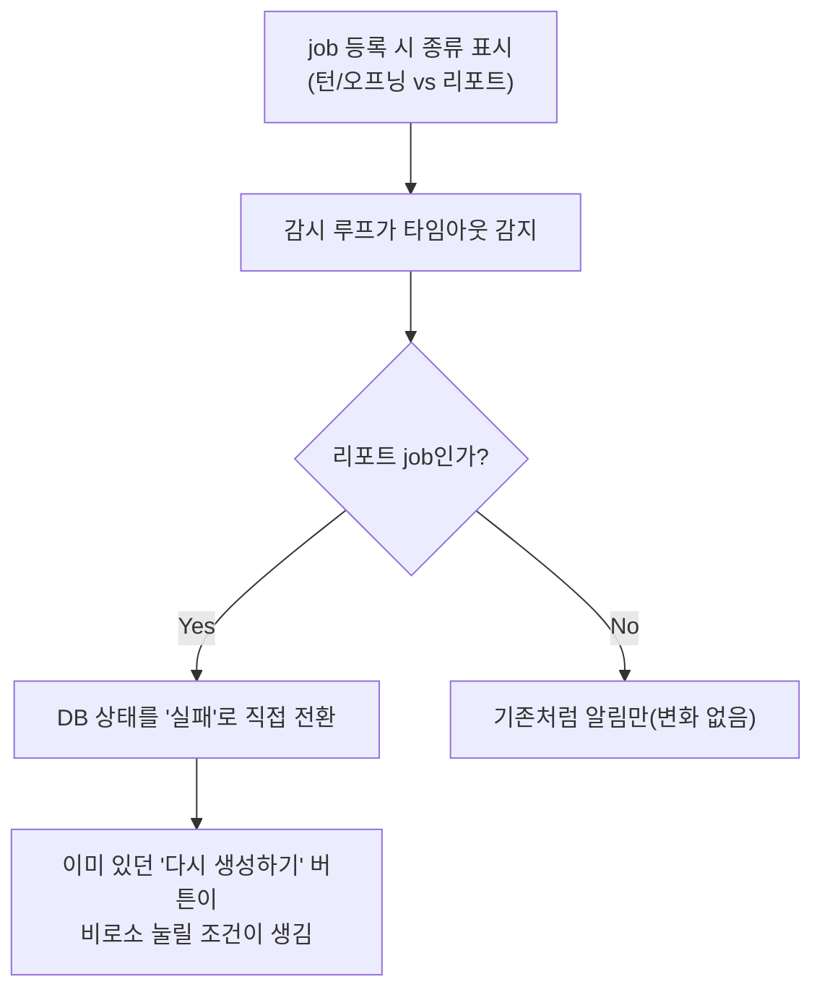

# Celery 워커 크래시 시 리포트 영구 고착 복구 (unit-10 DEF-002)

- **작업일**: 2026-09-28 14:10 (KST)
- **관련 결정 로그**: DEC-082
- **요청 내용**: 사용자가 승인한 "나머지 6개 후보" 중 #3 — "Celery 워커 크래시 복구"

## 배경

리포트를 만드는 워커 프로세스가 도중에 죽으면, 그 면접의 리포트 상태는 "생성 중"에서
영원히 멈춰버렸다. 화면은 3초마다 계속 물어보기만 할 뿐(WS 알림을 안 씀), 이 실패를
알아챌 방법이 없어서 사용자는 새로고침을 반복하는 것 말고는 할 수 있는 게 없었다.

## 한 일

새 화면을 만들지 않았다 — 이미 리포트 실패 시 보여주는 "다시 생성하기" 버튼이 있었는데,
그 버튼이 뜨는 조건(상태=실패)이 워커 크래시 상황에서는 한 번도 만들어지지 않았을
뿐이었다. 감시 로직이 리포트 job의 타임아웃을 감지했을 때 그 조건을 직접 만들어주도록
고쳤다.

## 검증

실제 Redis·DB로 5가지 상황(정상 등록/실패 전환/이미 완료된 건 안 건드림/전체 흐름/
일반 대화 job은 영향 없음)을 전부 확인했다. 자세한 내용은
`docs/harness/celery-crash-recovery-20260928-test.md` 참고.

## 영향받은 산출물

`backend/app/services/job_watchdog.py`, `backend/app/services/job_queue.py`,
`docs/harness/celery-crash-recovery-20260928-test.md`(신규), `docs/harness/decisions.md`
(DEC-082).
