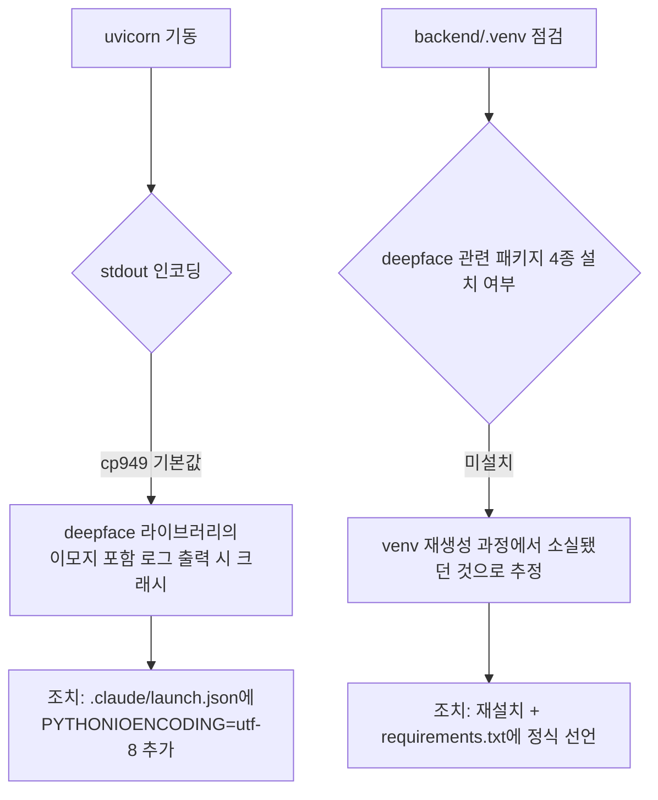

# DeepFace 표정분석 개인테스트 API 배선 (범위 축소 승인)

- **작업일**: 2026-09-24 17:05 (실제 작업 순서 기준 배치 시각, 정본은 `docs/harness/decisions.md` DEC-070)
- **관련 결정 로그**: DEC-070
- **요청 내용**: 사용자가 "DeepFace 서비스연결 → 법무 자문 필요없음(개인PC에서만 임시 테스트)"로 범위를 명시적으로 좁혀 연결 승인. 실제 채용 프로세스 연결에는 여전히 법무 검토 필수 조건 유지.

## 한 일

`POST /interviews/{id}/webcam-emotion` 신규 배선 — 면접 평가/리포트 파이프라인과 완전 분리, 결과 DB 미저장, 모든 응답에 "개인 PC 임시 테스트 전용·법무검토 필요" disclaimer 동봉.

## 배선 중 발견·수정한 결함 2건

unit-31-test.md §8이 미해결로 남겨뒀던 "uvicorn도 크래시하는가" 질문에 대한 답 — 실측 결과 **"그렇다"**.

## 검증 결과

| TC | 항목 | 결과 |
|---|---|---|
| 얼굴 없음 | 422 | PASS |
| 타인 접근 | 404 | PASS |
| 실제 얼굴 | happy, confidence 0.97 (unit-31 최초 검증과 동일 결과 재현) | PASS |

## 정리(규칙 K)

진단 계정 4건은 검증 직후 삭제.

## 영향받은 산출물

`backend/app/services/emotion_engine.py`(disclaimer 추가), `backend/app/schemas/emotion.py`(신규), `backend/app/api/v1/webcam_emotion.py`(신규), `backend/app/main.py`(라우터 등록), `backend/requirements.txt`(패키지 4종 선언 추가), `.claude/launch.json`(PYTHONIOENCODING 수정), `docs/harness/units/unit-31-test.md` §11.
