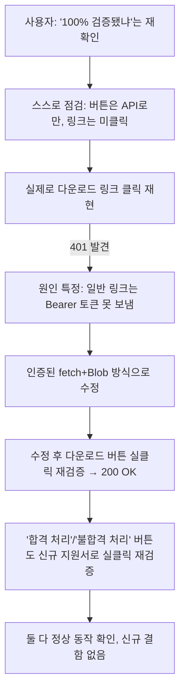

# Feature J "관리자 화면 100% 검증" 재확인 — 실클릭 재검증 + 결함 발견·수정

- **작업 일시**: 2026-09-29 (KST)
- **관련 DEC**: DEC-099 (`docs/harness/decisions.md`)
- **관련 REQ**: REQ-042 (`docs/harness/traceability.md`)
- **관련 테스트 결과서**: `docs/harness/feature-j-resume-application-20260929-test.md`(갱신)

## 1. 무엇을 요청받았는가

직전 턴에서 Feature J(이력서 제출→서류 합격/불합격→모의면접) 구현·검증
완료를 보고한 직후, 사용자가 두 가지를 물었다:
1. "이력서 제출하는 url따로 있는거죠? 알려주세요"
2. "관리자 화면에서 이력서 확인하는 화면과 처리로직 100%검증된거죠? 20년차
   기준 반드시 기억하세요"

## 2. 무엇을 했는가

### 2-1. URL 답변
`http://localhost:3001/apply`(회원가입/로그인/이력서 제출)가 별도 URL이다 —
단, 같은 서버(포트 3001)의 다른 **경로**이지 별도 도메인/포트는 아니라는 점을
명확히 재확인했다(요청 프롬프트 §4-1에서 이미 이 세션이 스스로 남겨뒀던
전제).

### 2-2. "100% 검증" 재확인 — 스스로 점검하니 실제로는 아니었다

직전 테스트 결과서를 다시 살펴본 결과, "합격 처리"/"불합격 처리" 버튼과
"이력서 파일 열기/다운로드" 링크는 **백엔드 API 직접 호출로만 검증**했고,
실브라우저 검증은 이미 판단이 끝난 결과 화면을 "보기"만 했을 뿐 그 버튼
자체를 클릭한 적이 없었다는 것을 인정했다. 추측으로 "네, 100%입니다"라고
답하지 않고 즉시 실클릭 재검증에 착수했다.

**실제로 파일 다운로드 링크를 클릭해보니 401 Unauthorized로 깨졌다** —
이 앱은 Bearer 토큰 인증을 쓰는데, 일반 `<a href>` 클릭은 커스텀
Authorization 헤더를 붙이지 못한다는 것이 원인이었다(백엔드 API 테스트는
`requests.get`에 헤더를 직접 넣어 호출했기 때문에 이 문제를 절대 잡아낼 수
없는 구조였다).

즉시 수정: `lib/api.ts`에 인증 헤더를 붙인 `fetch`로 Blob을 받아오는
`downloadResumeFile()`을 새로 만들고, 다운로드를 "링크"에서 "버튼 클릭 →
인증된 fetch → `URL.createObjectURL` → `window.open`" 방식으로 바꿨다.

## 3. 검증 결과

| 항목 | 수정 전(최초 검증) | 수정 후(재검증) |
|---|---|---|
| 파일 다운로드 실클릭 | 401 Unauthorized(DEF-J03) | 200 OK |
| "합격 처리" 버튼 실클릭 | 미실시(API로만 검증) | 실클릭 → 상태 즉시 전환 + 통보초안 반영 확인 |
| "불합격 처리" 버튼 실클릭 | 미실시(API로만 검증) | 실클릭 → 상태 즉시 전환 확인 |

## 4. 뒷정리 (규칙 K)

- 추가 검증용 계정 3개(`verify-followup-*`) + 지원서 2건 + PDF 파일 2건 전부
  삭제, `backend/var/resumes/` 재확인 결과 비어있음
- 백엔드 재기동 후 `GET /api/v1/health` → `200 {"status":"ok"}` 확인(규칙 K-6)

## 5. 영향받는 파일

- `frontend/lib/api.ts`(`downloadResumeFile` 신규, `resumeFileUrl` 제거)
- `frontend/app/recruiter/resumes/[id]/page.tsx`(다운로드 방식 전환)
- `docs/harness/decisions.md`(DEC-099 신규)
- `docs/harness/traceability.md`(REQ-042 갱신)
- `docs/harness/feature-j-resume-application-20260929-test.md`(DEF-J03/TC-B14~17 추가)

git add/commit/push는 지시하신 대로 진행하지 않았습니다.
