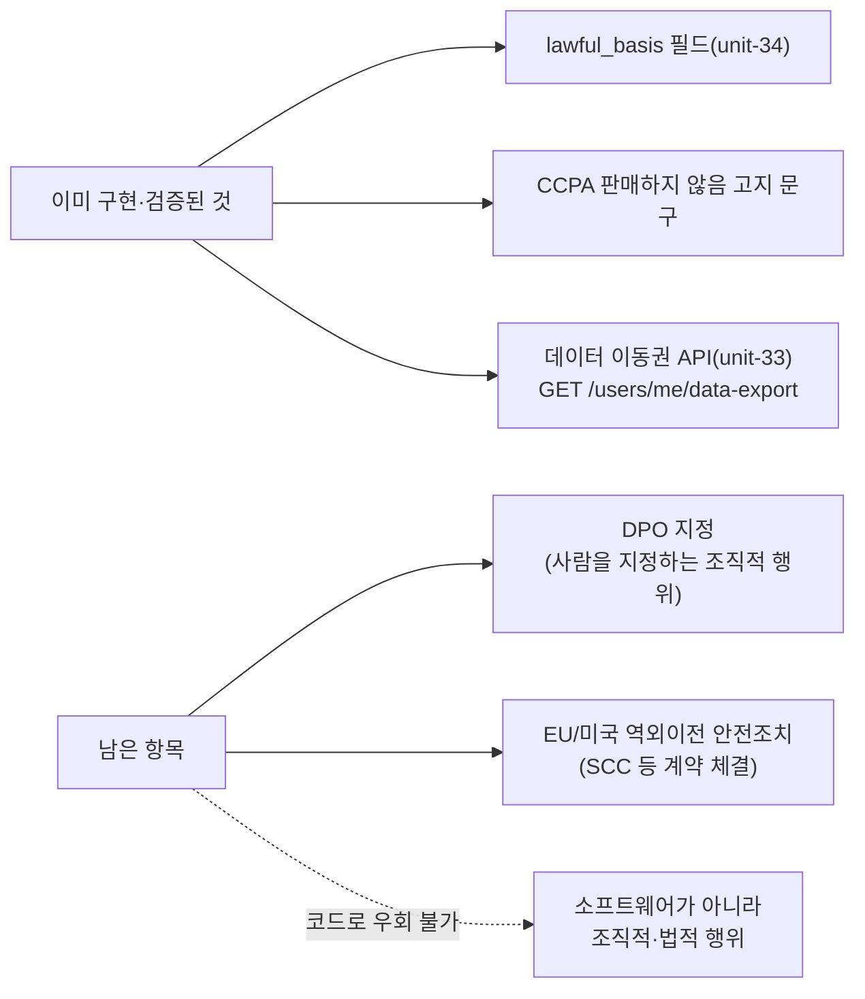

# GDPR/CCPA 완전준수 재검토

- **작업일**: 2026-09-24 19:20 (실제 작업 순서 기준 배치 시각, 정본은 `docs/harness/decisions.md` DEC-071)
- **관련 결정 로그**: DEC-071
- **요청 내용**: 사용자가 "GDPR/CCPA 동시준수 → 법근거 체계·DPO 지정 같은 법적 판단 필요없음(개인PC에서만 임시 테스트)"라며 완료 전환 가능 여부 검토 요청.

## 검토 결과

**추가로 배선할 코드 자체가 없음을 확인**하고 그대로 정직하게 보고 — DeepFace/STT처럼 "연결 안 된 실행 가능한 코드"가 남아있는 경우가 아니었다.

## 결론

"법무 필요"가 코드 완성도 문제가 아니라 **범주 자체의 차이**임을 명확히 구분해 설명. 매트릭스 상태는 "부분착수" 그대로 유지(거짓 완료 보고 금지).

## 영향받은 산출물

코드 변경 없음 — 상태 유지 이유를 채팅으로 상세 설명.
