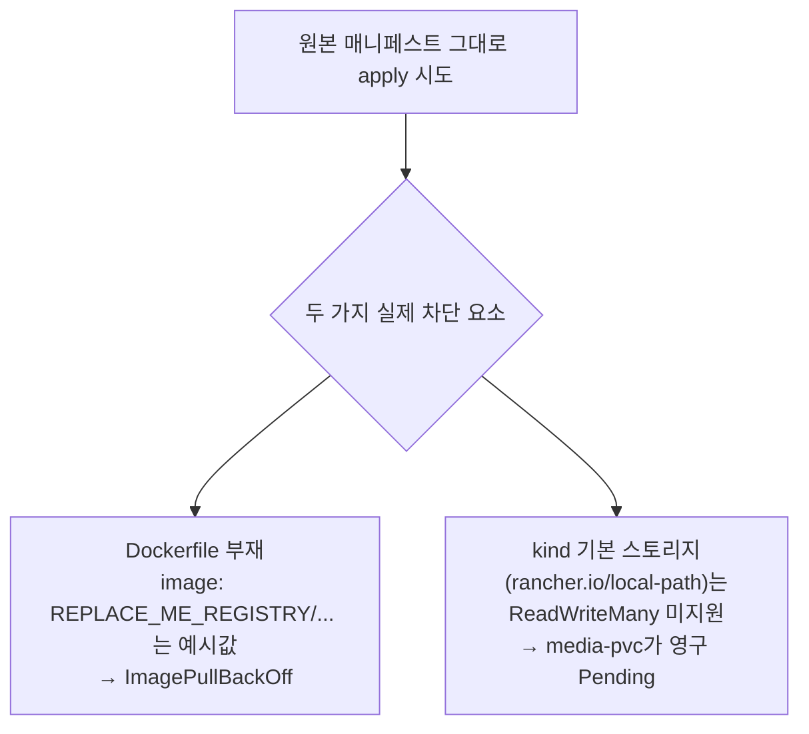
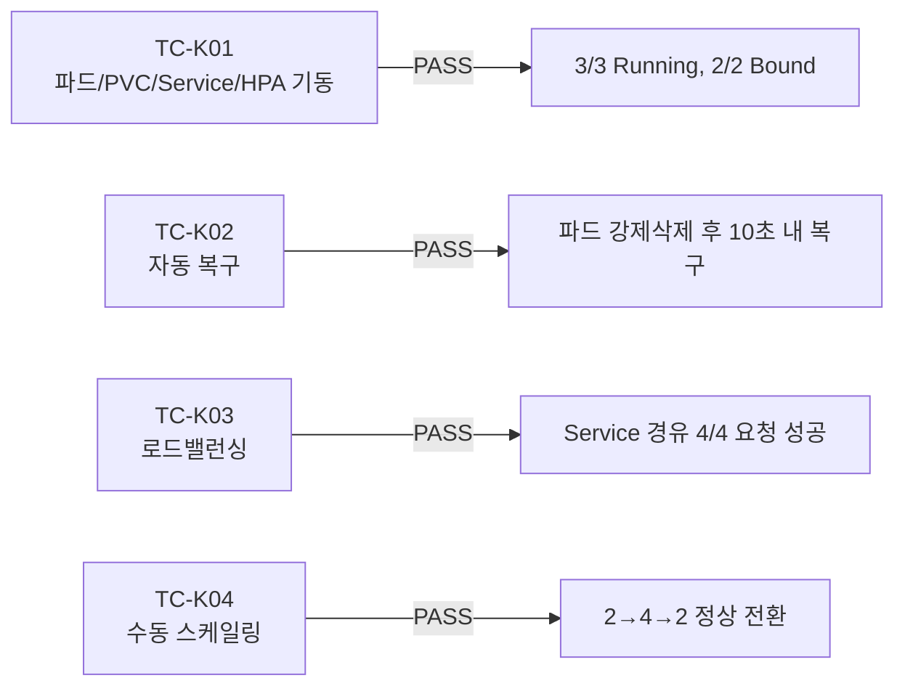

# K8s 로컬 kind 클러스터 실배포 메커니즘 검증

- **작업일**: 2026-09-25 08:07 (KST, 실제 작업 시각)
- **관련 결정 로그**: DEC-074
- **요청 내용**: 사용자가 Docker Desktop에서 Kubernetes(kind)를 직접 활성화한 뒤 "K8s 앱서버... 진행해 주세요"로 unit-30 매니페스트의 실제 클러스터 검증 진행 요청.

## 배포 전 발견한 제약 2건

## 검증 범위 결정 (사용자 확인)

AskUserQuestion으로 3개 선택지 제시 → 사용자가 **"메커니즘만 검증(권장)"** 선택. 원본 매니페스트는 무변경, 별도 격리 네임스페이스(`mock-interview-test`)에 이미지만 `nginx:alpine`/`busybox:stable`로 교체하고 PVC를 `ReadWriteOnce`로 조정한 사본을 적용.

## 검증 결과

| TC | 항목 | 결과 |
|---|---|---|
| TC-K01 | 파드/PVC/Service/HPA 기동 | PASS (HPA 등록은 성공, CPU 지표는 metrics-server 미설치로 `<unknown>`) |
| TC-K02 | 자동 복구(self-healing) | PASS |
| TC-K03 | 로드밸런싱 | PASS |
| TC-K04 | 수동 스케일링(2→4→2) | PASS |

## 정리(규칙 K) 및 K-6 헬스체크

`kubectl delete namespace mock-interview-test`로 완전 정리 확인. 규칙 K-6 헬스체크에서 로컬 백엔드(8000)/프런트(3000) 무응답 발견 → 조사 결과 K8s 테스트(격리된 kind 클러스터)로 인한 장애가 아니라, 이 세션에서 해당 서버들을 애초에 기동한 적이 없었던 것으로 확인(정상 상태).

## 결론

파드 기동·PVC 바인딩·자동 복구·로드밸런싱·수동 스케일링 4대 핵심 메커니즘이 로컬 kind 클러스터에서 실제로 동작함을 최초로 확인. 실제 앱 이미지 빌드(Dockerfile 작성 포함)·GPU 스케줄링·HPA 실지표 오토스케일은 이번 범위 밖으로 남음.

## 영향받은 산출물

`docs/harness/units/unit-30-test.md` §11/§12(신규), `docs/harness/decisions.md` DEC-074, `docs/harness/traceability.md`(갱신 예정), spec-compare 아티팩트(갱신 예정).
