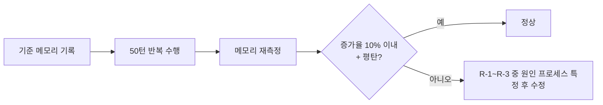

# LLM 메모리 누수 가능성 코드 검수 (Streamlit 사용 여부 포함)

- **작업 일시**: 2026-10-07 (KST)
- **작업 유형**: 코드 검수(읽기 전용, 코드 변경 없음)
- **한계(정직한 범위)**: 클라우드 세션에는 LLM 모델 파일·GPU·실제 서버가 없어 **런타임 메모리 측정은 하지 못했다.** 아래는 코드 읽기 기준의 위험 평가이며, 수치로 확인된 누수는 없다.

## 1. 요청

"현재 프로젝트에서 Streamlit을 사용하고 있나요? LLM 메모리 누수가 발생할 수 있으니 20년 경력자 기준으로 검수해 주세요."

## 2. 결론

- **Streamlit은 사용하지 않는다.** 저장소 전체에서 `streamlit`, `st.cache`, `st.session_state` 검색 결과 0건. 구성은 Next.js(프런트) + FastAPI(API) + Celery(워커) + llama.cpp 서버(LLM)이다.
- Streamlit/LangChain에서 흔한 "대화 이력 객체가 세션에 계속 쌓이는" 유형의 누수 구조는 **없다.** LLM은 별도 프로세스(llama-server)에 HTTP로 요청하고, 요청마다 메시지를 새로 조립한다.
- 다만 아래 **위험 6건**이 있다. 모두 코드 기준 추정이며 실측 전이다.

## 3. 양호한 점 (코드로 확인)

| 항목 | 근거 |
|---|---|
| 모델은 프로세스당 1회만 로드(잠금 포함 싱글톤) | `stt_engine.py`, `rag_engine.py`, `tts_engine.py` |
| LLM 대화 기록을 파이썬 객체로 보관하지 않음 | `llm_engine.py::_call_chat_completions`는 호출마다 system/user 메시지를 새로 만든다 |
| 입력 길이 상한 | 컨텍스트 4096 고정 + `available_input_tokens`로 입력 예산 제한 |
| DB 세션 | 모든 `SessionLocal()` 사용처가 `finally: db.close()`로 닫힘(`worker/tasks.py`, `ws.py` 등) |
| WebSocket 연결 레지스트리 | 연결 종료 시 `manager.remove`, 전송 실패 시 자동 제거, 빈 집합은 키 삭제 |
| Redis pub/sub | `finally`에서 `pubsub.close()`/`client.close()` |
| 업로드 상한 | 음성 25MB, 이력서 10MB, 웹캠 이미지 8MB |
| 프런트 | WebSocket `close()`, 미디어 트랙 `stop()`, `setInterval` 정리 확인 |
| 워커 구성 | `--pool=solo --concurrency=1`(DEC-019)로 모델 중복 로드 없음 |

## 4. 위험 목록 (우선순위순)

| # | 위험 | 심각도 | 근거 | 권장 조치 |
|---|---|---|---|---|
| R-1 | **API 프로세스에 무거운 모델이 상주**: Whisper(small)와 DeepFace/TensorFlow(MTCNN) | 중~높음 | STT는 `interviews.py`가 API 프로세스 스레드풀에서, 감정분석은 `webcam_emotion.py`가 API에서 실행. K8s API 파드 메모리 한도는 512Mi(`02-api-deployment.yaml`)로 모델 상주분보다 작을 가능성 → OOMKill 위험. TensorFlow는 장기 실행 시 메모리 증가가 알려진 라이브러리 | 실제 RSS 측정 후 한도 상향 또는 STT·감정분석을 워커로 이전 |
| R-2 | SmolVLM(화이트보드 비전) llama-server 종료 처리 없음 | 중 | `whiteboard_vision.py`에는 `atexit`/종료 함수가 없다(`llm_engine.py`에는 있음). API 재시작 시 고아 프로세스가 RAM/VRAM과 포트 8093을 계속 점유 | `_shutdown` 추가 + PID 파일, 시작 시 고아 정리 |
| R-3 | 장기 실행 워커 재활용 없음 | 중 | solo 풀은 `max-tasks-per-child`가 적용되지 않는다. numpy/librosa/Whisper 반복 호출로 RSS가 서서히 증가할 수 있음 | 메모리 한도 + 재시작 정책(K8s liveness) 또는 로컬은 주기적 재시작 |
| R-4 | TTS wav 파일이 영구 누적 | 낮음(디스크) | `var/media/tts/{uuid}.wav`를 만들기만 하고 삭제하는 코드가 없다(`deletion_tasks.py`에도 없음). 메모리가 아니라 디스크 증가 | 만료 파일 정리 배치(예: 7일) |
| R-5 | llama-server 로그가 `DEVNULL` | 낮음 | 서버 측 오류·메모리 지표를 볼 수 없어 누수 진단이 어렵다 | 로그 파일로 리다이렉트(회전 포함) |
| R-6 | 이력서 미리보기 ObjectURL이 화면 이탈 시 해제되지 않음 | 낮음 | `recruiter/resumes/[id]/page.tsx`는 교체 시에만 `revokeObjectURL` 호출 | 언마운트 시 해제 |

## 5. 권장 측정 계획 (실제 확정용)

로컬 PC(Windows)에서 아래를 1회 수행하면 위험 R-1~R-3이 실제인지 수치로 판정된다.

1. 서버를 띄우고 프로세스별 메모리 기준값을 기록한다. 대상은 API(uvicorn), Celery 워커, llama-server(8091), SmolVLM(8093)이다.
2. 모의면접 턴을 연속 50회 수행한다(텍스트 + 음성 + 웹캠 프레임 포함).
3. 같은 지점에서 메모리를 다시 기록한다. 기준값 대비 **증가율이 크고 계속 늘면 누수**, 일정 수준에서 멈추면 정상 캐시다.
4. 판정 예시: 50턴 후 증가가 10% 이내이고 이후 평탄하면 통과.

## 6. 후속

위험 6건 중 어디까지 수정할지는 사용자 결정 대기 상태다. 코드는 수정하지 않았다.
