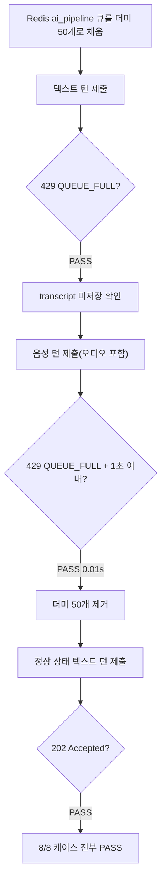

# QUEUE_FULL(429) 구현 + Redis 성능결함 발견·수정

- **작업 일시**: 2026-09-28 (KST)
- **관련 DEC**: DEC-096 (`docs/harness/decisions.md`)
- **관련 REQ**: REQ-007 행(§비고), `docs/harness/traceability.md`

## 1. 무엇을 요청받았는가

이전 턴에서 `traceability.md` 전수 재점검(DEC-095) 중 발견한 사실 하나를 사용자에게
보고했다: `POST /interviews/{id}/turns`(텍스트·음성 답변 제출) 경로에는 원래
설계서(03-system-design.md §1.3/§4.1)가 요구한 **"GPU 큐가 50개 이상 차면 429
QUEUE_FULL로 즉시 거절"** 방어가 없다는 것 — `job_queue.py` 모듈 docstring이
스스로 "09단계 인계 대상"이라고 명시해둔 채 방치돼 있었다.

사용자가 "QUEUE_FULL이게 뭔가요 자세하고 쉽게" 질문 후, 설명을 듣고
**"QUEUE_FULL진행해 주세요"**라고 명시적으로 구현을 승인했다.

## 2. 무엇을 했는가

### 2-1. 본 기능 구현
`backend/app/api/v1/interviews.py`에 `_ensure_queue_not_full()` 신규 함수를 추가하고,
텍스트(`_submit_text_turn`)·음성(`_submit_voice_turn`) 양쪽 제출 경로 모두 기존
레이트리밋 검사 직후에 호출하도록 배선했다. 특히 음성 경로는 무거운 멀티파트
파싱(`await request.form()`)보다 **먼저** 호출해, 큐가 찼을 때 오디오를 조금도
읽지 않고 즉시 거절하도록 했다(§1.3 원문 의도).

에러코드는 03-system-design.md 원문 표(§1.3/§4.1)를 직접 재확인해 **429**를
채택했다 — `recruiter.py` 재채점 엔드포인트(DEC-055)가 쓰는 503과는 다른
엔드포인트별 별도 결정이며, 통일하지 않는 이유를 코드 주석에 명시했다.

### 2-2. 검증 중 발견한 성능결함 2건과 수정
실HTTP 테스트에서 음성 턴 거절이 설계 의도(즉시)와 달리 4~6초 걸리는 것을
발견해 근본원인을 추적했다:

1. **Redis 접속 호스트명 `localhost`의 Windows IPv6 우선 해석 지연**: 이 환경에서
   `localhost`로 신규 Redis 연결을 만들 때마다 IPv6(`::1`)을 먼저 시도했다가
   실패 후 IPv4로 폴백하는 데 약 2.07초가 소요됨을 격리 벤치마크로 실측
   (`127.0.0.1`은 0.006초). → `config.py`/`.env`의 `REDIS_URL`을 `127.0.0.1`로
   고정.
2. **`queue_length()`의 매 호출 신규 연결 생성**: `prompt_safety.py::_get_redis()`가
   이미 쓰고 있던 "지연 생성 + 모듈 싱글턴 캐시" 패턴으로 `job_queue.py`를
   리팩터링(`_get_queue_redis()` 신규).

두 수정을 모두 적용한 뒤에도 동일한 2초대 지연이 재현돼, 서버 내부(consent
확인→rate limit→queue 확인 각 단계)에 임시 타임스탬프 로그를 심어 재조사한 결과
**서버 측 처리는 이미 1~4ms로 빨랐고, 지연의 실제 원인은 테스트 스크립트 자신이
백엔드에 접속할 때 쓴 호스트명 `localhost`**(1번과 동일한 Windows IPv6 폴백
패턴이 클라이언트 쪽에서도 재현)였음을 확인했다. 테스트 스크립트의 접속 주소를
`127.0.0.1`로 바꾸자 즉시 0.01초로 통과했다.

즉 `queue_length()` 캐싱 리팩터링 자체는 유효한 실제 성능 개선(정당한 버그
수정)이지만, 이번에 체감된 지연의 최종 원인은 백엔드 코드가 아니라 테스트
클라이언트 측 `localhost` 사용이었다 — 두 사실을 뭉뚱그리지 않고 구분해
기록한다(정직성 원칙).

## 3. 검증 결과

| TC | 내용 | 결과 |
|---|---|---|
| SETUP | 큐 기준선 길이 확인 | PASS |
| TC-QF01 | 텍스트 턴, 큐 찬 상태 → 429 QUEUE_FULL | PASS |
| TC-QF02 | 429 거절 시 transcript 미저장(DB 오염 없음) | PASS |
| TC-QF03 | 음성 턴, 큐 찬 상태 → 429 QUEUE_FULL | PASS |
| TC-QF03b | 음성 턴 거절이 1초 이내(STT 파싱 전 거절) | PASS (0.01s) |
| CLEANUP | 더미 큐 항목 제거 확인 | PASS |
| CLEANUP | 큐 원상복구 확인 | PASS |
| TC-QF04 | 대조군 — 정상 상태 텍스트 턴 → 202 | PASS |

**총 8/8 PASS.**

## 4. 뒷정리 (규칙 K)

- 서버 코드에 남겼던 임시 디버그 로그(`DEBUG-TEMP`, `DEBUG-TEMP2`) 전부 제거 확인(grep 0건)
- 테스트 중 실제로 enqueue된 뒤(워커 미기동으로) 소비되지 않고 Redis에 남아있던
  opening_question/turn job 8건 정리
- 테스트 후보 계정 4개(`queuefull-turns-*@example.com`) 및 연관 면접/대화/동의 레코드 삭제
- 백엔드 재기동 후 `GET /api/v1/health` → `200 {"status":"ok"}` 확인(규칙 K-6)

## 5. 영향받는 파일

- `backend/app/api/v1/interviews.py` (`_ensure_queue_not_full` 신규)
- `backend/app/services/job_queue.py` (`queue_length` 연결 캐싱 리팩터링)
- `backend/app/core/config.py` (`redis_url` 기본값 `127.0.0.1`)
- `backend/.env` (`REDIS_URL` `127.0.0.1`, 로컬 전용, git 추적 대상 아님)
- `docs/harness/decisions.md` (DEC-096 신규)
- `docs/harness/traceability.md` (REQ-007 행 §비고 갱신)
