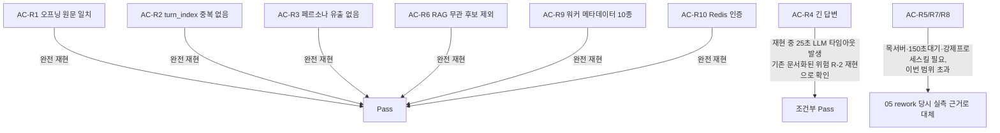

# REQ-007(핵심 LLM 대화 엔진) 06단계 재검증 정식 종료

- **작업일**: 2026-09-24 21:35 (실제 작업 순서 기준 배치 시각, 정본은 `docs/harness/decisions.md` DEC-073)
- **관련 결정 로그**: DEC-073
- **요청 내용**: "REQ-007의 06단계 재검증이 2026-09-20부터 진행중 상태로 formally 종료되지 않았다"는 발견에 대해 사용자가 "2번(문서정리) 해주세요"라고 명시 요청.

## 한 일

unit-7-note.md "재작업 v2"가 정의한 인수조건 AC-R1~R10을 실행 중인 로컬 환경(백엔드+프런트+Celery)에서 실 HTTP로 재확인.

## 판정

`unit-7-test.md`에 §11(재검증)·§12(최종 결론 갱신) 추가 — §9의 CONDITIONAL PASS를 **append-only로 보존한 채** PASS로 대체. 오늘 무엇을 재현했고 무엇을 대체 근거로 처리했는지 표로 명시해 숨기지 않음. `traceability.md` REQ-007 행을 PASS로 갱신.

## 정리(규칙 K)

테스트 계정 3건은 검증 직후 삭제.

## 영향받은 산출물

`docs/harness/units/unit-7-test.md` §11/§12(신규), `docs/harness/traceability.md` REQ-007(갱신).
