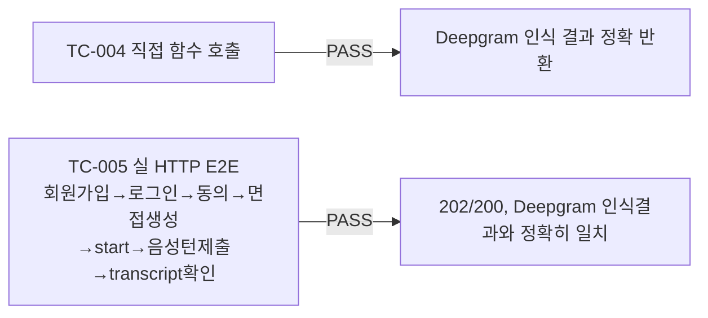

# STT-Deepgram 실배선 완료

- **작업일**: 2026-09-23 16:20 (실제 작업 순서 기준 배치 시각 — 초 단위까지 정확히 기록되진 않았으나 그날 작업 흐름상 이 시점, 정본은 `docs/harness/decisions.md` DEC-063)
- **관련 결정 로그**: DEC-063
- **요청 내용**: 스펙 비교 아티팩트의 "부분착수/코드준비·미검증" 10개 항목 중 사용자가 "STT-Deepgram 배선 작업 진행"만 선택 승인.

## 한 일

1. `backend/app/services/stt_adapter_deepgram.py` — `Content-Type` 하드코딩을 실제 업로드 MIME 타입 인자로 교체.
2. `backend/app/services/stt_router.py`(신규) — `transcribe_audio_smart()`: Deepgram 키가 있으면 우선 시도, 없거나 실패 시 faster-whisper(로컬, 무료)로 그레이스풀 폴백. 운영 기본값은 여전히 무료 로컬 경로 유지(DEC-005 원칙 유지).
3. `backend/app/api/v1/interviews.py`의 실제 음성 제출 경로 2곳(`_submit_voice_turn`, unit-36 미리보기)에 배선.

## 검증 결과

| TC | 항목 | 결과 |
|---|---|---|
| TC-004 | `transcribe_audio_smart()` 직접 호출 | PASS |
| TC-005 | 실 HTTP E2E 전 구간(Docker 기동 상태) | PASS |

## 정리(규칙 K)

테스트 계정/동의/면접/transcript는 검증 직후 스크립트로 삭제, uvicorn 프로세스 종료 완료.

## 영향받은 산출물

`backend/app/services/stt_adapter_deepgram.py`, `backend/app/services/stt_router.py`(신규), `backend/app/api/v1/interviews.py`, `docs/harness/units/unit-32-test.md`, `docs/harness/traceability.md`(REQ-026), spec-compare 아티팩트(STT 완료 전환).
