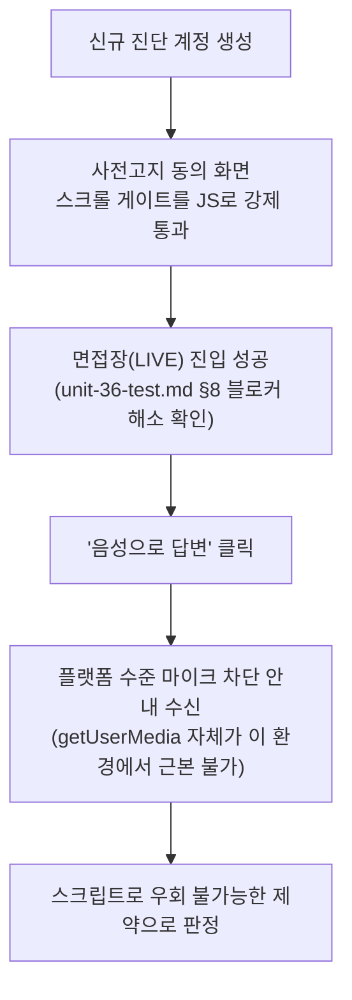

# STT 실시간 스트리밍 실브라우저 재검증 시도

- **작업일**: 2026-09-24 13:15 (실제 작업 순서 기준 배치 시각, 정본은 `docs/harness/decisions.md` DEC-068)
- **관련 결정 로그**: DEC-068
- **요청 내용**: 이전에 제시한 완료가능 후보 3개 중 "STT 실시간 스트리밍 실브라우저 검증" 선택 진행 요청.

## 진행 및 결과

- 코드는 04-ux-design [C-06] 명세대로 정확히 처리함을 확인(그레이스풀 폴백, 안내 문구 후 텍스트 입력 유지).
- 다만 TC-010의 본래 목적(실제 음성 스트리밍 STT 동작 확인)은 **여전히 검증하지 못함**.

## 판정

**CONDITIONAL PASS(부분착수) 유지 — 완료로 승격하지 않음.** 정직하게 보고. 사용자가 실제 마이크가 있는 일반 브라우저에서 직접 시도해야 최종 검증 가능함을 안내.

## 영향받은 산출물

코드 변경 없음, `docs/harness/units/unit-36-test.md` §11(시도 경위·결과 기록, 판정 불변).
