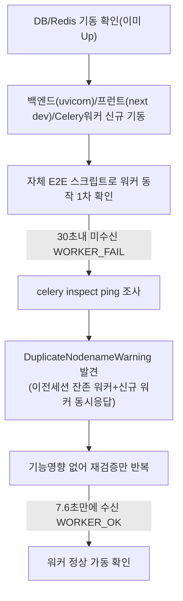

# STT 실시간 스트리밍(unit-36) 최종 해소 — 사용자 실기기 검증

- **작업일**: 2026-09-25 09:10 (KST, 실제 작업 시각)
- **관련 결정 로그**: DEC-075
- **요청 내용**: 사용자가 "STT 스트리밍 직접 테스트 절차 알려줘" 요청 → 절차 안내 후 로컬 PC 일반 브라우저(Claude Browser pane 아님)로 직접 마이크 테스트 수행.

## 배경

unit-36 §11(2026-09-24)에서 유일하게 남았던 검증 공백: 이 세션이 쓰는 Browser pane 자체가 마이크 장치 접근을 플랫폼 수준에서 차단해 TC-010(실 마이크로 4초 간격 실시간 미리보기 갱신 확인)을 검증하지 못했었음.

## 사전 준비 — 로컬 3종 프로세스 기동 + 워커 이상 발견·재확인

## 사용자 실기기 검증 결과 (TC-010 본래 목적 최초 달성)

## 결론

unit-36의 유일한 잔여 검증 공백이 사용자의 실기기 테스트로 완전히 해소됨. 판정 CONDITIONAL PASS → **PASS**로 갱신. ③ 매트릭스 STT 실시간 스트리밍 항목 "부분착수"→"완료" 승격.

## 정리(규칙 K)

워커 검증용 테스트 계정 2건(`workercheck-*@example.com`)과 면접 레코드는 DB에서 직접 삭제 완료.

## 영향받은 산출물

`docs/harness/units/unit-36-test.md` §12/§13(신규), `docs/harness/decisions.md` DEC-075, `docs/harness/traceability.md`(REQ-004 갱신), spec-compare 아티팩트(갱신 예정).
