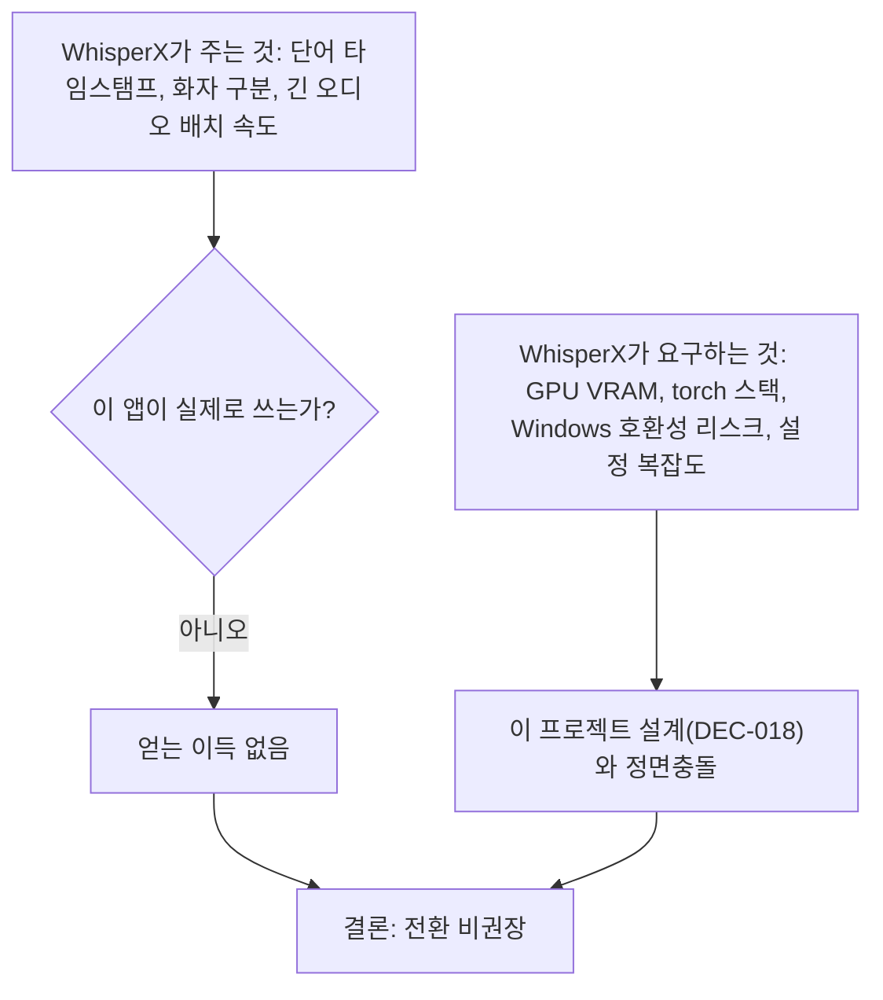

# WhisperX 전환 검토 — 결론: 비권장

- **작업 일시**: 2026-09-30 (KST)
- **관련 DEC**: DEC-113, DEC-114, DEC-115 (`docs/harness/decisions.md`)
- **작업 성격**: 검토만 수행, 코드 변경 없음(사용자가 명시적으로 "작업하지 말고 검토만" 지시)

## 1. 무엇을 요청받았는가

"현재 프로젝트에 Whisper를 사용하고 있는 걸로 알고 있습니다. WhisperX를 사용해도
문제가 없는것인지 모의면접시 변경해도 문제가 없는지 검토해줘."

## 2. 어떻게 검토했는가

1. Explore 서브에이전트로 현재 STT 구현을 코드 레벨에서 전수 조사
   (`stt_engine.py`, `stt_router.py`, 호출부 `interviews.py`,
   설계 문서 `03-system-design.md`/`decisions.md`의 관련 DEC).
2. WebSearch로 WhisperX 자체의 실제 특성(라이선스, 의존성, VRAM,
   속도/정확도 비교, Windows 호환성 이슈)을 조사.
3. 둘을 종합해 "이 프로젝트의 실제 사용 패턴에 WhisperX가 맞는가"를 판단.

## 3. 현재 구현 요약

- **faster-whisper**(small, **CPU 전용**, int8) — torch 의존성 완전히 없는
  순수 CTranslate2 엔진.
- 다운스트림에서 쓰는 건 **순수 텍스트뿐**(`Transcript.content_text`) —
  단어별 타임스탬프·화자 구분 정보는 어디에도 추출·저장·사용되지 않음.
- "실시간 스트리밍 미리보기"(unit-36)도 실제로는 4초마다 새 오디오 파일을
  만들어 **동일한 `transcribe_audio()`를 재호출**하는 방식(진짜 연속
  스트리밍이 아님).
- 교체가 필요하다면 함수 하나(`stt_engine.py::transcribe_audio(audio_bytes)
  -> str`)만 바꾸면 되는 구조 — 교체 자체의 구조적 난이도는 낮음.
- 실측 성능: 15초 오디오 → 3.37초 처리(RTF 0.22, 실시간 대비 4.5배),
  VRAM 사용 0.

## 4. 핵심 문제 — 프로젝트의 GPU 예산 설계와 정면충돌

이 프로젝트는 **"STT/TTS는 CPU 전용, GPU(4GB, 가용 3.3GB)는 전량 LLM에
할당"**을 이미 확정한 설계 결정(DEC-018)이다. WhisperX의 핵심 장점(속도·
단어 정렬·화자 구분)은 대부분 GPU에서 발휘되는데, WhisperX를 GPU에서
돌리면 약 3~4GB VRAM이 필요해 지금 LLM 혼자 쓰는 예산과 직접 충돌한다.

## 5. WhisperX 자체의 실제 리스크 (웹 조사 결과)

| 항목 | 내용 |
|---|---|
| Windows GPU 호환성 | **현재 보고된 실제 버그**(WhisperX 3.4.2) — cuDNN 9 버전 불일치로 Windows GPU 빌드가 런타임 오류를 냄. 이 프로젝트는 Windows 환경. |
| 의존성 충돌 | WhisperX 자체가 요구하는 torch 버전과, 종속 패키지(pyannote.audio→pytorch-lightning)가 요구하는 torch 버전이 달라 pip 설치 충돌이 보고됨. |
| 신규 의존성 | torch·torchaudio·pyannote.audio가 통째로 새로 들어옴(현재 STT 경로는 torch 의존성 0). |
| 화자 구분(diarization) | 쓰려면 HuggingFace 계정 생성 + 모델 약관 동의 + 토큰 발급 필요. 이 앱은 턴당 화자가 1명(지원자)뿐이라 애초에 불필요한 기능. |
| 속도 이점의 전제 조건 | "최대 70배 빠름"은 **긴 오디오를 VAD로 잘라 배치 처리**할 때 수치. 이 앱은 턴당 짧은 오디오 1개씩 처리하는 구조라 배치 이점이 거의 없고, 오히려 단어 정렬 단계가 요청당 5~10% 지연을 추가로 만듦. |
| 정확도 | 일부 비교 자료에서 WhisperX가 순정 faster-whisper보다 정확도가 소폭 낮다는 보고 존재(VAD 청크 분할·정렬 트레이드오프). |

## 6. 결론

**지금 쓰지 않는 기능을 얻으려고, 이미 검증되고 안정적으로 동작 중인
CPU 전용 구조를 GPU 예산 충돌 + Windows 호환성 버그 + 의존성 복잡도
증가와 맞바꿀 이유가 없다.** 전환을 권장하지 않는다.

## 6-1. 후속 검토 — "3.8 버전이라면?" (DEC-114, 같은 날 추가 요청)

사용자가 특정 버전(3.8)을 지정해 재검토를 요청. 결론은 **동일(비권장)**이지만
근거가 더 구체적이고 확정적으로 바뀌었다.

**정정할 점**: 위 §5의 "Windows GPU cuDNN 버그"는 **3.8.5부터 실제로
수정되었다**(torch·torchvision·torchcodec 버전을 서로 맞춰 pin하는 방식) —
이 부분은 3.4.2 시점 기준이었고 3.8.x에는 더 이상 해당하지 않는다.

**대신 이 프로젝트의 실제 백엔드 가상환경에 `pip install --dry-run
whisperx==3.8.6`을 직접 실행**(설치는 하지 않음, 순수 의존성 계산 결과만
확인)해 훨씬 더 확정적인 증거를 얻었다:

| 확인 사실 | 내용 |
|---|---|
| **torch 강제 다운그레이드** | 현재 설치된 torch **2.14.0**(sentence-transformers 경유로 이미 설치돼 있음) → WhisperX 3.8.6 설치 시 **2.8.0으로 다운그레이드**됨(dry-run 출력에 `torch-2.8.0` 명시). 다른 ML 컴포넌트가 2.14.0에 의존하고 있다면 영향 가능 — 실제 설치 전에는 100% 장담 불가. |
| **pyannote-audio 필수화** | 3.8.x부터는 화자 구분을 안 써도 `pyannote-audio`(4.0.7)가 무조건 함께 설치됨. |
| **50개 이상 신규 패키지** | `lightning`, `pytorch-lightning`, `optuna`, `matplotlib`, `opentelemetry` 전체 스택, `torch-audiomentations`, `torchvision`, `torchcodec` 등. |
| **실제 GPU 재확인(`nvidia-smi`)** | 설계문서 기록(GTX 1650 Ti 4096MiB)과 달리 실제로는 **GTX 1660 SUPER 6144MiB**. 다만 지금 이 순간 **5799MiB가 이미 사용 중**(가용 345MiB뿐) — `nvidia-smi --query-compute-apps`로 이 프로젝트의 LLM 서버(`backend/var/llm/bin_vulkan/llama-server.exe`)가 그 점유 주체임을 확인, DEC-018 설계(GPU 전량 LLM 할당)가 실측대로 동작 중임을 재확인. |
| **GPU 연산 API 불일치** | 이 프로젝트의 LLM은 **Vulkan** 백엔드 사용. WhisperX/ctranslate2/pyannote의 GPU 가속은 **CUDA** 전제라, GPU로 쓰려면 별도의 CUDA 드라이버·툴킷 스택이 추가로 필요. |

**결론: 여전히 비권장.** 이번엔 일반 비교자료가 아니라 이 프로젝트 실제
환경에 대한 시뮬레이션(dry-run)과 실측(nvidia-smi)으로 뒷받침되는
확정적 결론이다. (관련 DEC-114)

## 6-2. 후속 검토 — "GPU 메모리만 아니라면?" (DEC-115, 같은 날 추가 요청)

사용자가 "지금 GPU 개발하는 건이 있어서 VRAM이 부족한 것 같다"며, VRAM
제약을 제외하고 나머지 요인만으로 다시 판단해달라고 요청. **결론은
동일(비권장)** — 오히려 VRAM은 여러 문제 중 가장 작은 것이었다는 게
이번에 드러났다.

**VRAM을 빼고 봐도 남는, 더 근본적인 사실**:
- **이 PC에 CUDA 툴킷 자체가 설치돼 있지 않다**(`nvcc` 명령 없음).
- **현재 설치된 torch가 CPU 전용 빌드**다(`2.14.0+cpu`,
  `torch.cuda.is_available()` → `False`).
- **TensorFlow(DeepFace)는 Windows에서 GPU를 아예 못 쓴다** — 직접
  실행해 확인: `GPU support is not available on native Windows for
  TensorFlow >= 2.11. Even if CUDA/cuDNN are installed, GPU will not
  be used.` (`GPU devices (tf): []`)

즉 이 백엔드가 실제로 GPU를 쓰는 건 모의면접 LLM(Vulkan 백엔드) 하나뿐이고,
나머지는 전부 이미 CPU로 돈다 — Windows+CUDA+Python ML 조합의 골치 아픈
문제들을 이 프로젝트가 실무적으로 이미 피해온 결과로 보인다. WhisperX는
여기에 CUDA라는 축을 새로 하나 얹는 셈이라, **VRAM 용량과 무관하게** 아래
5가지가 그대로 남는다:

1. CUDA 툴킷을 처음부터 새로 설치해야 함
2. torch 2.14.0→2.8.0 다운그레이드가 다른 기능에 미치는 영향 미검증
3. pyannote-audio+50여개 패키지가 안 쓰는 기능 때문에 유지보수 부담만 증가
4. 단어 타임스탬프·화자구분 모두 다운스트림 사용처 없음(기능 이득 0)
5. WhisperX의 속도 우위(배치처리)는 이 앱의 "턴당 짧은 오디오 1개" 구조와 안 맞음

**결론: GPU 메모리 제약을 완전히 제외해도 전환 비권장.** (관련 DEC-115)

## 7. 뒷정리 (규칙 K)

- 코드 변경 없음(순수 검토) — 정리할 임시 아티팩트 없음.
- 헬스체크(규칙 K-6) 해당 없음(로컬 서버 대상 부하/E2E 테스트를 하지
  않았으므로).

## 8. 영향받는 파일

- `docs/harness/decisions.md` (DEC-113, DEC-114, DEC-115 신규, 코드 변경 아님)

git add/commit/push는 지시하신 대로 진행하지 않았습니다.
