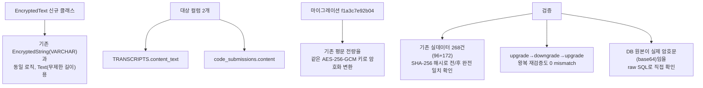

# content_text · 코드제출 내용 AES-256 암호화 확대

- **작업일**: 2026-09-28 11:56 (KST)
- **관련 결정 로그**: DEC-078
- **요청 내용**: 사용자가 승인한 보강 작업 3건(1→6→8) 중 2번째 — "content_text
  등 핵심 컬럼 암호화 확대"

## 배경

unit-25(2026-09-22)가 `content_text`를 "인코딩 손상 결함 조사 먼저"라는 이유로
암호화 대상에서 뺐는데, 그 손상 결함은 2026-09-23 재조사 결과 오탐(실제 데이터
손상 없음, 화면 표시 문제였을 뿐)으로 이미 정정됐다. 즉 미룰 이유가 사라진 채로
계속 방치돼 있었다.

## 한 일

## 검증 결과 (핵심)

**기존에 쌓여있던 실제 데이터 268건을 단 한 건도 잃지 않고** 암호화 형태로
전환했다 — 마이그레이션 전 모든 행의 지문(SHA-256 해시)을 미리 찍어두고,
전환 후 하나하나 대조해 전부 일치함을 확인했다. 되돌리기(downgrade)도 실제로
동작하는지 왕복으로 검증했다.

## 의도적으로 하지 않은 것

`evaluation_reports`의 `star_json`/`details_json`/`criteria_scores_json`은
이번에 손대지 않았다. 이 세 필드는 JSONB(구조화된 형태로 DB가 직접 조회 가능)라,
암호화하려면 일반 텍스트 형태로 바꿔야 해서 DB가 그 안의 내용을 직접 조회하는
기능을 잃는다 — 이건 "암호화 범위를 넓히는" 수준이 아니라 별도의 구조 변경
결정이라, 마음대로 진행하지 않고 다음에 확인받기로 했다.

## 부수 발견

로컬 개발 DB가 최신 스키마보다 한 단계 뒤처져 있었다(이전 세션의 루브릭
채점 기능 마이그레이션이 이 DB 컨테이너에는 적용 안 돼 있었음) — 이번
작업으로 함께 정상화했고, 데이터 손실은 없었다.

## 영향받은 산출물

`backend/app/services/field_encryption.py`, `backend/app/models/transcript.py`,
`backend/app/models/code_submission.py`, `backend/alembic/versions/
f1a3c7e92b04_v16_content_encryption.py`(신규), `docs/harness/
content-encryption-20260928-test.md`(신규), `docs/harness/decisions.md`(DEC-078).
