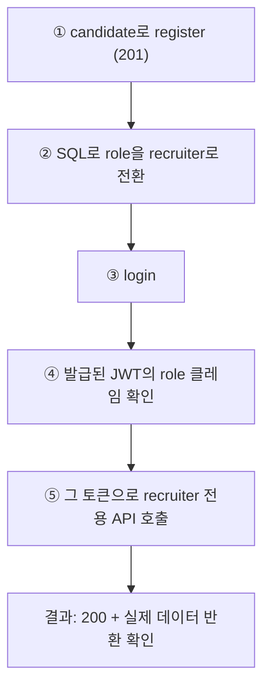

# e2e 테스트 픽스처 복구 — recruiter 계정 생성 방식 전환

- **작업 일시**: 2026-09-30 (KST)
- **관련 DEC**: DEC-108 (`docs/harness/decisions.md`), 선행 DEC-107

## 1. 무엇을 요청받았는가

DEC-107(3001 회원가입 제거 + 채용담당자 등록 보안 수정) 완료 보고에서 "알려드릴
부작용"으로 남겼던 내용 — "기존 자동화 테스트(unit-19 e2e 스펙 3개)가 테스트용
채용담당자 계정을 이 공개 API로 만들고 있었는데, 이번 보안 수정으로 그
테스트들은 다음에 실행하면 실패합니다" — 에 대해 사용자가 "수정해 주세요"라고
지시.

## 2. 재조사 중 발견 — 최초 보고의 누락분 정정

다시 찾아보니 **최초 보고가 실제 영향 범위를 과소평가했다.** `unit-19` 3개
스펙뿐 아니라, **`frontend/e2e/unit-20/support.ts`의 별도 헬퍼
(`createAccount()`)도 똑같이 공개 `/auth/register`에 role을 그대로 실어
호출**하고 있었고, `unit-20/api-regression.spec.ts`의 2개 지점이
`createAccount("recruiter")`를 쓰고 있었다 — 이것도 함께 깨질 대상이었는데
처음 보고 때 놓쳤다. 숨기지 않고 이번 보고에 정정해 포함한다.

## 3. 무엇을 했는가

두 헬퍼 파일을 동일한 방식으로 고쳤다 — **이 하네스에 이미 있던 관례를 그대로
재사용**(새 패턴을 발명하지 않음):

- `unit-19/helpers.ts::AccountKit.create()`가 `home.spec.ts`에서 admin
  역할을 만들 때 이미 쓰고 있던 방식(raw SQL `UPDATE users SET role=...`)과
  똑같은 방식을 recruiter에도 적용:
  1. 공개 `/auth/register`에는 항상 `role: "candidate"`로 보내 계정 생성
     (비밀번호 해시는 백엔드가 정상 처리하므로 그대로 재사용 가능)
  2. `role === "recruiter"`가 요청된 경우에만, 생성된 계정의 DB row를 SQL로
     `role='recruiter'`로 전환
  3. 그 다음 로그인 — 로그인 시점에 DB의 최신 role을 읽어 토큰을 발급하므로
     (`backend/app/api/v1/auth.py::login`), 최종 토큰은 정확히 recruiter
     role을 담는다
- `unit-20/support.ts::createAccount()`도 동일 로직 적용. 이 파일에는 원래
  `sql()`/`assertUuid()` 유틸이 없어서, `unit-19/helpers.ts`와 똑같은 패턴
  (docker exec psql — 신규 패키지 없이 Node에서 DB에 닿는 이 하네스의 기존
  방식)으로 신규 추가했다.

## 4. 검증

Playwright 스펙 자체는 `docs/harness/test-infra.md`가 요구하는 별도 포트
인프라(예: unit-19는 8720/3620대 포트)가 필요해 이번 세션에서 전체 실행은
하지 않았다 — 대신 **고친 헬퍼가 실제로 하는 일과 동일한 순서를 지금 떠 있는
실제 백엔드(8001)로 재현**해, 결과가 맞는지 curl로 직접 확인했다.

| 단계 | 확인 방법 | 결과 |
|---|---|---|
| candidate로 register | curl | `201`, role=candidate로 정상 생성 |
| SQL로 role 전환 | `docker exec ... psql UPDATE` | `UPDATE 1` |
| login | curl | `200`, JWT 페이로드에 `"role":"recruiter"` 확인 |
| recruiter 전용 API 호출 | `GET /recruiter/reports` + 그 토큰 | `200`, 실제 면접 목록 데이터 반환(권한 정상 작동) |
| 정리 | `DELETE FROM users` | 잔여 0건 확인 |
| 정적 타입 검사 | `npx tsc --noEmit` (frontend 전체) | 두 헬퍼 파일 실제 컴파일 오류 없음(유일한 경고는 삭제된 `/register` 라우트를 가리키던 Next.js 캐시 자동생성 파일 — 실코드 오류 아님, 라이브 서버는 이미 그 경로 404 정상 반환 중) |

## 4-1. 재확인 중 발견한 3번째 동일 결함 — 백엔드 pytest 하네스 (DEC-109)

이 보고서를 마무리하기 전에 "혹시 또 놓친 게 있는지" 저장소 전체를 다시
`auth/register` 문자열로 검색했다. **`backend/tests/support/accounts.py::
register_account()`도 똑같은 문제**였다 — `backend/tests/test_smoke.py::
test_register_login_me_roundtrip`가 `role="recruiter"`로 파라미터화돼 이
경로를 직접 쓰고 있었다. 최초 보고(DEC-107)도, 1차 정정(DEC-108)도 이걸
놓쳤다는 것을 인정하고 세 번째로 정직하게 보고한다.

**수정**: `accounts.py`에 `_database_url()`(`cleanup.py`의 동일 함수를
순환 import 없이 로컬 복제)과 `_promote_to_recruiter(user_id)`(psycopg
직접 접속으로 `UPDATE users SET role='recruiter'`)를 추가. `register_account()`
가 이제 공개 API에는 항상 `role: "candidate"`를 보내고, recruiter가
필요하면 그 직후 role만 SQL로 전환한다.

**검증 — 이번엔 재현이 아니라 실제 코드를 직접 실행**: 임시 스크립트로
수정된 `AccountFactory.create("recruiter")`를 실제로 호출해 `/auth/me`가
`role: "recruiter"`를 반환하는 것, `GET /recruiter/reports`가 `200`으로
성공하는 것, `cleanup_test_data()`가 실제로 `users=1`을 삭제하는 것까지
전부 확인했다. **다만 이 가상환경(venv)에 `pytest` 패키지 자체가 설치돼
있지 않아, `pytest tests/test_smoke.py`로 실제 그린 테스트 실행 자체는
하지 못했다** — 사용자 승인 없이 새 패키지를 설치하는 건 이번 범위를
벗어난다고 판단해 설치하지 않았고, 대신 그 테스트가 호출하는 것과
동일한 코드를 직접 실행해 확인하는 차선책을 택했다.

## 5. 한계 — 정직하게 기록

Playwright 스펙 3+2개(unit-19 3개 + unit-20 `api-regression.spec.ts`)를
**실제로 끝까지 실행**해서 PASS를 확인한 것은 아니다 — 그 실행에는 이
세션에 없는 별도 포트 구성(8720/3620, 8000/8xxx 등)이 필요하다. 대신
헬퍼 함수가 실제로 만들어내는 결과(올바른 role의 토큰)가 맞다는 것을
동일한 백엔드로 직접 재현해 확인했다 — 이건 "테스트가 통과할 것"이라는
합리적 근거는 되지만, "테스트를 실행해서 통과를 확인했다"는 것과는 다르다는
점을 명확히 해둔다.

## 6. 뒷정리 (규칙 K) + 헬스체크 (규칙 K-6)

- 검증용 테스트 계정 1개 삭제, 잔여 0건 확인.
- `GET /api/v1/health` → `200`, 3001 랜딩 → `200`.

## 7. 영향받는 파일

- `frontend/e2e/unit-19/helpers.ts`
- `frontend/e2e/unit-20/support.ts`
- `backend/tests/support/accounts.py`
- `docs/harness/decisions.md` (DEC-108, DEC-109 신규)

git add/commit/push는 지시하신 대로 진행하지 않았습니다.
