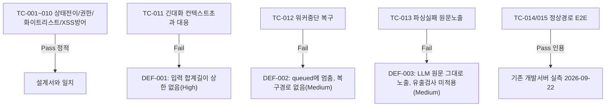

# unit-10 — STAR 기반 평가 리포트 생성 (REQ-009, 소급 문서화) — FAIL

- **작업일**: 2026-09-23 20:54 (git 커밋 실제 시각)
- **소스 문서**: `docs/harness/units/unit-10-note.md`, `unit-10-test.md`
- **속도 트랙**: L3 · **판정**: **FAIL** (정적 검토만 가능, 실행 검증 없음 — DEC-053. 결함 3건 Open)

## 배경

코드는 이미 2026-09-21~22에 구현·커밋(`18d5ceb`)됐으나 하네스 절차(05→06→traceability) 없이 진행돼 `traceability.md`가 계속 "미착수"로 남아있던 절차 공백을 이번에 소급 정리.

## 한 일 (기존 코드 확인)

`evaluation_reports` 테이블, `/end`→`report_status=queued`, `GET /report`(none 409/queued 202/failed 409/ready 200), `/report/regenerate`(failed일 때만), 워커의 LLM 리포트 생성(파싱실패→summary_text 폴백, 호출실패→failed).

## 검증 결과 (정적 검토, 개발서버 기존 실측 2건 인용)

## 결론

Must 요건의 정상 경로 자체는 기존 실측으로 동작이 확인되나, 하네스 기준 완료 조건(L3 실행 검증)을 충족 못해 FAIL. 결함 수정 방향은 사용자 결정 대기(DEC-054).

## 영향받은 산출물

코드 변경 없음(소급 문서화만) — `docs/harness/units/unit-10-note.md`/`unit-10-test.md`(신규), `verify-log_unit-10-test.md`.
