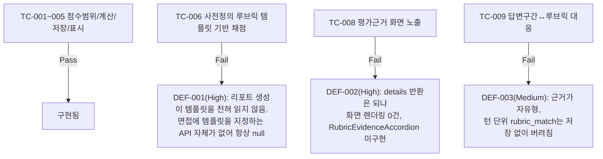

# unit-11 — 루브릭 기반 스코어링 + 평가근거 노출 (REQ-010/012, 소급 문서화) — FAIL

- **작업일**: 2026-09-23 20:54 (git 커밋 실제 시각)
- **소스 문서**: `docs/harness/units/unit-11-note.md`, `unit-11-test.md`
- **속도 트랙**: L3 · **판정**: **FAIL** (Must 요건 핵심 미구현, 결함 3건 Open)

## 배경

unit-10과 동일 커밋(`18d5ceb`)에 점수/근거 필드가 함께 들어갔으나 소급 검토 결과 REQ-010/012의 **핵심 요건이 실제로는 구현되지 않은 것**을 이번에 발견.

## 검증 결과 (정적 검토)

## 결론

REQ-010("사전 정의 루브릭 템플릿 기반 채점")과 REQ-012("평가 근거 노출")의 핵심이 모두 구현되지 않은 것으로 판명 — 채점 축은 프롬프트에 고정된 3축뿐. 근본 원인이 03 설계서의 공백일 수 있어(규칙 F) 수정 방향(템플릿 지정 주체, 채점 반영 방식 3가지 옵션)을 사용자 결정 대기(DEC-054).

## 영향받은 산출물

코드 변경 없음(소급 문서화·결함 발견만) — `docs/harness/units/unit-11-note.md`/`unit-11-test.md`(신규), `verify-log_unit-11-test.md`.
