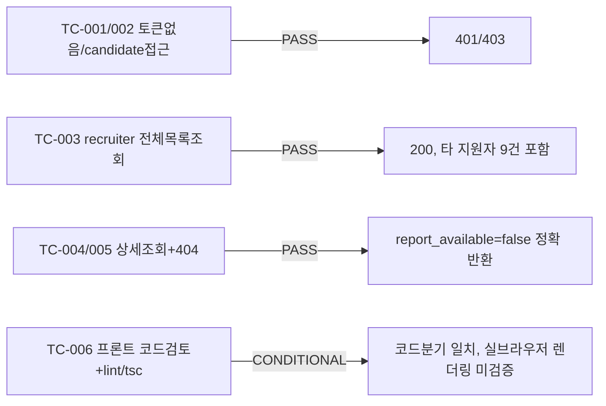

# unit-12 — 채용담당자 대시보드 (REQ-011, Feature F)

- **작업일**: 2026-09-19 17:00 (git 커밋 실제 시각)
- **소스 문서**: `docs/harness/units/unit-12-note.md`, `unit-12-test.md`
- **속도 트랙**: L1 · **판정**: CONDITIONAL PASS(브라우저 실렌더링 미검증, 도구 부재)

## 한 일

`GET /recruiter/reports`(전체 지원자 열람, 단일조직 정책), `GET /recruiter/reports/{id}`(상세, 리포트 본문 없으면 `report_available=false`+안내문만 — 가짜 데이터 금지 원칙), `frontend/app/recruiter/{page.tsx,[id]/page.tsx}` 신규.

## 검증 결과

## 영향받은 산출물

`backend/app/{api/v1/recruiter.py,schemas/recruiter.py}`(이전 세션 산출물 재확인), `frontend/app/recruiter/{page.tsx,[id]/page.tsx,recruiter.module.css}`(신규).
