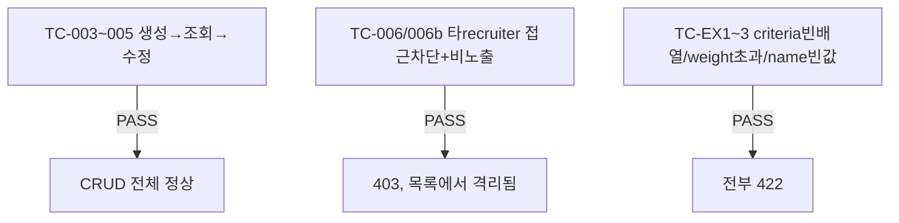

# unit-13 — 질문지/루브릭 최소 커스터마이징 (REQ-014, Feature F)

- **작업일**: 2026-09-19 17:00 (git 커밋 실제 시각)
- **소스 문서**: `docs/harness/units/unit-13-note.md`, `unit-13-test.md`
- **속도 트랙**: L1 · **판정**: PASS(프론트 실렌더링만 미검증)

## 한 일

`rubric_templates` 테이블 신설(interviews.rubric_template_id에 unit-2가 미룬 FK 제약 추가), `GET/POST /recruiter/rubric-templates`(본인+시스템기본만 조회), `PATCH .../{id}`(본인 것만), `frontend/app/recruiter/rubric-templates/page.tsx` 신규.

## 검증 결과 (정상경로 3건 + 권한/경계 5건 + 위험케이스 3건, 총 11건 PASS)

편차: 시스템 기본 템플릿 시드 데이터 없음(0건) — 별도 시드 스크립트 필요(인수인계). `weight` 합계 100 검증은 미구현.

## 영향받은 산출물

`backend/app/{models/rubric_template.py,schemas/rubric_template.py,api/v1/recruiter.py(추가)}`, Alembic `d3f7a2c9e1b4_v7_rubric_templates`, `frontend/app/recruiter/rubric-templates/page.tsx`(신규).
