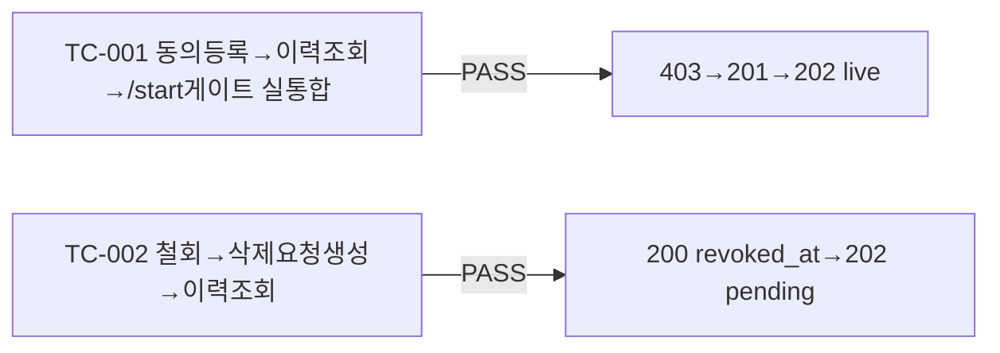

# unit-14 — 규제 컴플라이언스: 동의/삭제요청 API (REQ-029/030, Feature G)

- **작업일**: 2026-09-19 17:00 (git 커밋 실제 시각)
- **소스 문서**: `docs/harness/units/unit-14-note.md`, `unit-14-test.md`
- **속도 트랙**: L1 · **판정**: PASS

## 한 일

`deletion_requests` 테이블 신설(status는 설계서 그대로 pending/completed 2값만, 지시문의 processing 언급은 설계서에 없어 채택 안 함), `POST /consents`(동의등록, 중복허용), `POST /consents/{id}/revoke`, `GET /users/me/consents`, `DELETE /users/me/biometric-data`(삭제요청 생성만, 실제 파기는 unit-15 몫), `GET /users/me/deletion-requests`.

## 검증 결과

unit-2의 `/start` 게이트(다른 파일)가 이번 유닛이 새로 만든 CONSENTS 데이터를 실시간으로 정상 소비함을 통합 증명. `biometric_voice` 실제 차단(음성 제출 경로 자체)은 unit-5가 아직 없어 이번엔 검증 못함(순서상 제약, 결함 아님).

## 영향받은 산출물

`backend/app/{api/v1/consents.py(신규),models/deletion_request.py(신규),schemas/consent.py(신규)}`, Alembic `8a55fda78a42_v4_deletion_requests`.
