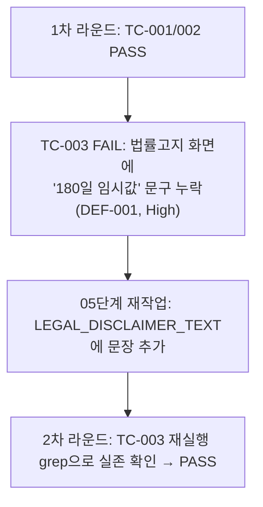

# unit-15 — 규제 컴플라이언스 화면 (REQ-031~034, Feature G)

- **작업일**: 2026-09-19 17:00 (git 커밋 실제 시각, 원본 §1-10 기준. 이후 2026-09-24 추가 작업은 `404캐시진단`/`자체회귀수정`/`Celery워커복구` 파일 참고)
- **소스 문서**: `docs/harness/units/unit-15-note.md`, `unit-15-test.md` §1-10
- **속도 트랙**: L1 · **판정**: PASS (1차 FAIL→재작업 후 PASS)

## 한 일

`/interviews/[id]/consent`([C-04], 스크롤 완독해야 필수체크박스 활성화), `/legal`([C-14], 법률고지 정적페이지), `/mypage`([C-13], 동의이력/철회/삭제요청). 백엔드 파일 수정은 범위 밖이라 고지문은 프론트 정적 텍스트로만 구현(`GET /pre-notice`/`GET /legal/disclaimer` API는 미구현).

## 검증 결과

편차: 자동 파기 배치(REQ-033 일부) 미구현(unit-15가 아니라 후속 책임), 보관기간 180일은 법률자문 미확정 임시값(문구에 숨기지 않고 명시).

## 영향받은 산출물

`frontend/app/{interviews/[id]/consent,legal,mypage}/page.tsx`, `frontend/lib/complianceContent.ts`(DEF-001 수정).
