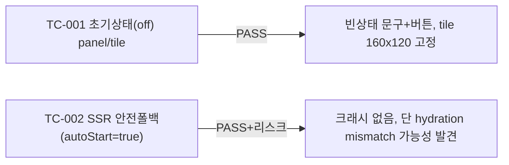

# unit-16 — 웹캠 프리뷰(비분석) (REQ-015, Feature H)

- **작업일**: 2026-09-19 17:00 (git 커밋 실제 시각)
- **소스 문서**: `docs/harness/units/unit-16-note.md`, `unit-16-test.md`
- **속도 트랙**: L1 · **판정**: PASS (Medium 결함 1건 Deferred)

## 한 일

`frontend/components/WebcamPreview.tsx`(신규, 유일 파일) — 로컬 웹캠 미리보기만, **서버 전송 코드 없음**(DEC-008/REQ-015 "AI 분석 없음"을 코드 구조로 보장). 6가지 상태(off/requesting/active/permission-denied/unsupported/error), 접근성(`aria-hidden` on video), 언마운트 시 트랙 정지. 아직 면접장 화면에 배선 안 됨(통합 담당 유닛 몫).

## 검증 결과

**DEF-001(Medium, Deferred)**: SSR과 클라이언트가 `autoStart` 초기 상태를 다르게 계산해 hydration mismatch 가능성 — 아직 실제 화면에 배선 안 돼 현재 라이브 영향 없음, 배선 시 `next/dynamic(ssr:false)` 권장.

## 영향받은 산출물

`frontend/components/WebcamPreview.tsx`(신규).
