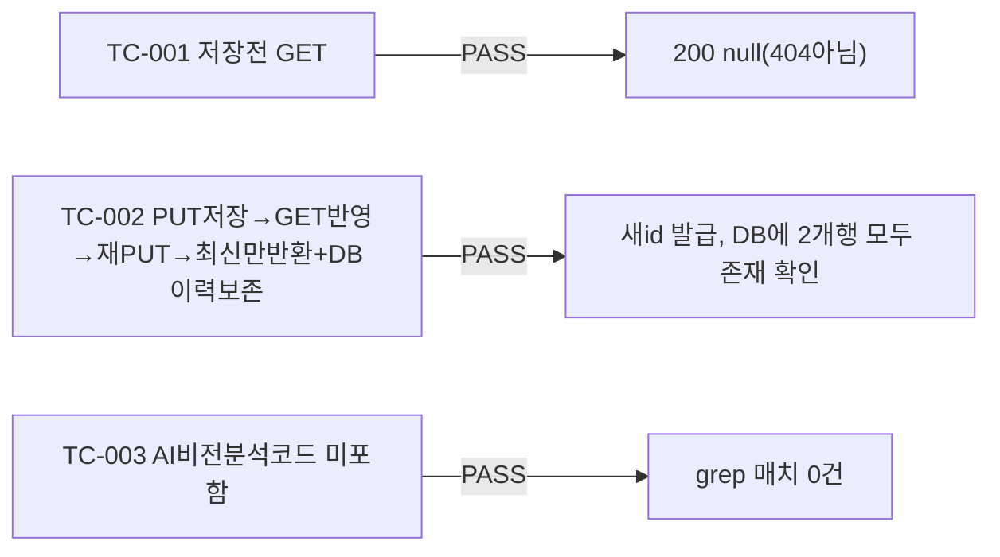

# unit-17 — 화이트보드 캔버스 (REQ-017, Feature H)

- **작업일**: 2026-09-19 17:00 (git 커밋 실제 시각)
- **소스 문서**: `docs/harness/units/unit-17-note.md`, `unit-17-test.md`
- **속도 트랙**: L1 · **판정**: PASS

## 한 일

`whiteboard_snapshots` 테이블(이력 테이블 설계), `PUT/GET /interviews/{id}/whiteboard`(PUT=새 스냅샷 추가, GET=최신 조회), `WhiteboardCanvas.tsx`(독립 컴포넌트 — Pointer Events 통합, 색상5종/굵기/지우기/저장, 세션 재개 시 최신 스냅샷 복원).

## 검증 결과

부대 사건: 검증 도중 다른 병렬 유닛(teardown)이 공유 venv를 포함한 `.harness-tmp/` 전체를 삭제하는 걸 관찰(소스/DB엔 영향 없음, 새 venv로 재검증 완료).

## 영향받은 산출물

`backend/app/{models/whiteboard.py,schemas/whiteboard.py,api/v1/whiteboard.py}`(신규), Alembic `c1a2f5e9b7d3_v5_whiteboard_snapshots`, `frontend/app/interviews/[id]/components/WhiteboardCanvas.tsx`(신규).
