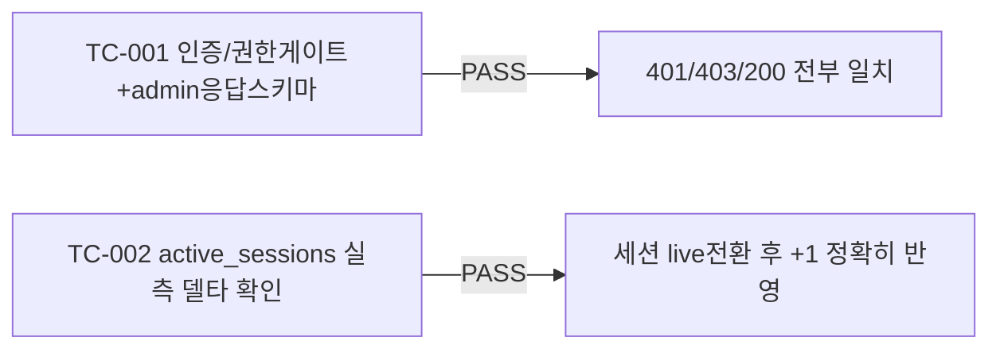

# unit-18 — 운영자 기본 모니터링 (REQ-016, Feature H)

- **작업일**: 2026-09-19 17:00 (git 커밋 실제 시각)
- **소스 문서**: `docs/harness/units/unit-18-note.md`, `unit-18-test.md`
- **속도 트랙**: L1 · **판정**: PASS

## 한 일

`GET /ops/health`(admin 전용) — 4개 지표 중 `active_sessions`만 실측(`INTERVIEWS.status='live'` COUNT), 나머지(queue_length/gpu_memory_used_bytes/error_rate)는 하위 시스템(Celery/GPU/Prometheus) 미구축으로 **상시 0**(가짜 데이터 금지 원칙, `notes` 필드로 실측/스텁 여부 숨기지 않고 명시). `frontend/app/admin/ops/page.tsx`(7초 폴링, admin 아니면 API 호출 자체 안 함).

## 검증 결과

TC-002는 공유 DB에 다른 유닛이 남긴 live 세션이 이미 있어 절대값이 아닌 **델타(+1)**로 검증 기준을 설계 — 안전한 테스트 설계로 조정한 사례.

## 영향받은 산출물

`backend/app/{api/v1/ops.py,schemas/ops.py}`(신규), `frontend/app/admin/ops/page.tsx`(신규).
