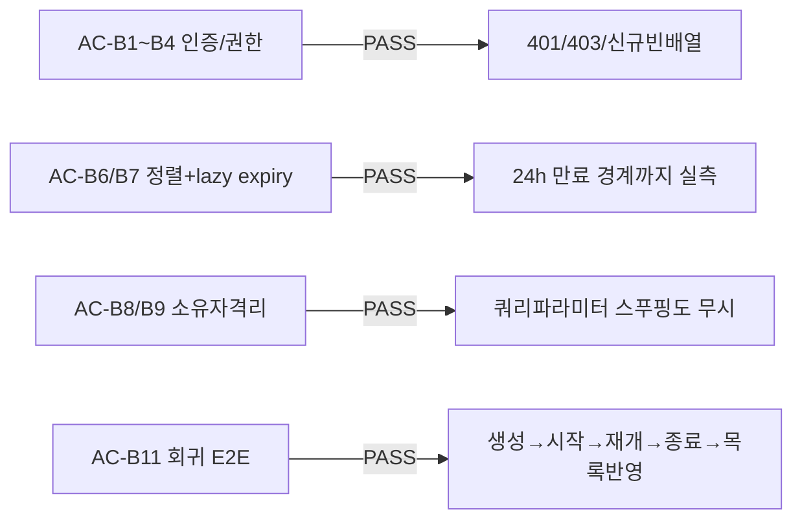

# unit-19 — 내 면접 목록 API + 지원자 홈 (REQ-002, Feature B)

- **작업일**: 2026-09-20 03:06 (note 작성 시각, git 커밋은 20260920_2339)
- **소스 문서**: `docs/harness/units/unit-19-note.md`, `unit-19-test.md`
- **속도 트랙**: L3(정식, Tier High) · **판정**: PASS (Playwright 브라우저 자동화 포함 정식 검증)

## 한 일

`GET /api/v1/interviews`(내 면접 목록, 소유자만 조회, `COALESCE(started_at,created_at)` 내림차순), `frontend/components/CandidateHome.tsx`(신규, [C-03] 지원자 홈 — CTA/중단세션배너/최근면접카드).

## 검증 결과 (AC-B1~B11 + AC-F 계열, 브라우저 자동화 포함 정식 06단계)

## 영향받은 산출물

`backend/app/{api/v1/interviews.py(GET추가),schemas/interview.py}`, `frontend/{components/CandidateHome.tsx(신규),components/CandidateHome.module.css(신규),app/page.tsx,lib/api.ts}`.
