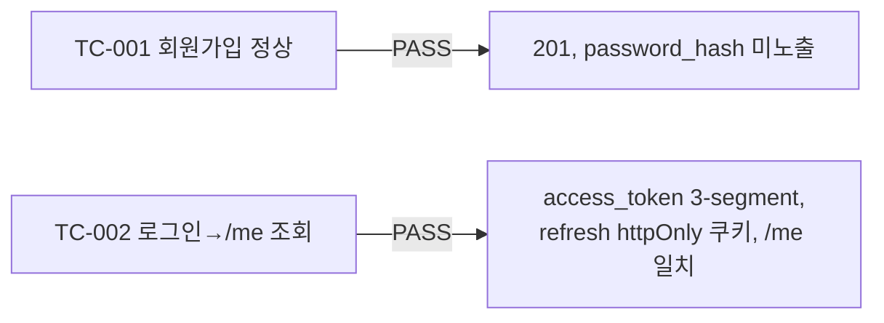

# unit-1 — 인증/회원가입 (REQ-001, Feature A)

- **작업일**: 2026-09-19 07:34 (git 커밋 실제 시각)
- **소스 문서**: `docs/harness/units/unit-1-note.md`, `unit-1-test.md`
- **속도 트랙**: L1(경량, DEC-003) · **판정**: PASS

## 한 일

프로젝트 최초 코드 작업 — FastAPI(`backend/`)/Next.js(`frontend/`) 골격 신설과 함께 인증 구현.
- `users` 테이블(Alembic `v1_initial_users`), Argon2id 비밀번호 해시, JWT(access 15분/refresh 7일)
- `POST /auth/register`(중복 409, role candidate/recruiter만 422), `POST /auth/login`(계정존재 비노출 401), `GET /auth/me`, `POST /auth/refresh`(설계서에 없던 신규, 표준 관례로 추가)
- 프론트 `/register`, `/login`, 임시 홈 화면

## 검증 결과 (06단계 독립 재현)

| 항목 | 결과 |
|---|---|
| ruff(백엔드 lint) | 0 에러 |
| eslint/next build(프론트) | 0 에러/경고 |
| 결함 | 0건 |

## 설계서 대비 편차(5건, 전부 낮은 되돌리기 난이도)

refresh 엔드포인트 신규 추가, `COOKIE_SECURE` 환경변수화, 초기 마이그레이션에 users만 포함, access token을 sessionStorage 저장(추후 unit-2에서 교체 필요), 개인정보처리방침 동의는 프론트 전용(서버 미저장).

## 영향받은 산출물

`backend/app/{models/user.py,core/security.py,api/v1/auth.py,core/errors.py}`, `frontend/app/{register,login,page}.tsx`, `frontend/lib/api.ts`, Alembic `v1_initial_users`.
