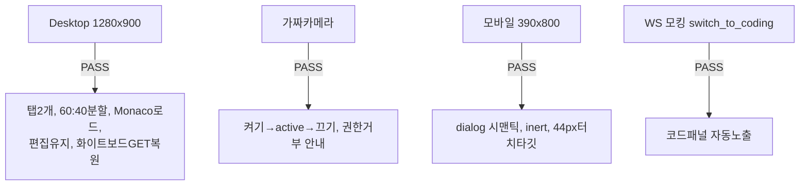

# unit-20 — 면접장 화면 통합 배선 (REQ-008/015/017, Feature I)

- **작업일**: 2026-09-20 02:35 (note 작성 시각)
- **소스 문서**: `docs/harness/units/unit-20-note.md` (test.md 없음 — 소스 목록에 미존재, 05단계 자체 브라우저 검증만 기록됨)
- **속도 트랙**: L3 · **상태**: 05단계 완료, 06 정식 검증 대기(당시 기준)

## 한 일

코드에디터(unit-9)·화이트보드(unit-17)·웹캠(unit-16) 3개 독립 컴포넌트를 실제 면접장 화면(`/interviews/[id]`)에 처음 배선. 툴바 탭 토글, Desktop 60:40/Tablet 1:1 분할, Mobile 전체화면 모달(dialog+inert+Esc+포커스복귀), `switch_to_coding` WS 신호로 코드패널 자동 노출. unit-16의 DEF-001(SSR hydration mismatch)도 이번에 해소.

## 검증 결과 (05단계 자체, headless Chromium 직접 구동 — 47/47 통과)

## 미해결 질문 (Q1~Q4, 오케스트레이터 판단 대기)

Q1: [C-05] 장치점검 화면 신설 여부. Q2: 데스크톱 패널 초기 열림 여부. Q3: 비-live 세션 읽기전용 열람 여부. Q4: 재접속 시 마지막 제출 언어 자동선택 여부.

## 영향받은 산출물

`frontend/app/interviews/[id]/page.tsx`, `frontend/app/interviews/[id]/components/InterviewSidePanel.tsx`(신규), `frontend/lib/useMediaQuery.ts`(신규), `frontend/components/WebcamPreview.tsx`(DEF-001 수정), `CodeEditorPanel.tsx`/`WhiteboardCanvas.tsx`(최소 수정).
