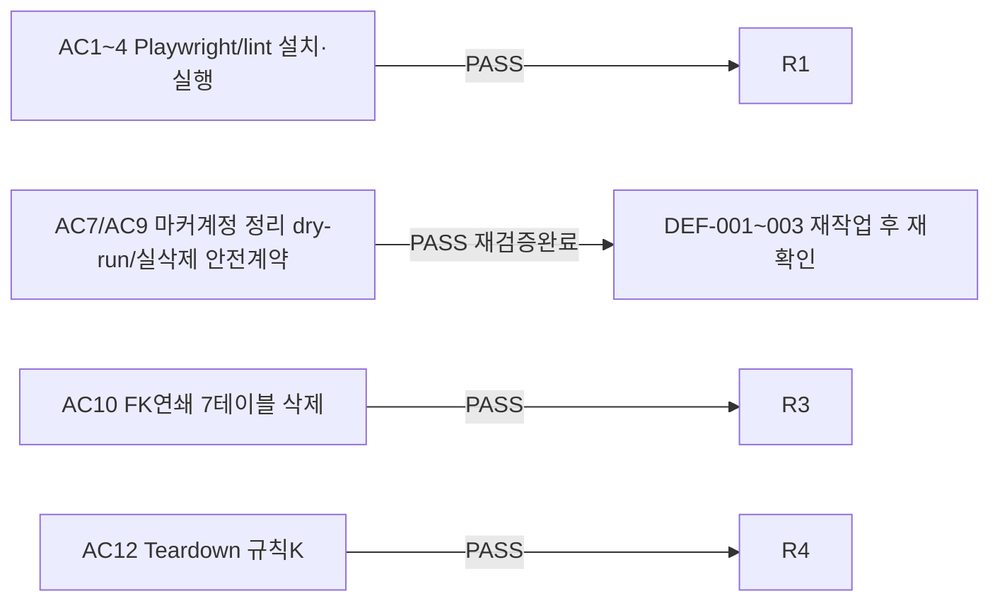

# unit-22 — 공통 테스트 인프라: Playwright + pytest 골격 (DEC-030)

- **작업일**: 2026-09-20 02:30 (note 작성 시각, 재검증 v5는 07:21)
- **소스 문서**: `docs/harness/units/unit-22-note.md`, `unit-22-test.md`(v5, 재작업 후 재검증본)
- **속도 트랙**: L3 · **판정**: v4 CONDITIONAL PASS(결함 3건) → 05 재작업(DEC-033) → **v5 재검증**

## 한 일

`frontend`에 Playwright(`@playwright/test`) devDependency + `e2e/smoke.spec.ts`, `backend/tests/`에 pytest 골격(`conftest.py`, `support/accounts.py`, `support/cleanup.py`, `test_smoke.py`). `docs/harness/test-infra.md` 신규(실행규약 문서).

## 검증 결과 (AC1~AC13 전부 PASS, 인프라 자체를 06이 독립 재현)

v4에서 발견된 Low 결함 3건(DEF-001~003, 정리 헬퍼 `connect_timeout` 없음/tsc 캐시 이슈/dry-run 비-UUID 마커 처리)을 05가 재작업, 신규 테스트 7건 추가로 계약 고정. 재검증(TC-053~060)에서 회귀 없음 확인.

## 영향받은 산출물

`frontend/{playwright.config.ts,e2e/smoke.spec.ts,package.json}`, `backend/{requirements-dev.txt,pyproject.toml,tests/**}`, `docs/harness/test-infra.md`(신규), `.gitignore`.
