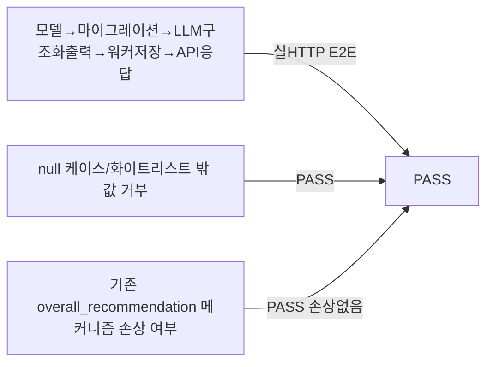

# unit-23 — 합격/불합격 추천 의견 필드 복원 (원안 REQ-F-006/007)

- **작업일**: 2026-09-22 (git 커밋 20260923_1245)
- **소스 문서**: `docs/harness/units/unit-23-note.md`, `unit-23-test.md`
- **속도 트랙**: L1(표준 수준으로 채움, 사용자 요구) · **판정**: PASS

## 배경

사용자가 원 계획서와 현재 구현(REQ-031 "합격/불합격 확정 필드 스키마에 안 만듦")의 불일치를 지적, **법적 리스크(개보법 제37조의2, 자동화된 결정 거부권)를 인지한 상태로 복원 승인**. 정식 DEC 번호는 부여되지 않아 09단계 보안/컴플라이언스 감사에서 재검토 필요로 남김.

## 한 일

`pass_fail_recommendation`(pass/fail/borderline) nullable 컬럼 신규 추가 — 기존 `overall_recommendation`(REQ-031 3단계 방어선)은 삭제하지 않고 유지, 신규 필드는 순수 추가.

## 검증 결과

## 영향받은 산출물

`backend/app/{models/evaluation_report.py,services/llm_engine.py,services/interview_prompts.py,worker/tasks.py,schemas/interview.py,api/v1/interviews.py,schemas/recruiter.py,api/v1/recruiter.py}`, Alembic `a7c3e9f14b02_v11_pass_fail_recommendation`.
