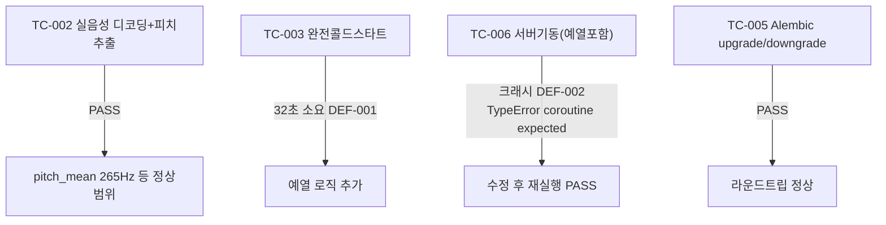

# unit-24 — 음성 Prosody 분석 (원안 REQ-018/019 축소판)

- **작업일**: 2026-09-22 (git 커밋 20260923_1245)
- **소스 문서**: `docs/harness/units/unit-24-note.md`, `unit-24-test.md`
- **속도 트랙**: L1(표준 수준) · **판정**: PASS (결함 2건 발견 즉시 수정)

## 순서 변경 사유

원래 우선순위는 "STT 실시간 스트리밍"이었으나, 착수 직전 음성 제출 경로에 **오늘 이미 실제 장애 대응이 있었던 주석**을 발견 — 검증 불가능한 상태에서 고위험 경로를 재설계하는 건 무리라고 판단해 더 안전한 Prosody 분석을 먼저 진행(STT 스트리밍은 별도 재개).

## 한 일

`prosody_engine.py`(신규) — PyAV+librosa.pyin으로 피치(Hz) 평균/표준편차, 유성음 비율 등 **원시 수치만** 추출("자신감/긴장도" 등 해석 라벨은 만들지 않음, 공정성 원칙).

## 검증 결과 (발견·즉시수정 2건 포함)

## 영향받은 산출물

`backend/app/services/prosody_engine.py`(신규), Alembic v12, `backend/app/main.py`(예열 로직).
