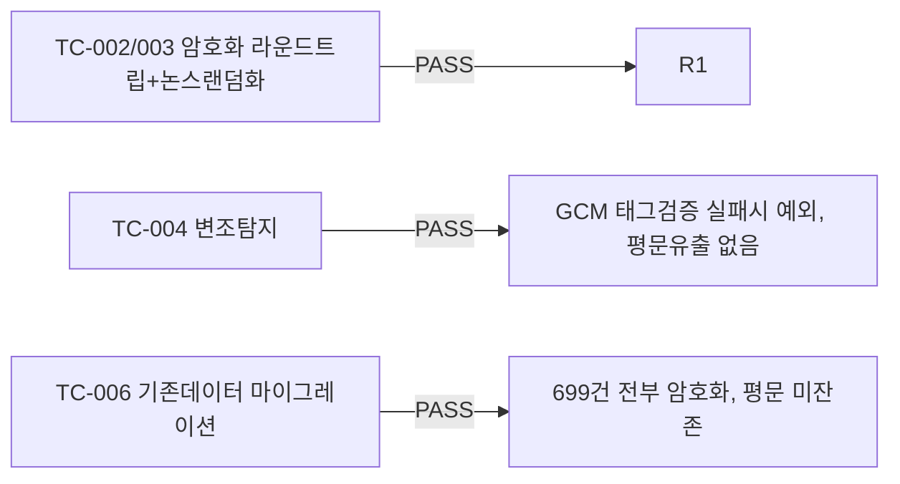

# unit-25 — TLS 1.3 + AES-256 저장암호화 (원안 REQ-N-001/003 축소판)

- **작업일**: 2026-09-22 (git 커밋 20260923_1245)
- **소스 문서**: `docs/harness/units/unit-25-note.md`, `unit-25-test.md`
- **속도 트랙**: L1(표준 수준) · **판정**: PASS

## 스코프 결정

원 계획서의 "모든 데이터" 암호화를 문자 그대로 하지 않음 — `content_text` 등은 당시 별도 조사 중이던 인코딩 손상 결함(추후 오탐으로 정정, DEC-051)과 얽혀 있어 암호화를 먼저 씌우면 조사가 더 어려워질 위험 판단. 대신 재사용 가능한 `EncryptedString` TypeDecorator 인프라를 만들고, 그 파이프라인과 무관한 `consents.ip_address`에 실제 적용해 "동작하는 예시"로 검증.

## 검증 결과

## 영향받은 산출물

`backend/app/{services/field_encryption.py(신규),models/consent.py}`, Alembic v13(699건 데이터 마이그레이션 포함), nginx TLS 샘플 설정(문법 검토만, 실제 핸드셰이크 미검증).
